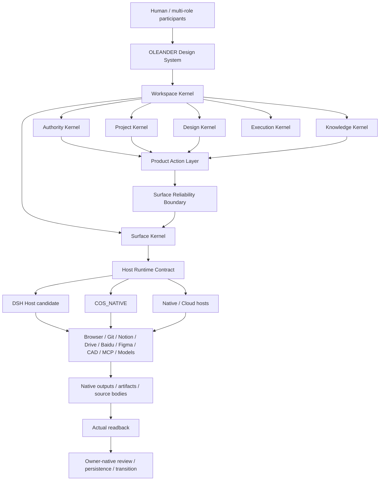
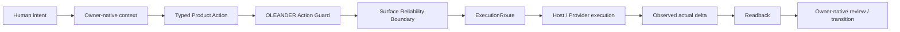
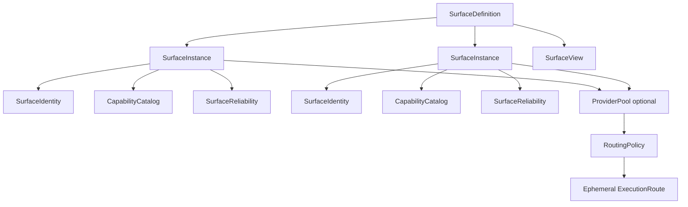
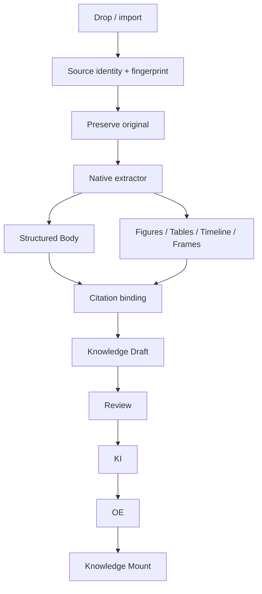

# OLEANDER Design System Architecture v0.1

**Status:** CANDIDATE / NON-AUTHORITY / DESIGN-SYSTEM SUCCESSOR VIEW
**Date:** 2026-09-27
**System baseline:** `OLEANDER_SYSTEM_MANAGEMENT_ARCHITECTURE_v0.2.md`

This document defines the Human-facing Design System product architecture that sits above the existing OLEANDER runtime and governance architecture. It does not create a second Project State, Knowledge Registry, professional process, Runtime Layer family, Design KEEP path or Promotion path.

## 1 | Product definition

OLEANDER Design System is the unified Human–AI design working environment. Chat is one interaction surface inside the product, not the product itself. CoS is no longer the primary product shell; it becomes a local execution capability (`COS_NATIVE`). DeepSeek Harness (DSH) is treated as a Host Runtime reference/candidate, not as OLEANDER authority.



The product must remain usable even when individual execution surfaces are degraded or absent. A surface failure may reduce capability; it must not corrupt or redefine Project State, Knowledge Authority, Design Decision or Project Current.

## 2 | Primary product navigation

The first-class product navigation is intentionally limited to nine areas:

```text
Home
Projects
Design
Knowledge
Sources
Browser
Integrations
Review
System
```

Git is a Project sub-surface, not a top-level product. Surface Reliability appears contextually in Integrations/System and on affected actions. Runtime internals remain under System / Advanced unless a concrete blocker requires exposure.

## 3 | Six ownership kernels

These kernels are ownership/product views. They do not replace R-A..R-K.

| Kernel | Owns | Explicitly does not delegate |
|---|---|---|
| Authority Kernel | scoped human rights, durable Design Decision ownership, KEEP/Promotion gates | provider approval never grants authority |
| Project Kernel | Project identity, owner-native Project State refs, repository/workspace/artifact relationships | Git HEAD, worktree, session or folder never becomes Project Current |
| Design Kernel | explore, compare, critique, synthesize, develop, modify, review | workflow completion never equals Design KEEP |
| Knowledge Kernel | Source, structured Body, provenance, KI, OE, claim ceiling, mounts | vector index, RAG memory or external connector never becomes Knowledge Authority |
| Surface Kernel | surface definitions/instances/identities/catalogs/reliability/views/routes | surface readiness never becomes Project/Design authority |
| Execution Kernel | ExecutionLedger, ActionRuntime, DurableJob | execution evidence never becomes Project State |

Cross-cutting system concerns remain only:

```text
AUTHORITY
RELIABILITY
OBSERVABILITY / RECOVERY
SECURITY / PRIVACY
```

## 4 | Product action layer

Human actions are expressed as design/product verbs rather than provider mechanics:

```text
EXPLORE
COMPARE
CRITIQUE
DEVELOP
MODIFY
MIX
SYNTHESIZE
INGEST
RESEARCH
REVIEW
READBACK
CONTINUE
RESUME
RECOVER
SYNC
PUBLISH
```

Every action resolves through owner-native context, OLEANDER Action Guard, Surface Reliability Boundary, an ephemeral ExecutionRoute, actual execution and actual readback where required.



## 5 | Surface Reliability Boundary is core architecture

`OLEANDER_SURFACE_RELIABILITY_BOUNDARY_v0.1.json` is the machine-readable contract. Reliability is not one boolean or one free-form string. It has five stages:

```text
R1 ADMISSION
registered / configured / compatible / loaded

R2 IDENTITY
authenticated / identity-bound / permission scope / credential freshness

R3 CAPABILITY
catalog valid / capability verified / required feature present

R4 EXECUTION
provider health / capacity / request admission / retryability / side-effect certainty

R5 RESULT
native output / actual delta / readback / semantic fidelity / source-version consistency
```

R1-R4 are pre-execution routing evidence. R5 exists only after execution; a preflight must not fabricate R5. Material mutation cannot close as verified without R5 readback evidence.

Hard non-equivalences:

```text
Visible ≠ Loaded
Loaded ≠ Ready
Ready ≠ Executed
Executed ≠ Native output correct
Native output exists ≠ Readback PASS
Readback PASS ≠ Design KEEP
Synced ≠ Project Current
Imported ≠ Knowledge Current
Connected ≠ Reliable
```

Reliability evidence must preserve four different semantic levels:

```text
Observation ≠ Interpretation
Interpretation ≠ Derived Reliability State
Derived Reliability State ≠ Authority State
```

A provider-specific heuristic may never overwrite upstream facts. For example, a local cooldown is not allowed to rewrite a server-reported quota value; a text fragment containing `429` is not by itself a hard rate-limit fact.

## 6 | Surface object model

The old normalized `ExecutionSurface` remains a compatibility envelope. The Design System uses a more explicit object graph:



Definitions:

- `SurfaceDefinition`: stable product concept such as GitHub, Notion, Browser, Figma, Rhino.
- `SurfaceInstance`: one concrete installation/endpoint/account-capable runtime instance.
- `SurfaceIdentity`: account/workspace/credential binding. Identity change invalidates identity-bound reliability observations.
- `CapabilityCatalog`: currently known capabilities with source/version/freshness.
- `SurfaceReliability`: R1-R5 observations, interpretations and derived states.
- `ProviderPool`: optional set of legitimate instances/endpoints for redundancy and routing; never a mechanism for circumventing provider limits or policy.
- `RoutingPolicy`: capability fit, data boundary, native format, reliability and fallback rules below Authority.
- `SurfaceView`: Human-facing UI projection of a surface; it cannot invoke a provider outside Product Action / ActionRuntime.

Routing precedence:

```text
Authority / Security constraints
>
Capability fit
>
Data / disclosure boundary
>
Required native format and readback
>
Reliability
>
Cost / convenience
```

## 7 | Host Runtime: DSH and CoS

DSH is a Host Runtime candidate/reference because its current architecture already separates capability seams from providers and includes Workspace, Session Persistence, Projection Cache, Remote/BFF, Plugin Manager, Browser provider lifecycle, uploads, attachments, Office conversion, sandbox, approvals, terminals and host services.

Reference snapshot used for this design review:

```text
deepseek-ai/deepseek-harness
observed commit: 477b4f420553e8a52c2fbccc464d7561b239c443
observed package generation: 0.1.7-rc.2
```

`dsh-agy-link` is a third-party provider adapter reference for provider pools, identity-bound state, catalog validation, bounded retry, quota/capacity observations and UI-visible provider health:

```text
amlyczz/dsh-agy-link
observed repository commit in review: 3ee8416a4433fa3e8032f4832b217da0c4ab0e71
observed package version: 0.4.38
```

These references inform implementation patterns only. They do not become OLEANDER authority.

Required boundaries:

```text
DSH Workspace ≠ OLEANDER Project
DSH Session ≠ Project State
DSH Event Log ≠ Project Current
DSH Approval ≠ Human Design Decision
DSH Plugin Enabled ≠ Surface Reliable
DSH Tool Success ≠ Readback PASS
dsh-agy-link account state ≠ provider-wide truth
```

CoS remains `COS_NATIVE`: local files, processes, workers/agents, terminals, native apps, local browser automation, runtime health and local readback. CoS and DSH must converge behind one Host Runtime Contract rather than becoming two competing authority stacks.

## 8 | Project / Git / Workspace separation

The current monorepo layout must not remain the long-term project container. OLEANDER platform code and real design projects are separate system objects.

Hard object boundary:

```text
OLEANDER Project
≠ Git Repository
≠ Runtime Workspace
≠ Artifact Store
≠ Knowledge Store
```

Default project topology:

```text
OLEANDER Project
├─ one Primary Repository
├─ zero or more Satellite Repositories
├─ zero or more Runtime Workspaces / worktrees
├─ Artifact Stores
├─ Knowledge Mounts
└─ External Surface Bindings
```

Git remains versioned materialization:

```text
Git commit ≠ Project Current
Git branch ≠ Design Direction
Git merge ≠ Design KEEP
Git clean ≠ Design Valid
```

Each repository may contain `.oleander/project.json` as a lightweight bootstrap locator. It is not Project State and may only point to the owner-native Project State / Current references.

## 9 | Knowledge and Source Inbox

Knowledge is Source-first and body-preserving:

```text
Source
├─ Original
├─ Fingerprint
├─ Rights / access
├─ Provenance
├─ Structured Body
├─ Figures / tables / frames
├─ Claims / concepts / entities / relations
├─ Citations
├─ Index / embeddings
├─ KI
└─ OE
```

`Vector Index ≠ Knowledge` remains a hard invariant.

Source Inbox accepts documents, media, URLs and folders as durable Source candidates:



Video ingestion must retain timestamp-addressable citations; Office/PDF extraction must retain source revision/digest and reject silent use of a changed source version.

```text
Original Source ≠ Extracted Body
Extracted ≠ Validated
Imported ≠ Knowledge Current
```

## 10 | Browser as a project-scoped design surface

Browser is a first-class Design System surface, not merely an agent tool. Browser profiles are project/research scoped and may own tabs, cookies, logins, downloads and captures while respecting credential/privacy boundaries.

```text
Browser loaded page ≠ Source captured
Source captured ≠ Knowledge ingested
Knowledge ingested ≠ Knowledge Current
```

Browser surface actions include Browse, Research, Compare, Capture, Clip, Ingest, Add to Project and Add to Knowledge. Any persistent capture passes through Source Inbox and the Surface Reliability Boundary.

## 11 | External knowledge/application surfaces

Notion, Google Drive, Baidu, GitHub, Figma and similar systems remain owner-native external sources/surfaces. The Design System may provide a unified view while retaining source ownership and permission semantics.

Every mounted external source should retain at least:

```text
source_owner
source_provider
source_identity
source_revision
permission_scope
sync_state
materialization_state
observed_at
```

`Unified view ≠ unified ownership` is mandatory.

## 12 | UI reliability model

The product must not reduce reliability to a green `Connected` badge. SurfaceView should be capable of presenting separate states such as:

```text
REGISTERED
CONFIGURED
LOADED
AUTHENTICATED
PROBED
READY
EXECUTING
READBACK
VERIFIED

DEGRADED
STALE
PARTIAL
FAILED
BLOCKED
QUARANTINED
```

Visibility is stable product knowledge; executability is current runtime evidence. A known integration remains visible when unavailable and carries the real failure/degradation reason.

## 13 | Source-control / filesystem target shape

The target physical organization is a policy direction, not an automatic migration:

```text
D:\OLEANDER\
├─ platform\
│  ├─ oleander-core\
│  └─ oleander-design-system\
├─ projects\
├─ workspaces\
├─ knowledge\
├─ sources\
│  ├─ inbox\
│  └─ originals\
├─ artifacts\
├─ runtime\
└─ temp\
```

Existing repositories/projects are not moved by this architecture alone. Migration requires inventory, history preservation, Project ID binding, artifact/knowledge binding and owner-native readback before removal of old duplicates.

## 14 | Architecture lints required

The Design System architecture must fail lint if it introduces any of the following:

1. a second Project State or Project Current owner;
2. Git HEAD/branch/worktree treated as Project Current or Design KEEP;
3. runtime/session/projection state treated as Project State;
4. external connector/view treated as Knowledge Authority;
5. SurfaceView directly bypassing Product Action / ActionRuntime;
6. surface readiness inferred only from static registration or stale observation;
7. provider interpretation overwriting upstream observation facts;
8. identity change inheriting identity-bound quota/permissions/reliability without revalidation;
9. material mutation closing without actual delta/readback evidence;
10. provider fallback after uncertain mutation side effects without verification;
11. `Connected`/`Enabled` treated as reliability completion;
12. vector/RAG index treated as canonical knowledge body.

## 15 | Does not prove

This document does not prove UI implementation completeness, DSH adoption, CoS migration completion, browser production readiness, source-ingestion correctness, external provider reliability, project-repository migration, Design KEEP, Knowledge Current, professional PASS or Promotion. Those require separate implementation and owner-native evidence.
