# OLEANDER System Management Architecture v0.2

**Status:** CANDIDATE / NON-AUTHORITY / PHASE-2 IMPLEMENTATION

**Supersedes management view:** `OLEANDER_SYSTEM_MANAGEMENT_ARCHITECTURE_v0.1.md`. The v0.1 document remains historical evidence of Phase 1. This v0.2 view does **not** create a second architecture, Runtime Layer family, Project State, Knowledge Registry, professional process or Promotion path.

## 1 | One system, not another framework

OLEANDER remains the Human–AI Design OS. Human–AI co-design is the product core; Governance / Authority is the base. CoS, DeepSeek Harness, Microsoft Agent Framework, PydanticAI, Temporal, Dify, MCP and ChatGPT plugins are replaceable execution capabilities below OLEANDER semantics.

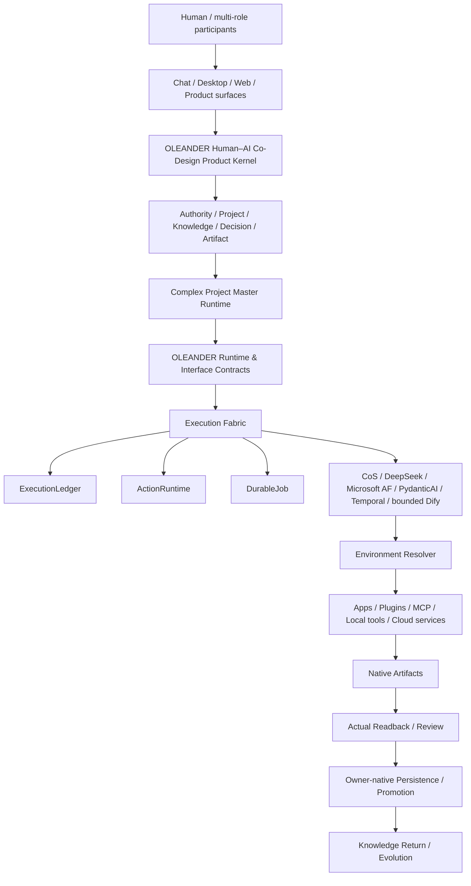

The fixed non-equivalences remain:

```text
Conversation ≠ Project State
Model Memory ≠ Project State
Harness Session ≠ Project State
Harness Event Log ≠ Project Current
Harness Approval ≠ Human Design Decision
Provider Tool Permission ≠ OLEANDER Action Guard
Workflow DAG ≠ Professional Design Process
Artifact existence ≠ Design quality
Process PASS ≠ Design KEEP
Executed ≠ Validated
CURRENT ≠ CLEAN
CONTENT ≠ KI / OE
KI ≠ OE
OE ≠ DQ
DQ ≠ professional stage
```

## 2 | G0–G11 are management views, not Runtime Layers

The existing R-A..R-K Runtime Layers remain stable. G0–G11 only answer “who owns this responsibility, what interface crosses it, and what may an execution provider never own?”

| Management view | Existing owner/layer | System responsibility | Provider ceiling |
|---|---|---|---|
| G0 Governance / Authority | root governance + R-A | identity, rights, authority boundaries | consume refs only |
| G1 Project State / Decision | R-A + owner-native project contracts | Project State, Current refs, durable Design Decision | no provider ownership |
| G2 Knowledge / Evidence | R-B | corpus, provenance, KI, OE, claim ceiling, task mount | runtime projection only |
| G3 Design / Professional Process | R-C..R-F | explore, critique, synthesize, DQ, domain stages, cross-discipline integration | execute bounded actions only |
| G4 Interface / Contract Plane | Runtime Layer / Skill / Tool / Artifact contracts | stable OLEANDER-native references and envelopes | provider adapter implements contract |
| G5 Master Runtime | Complex Project Master Runtime | coordinates the professional/co-design flow | workflow engine is subordinate |
| G6 Execution Fabric | Runtime Provider Contract + Phase-2 primitives | ledger, typed action execution, durable jobs | execution + observability only |
| G7 Environment / Capability Resolver | Universal Production Environment | current capability view and routing | availability is not authority |
| G8 Apps / Plugins / MCP / Connectors | Shared Execution Surfaces | canonical static surface roles | execution capability only |
| G9 Artifact / Persistence / Sync | R-H..R-J | native artifact identity, readback, persistence, promotion path | provider output is evidence only |
| G10 Observability / Recovery | observability/recovery contract | incidents, partial execution, recovery evidence | telemetry is not project truth |
| G11 Evolution / Designer Development | R-K + Product N10J | learning candidates, contextual designer support | no hidden competence/taste authority |

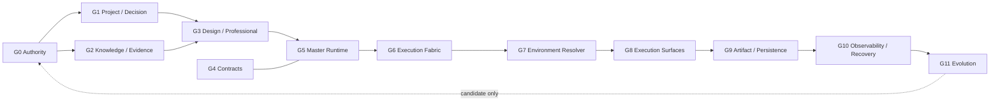

## 3 | Authority ownership map

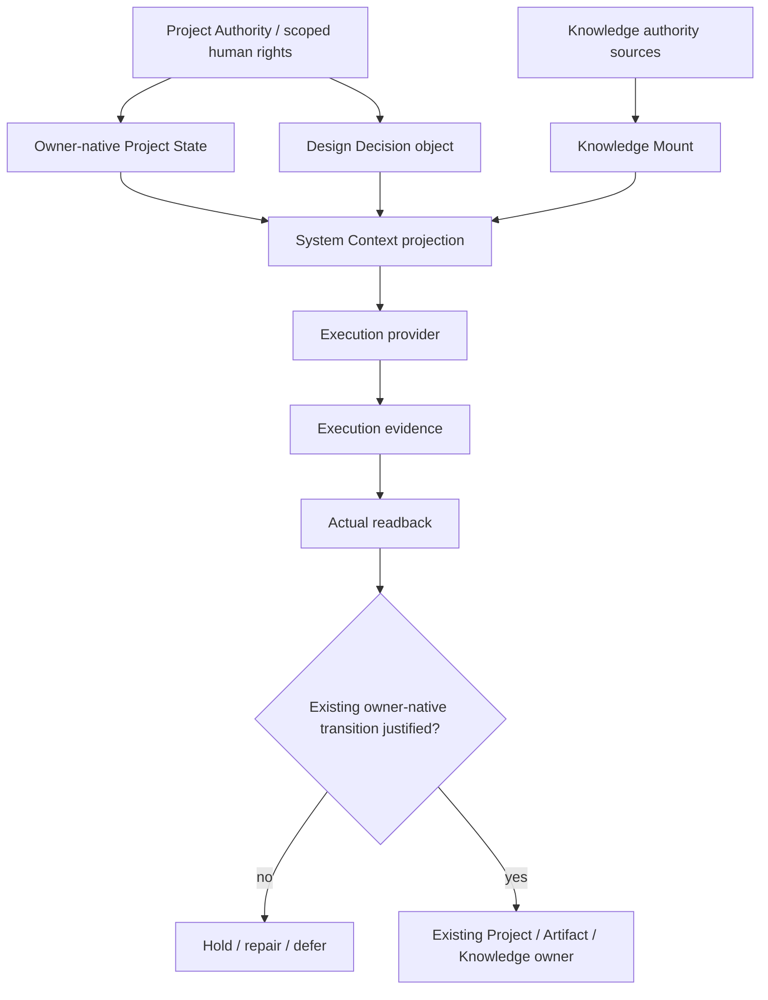

Neither `EX` nor `EV` can create Project Current, Design KEEP, professional PASS or Promotion.

### G4 stable interface vocabulary

`OLEANDER_CORE_INTERFACE_PRIMITIVES_v0.1.json` normalizes the small set of cross-system handoff objects without turning them into a new database: `AuthorityRef`, `ProjectRef`, `KnowledgeMount`, `DecisionObject`, `ProfessionalStageRef`, `ActionRequest`, `ExecutionRoute`, `ArtifactRef`, `ReadbackResult`, `ReviewResult`, `PersistenceReceipt`, `LearningCandidate`. Each primitive points back to its existing owner-native contract; provider adapters translate to/from these envelopes but do not redefine their authority.

## 4 | Project State lifecycle

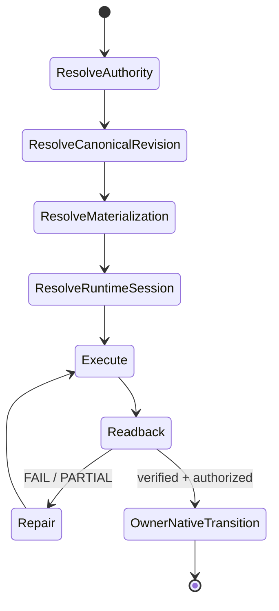

Startup is therefore **authority-first**, never “local file exists → treat local file as Current”. A worktree, harness checkpoint or runtime session can be stale while Project Current remains valid elsewhere.

## 5 | Knowledge mount flow

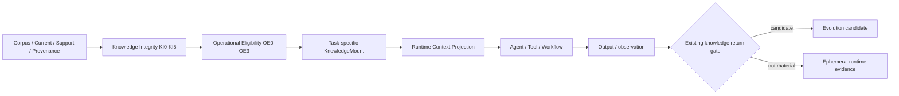

Vector DBs, agent memory and RAG indexes may implement `RP`; they do not own `C`, `KI`, `OE` or Knowledge Current.

## 6 | Execution Fabric: three provider-neutral primitives

### 6.1 ExecutionLedger

`ExecutionLedger` is append-only runtime evidence with `append()`, `flush()`, `replay()` and disposable `project()`. It refuses fields such as `project_state`, `project_current`, `design_decision`, `artifact_current`, `promotion` and `professional_pass` inside runtime event payloads.

### 6.2 ActionRuntime

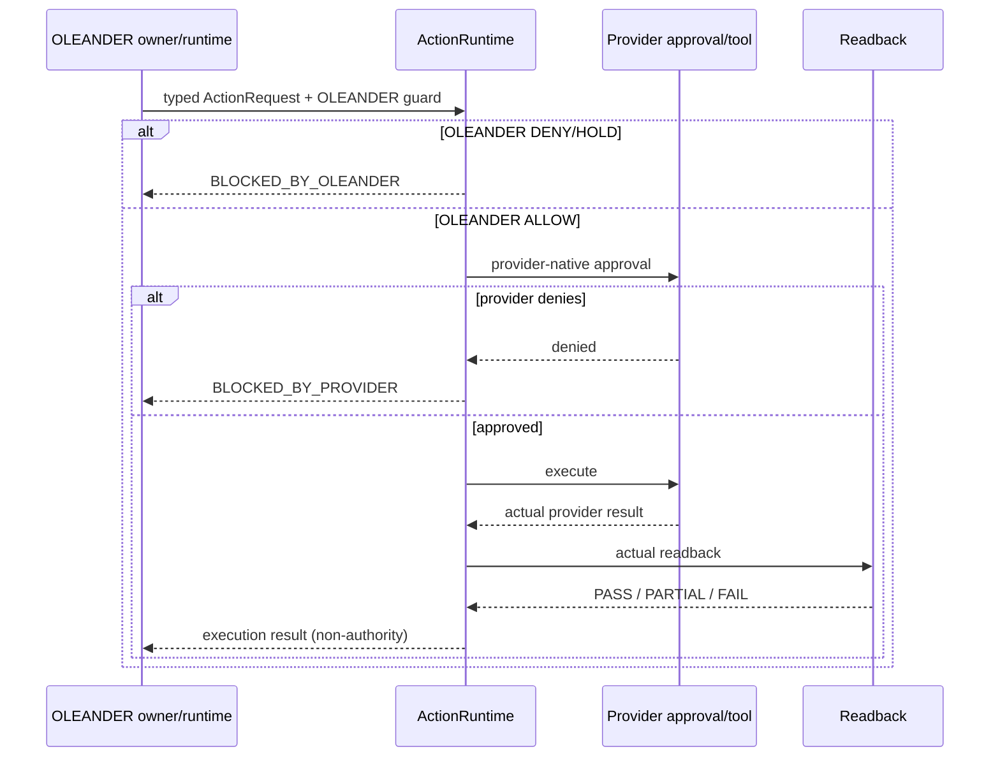

Provider approval may narrow an OLEANDER `ALLOW`; it can never widen an OLEANDER `DENY/HOLD`. Material mutation with no actual readback is `PARTIAL`, not complete.

### 6.3 DurableJob

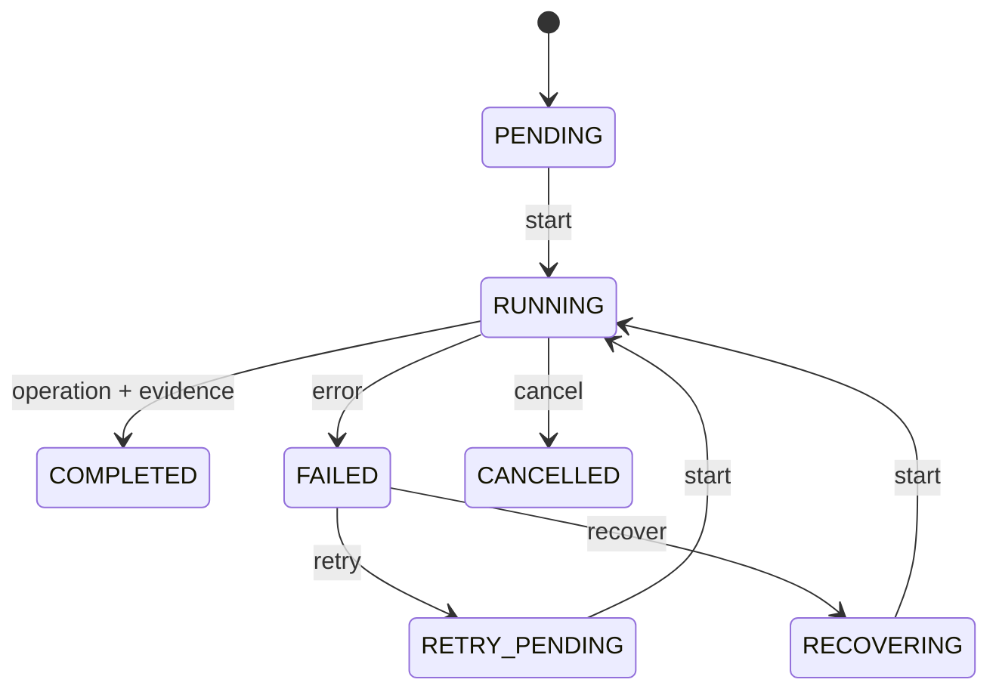

Temporal may later back these operations. Temporal Workflow History remains execution durability, not Project continuity or Project State.

## 7 | Environment = registry + current observation + resolver

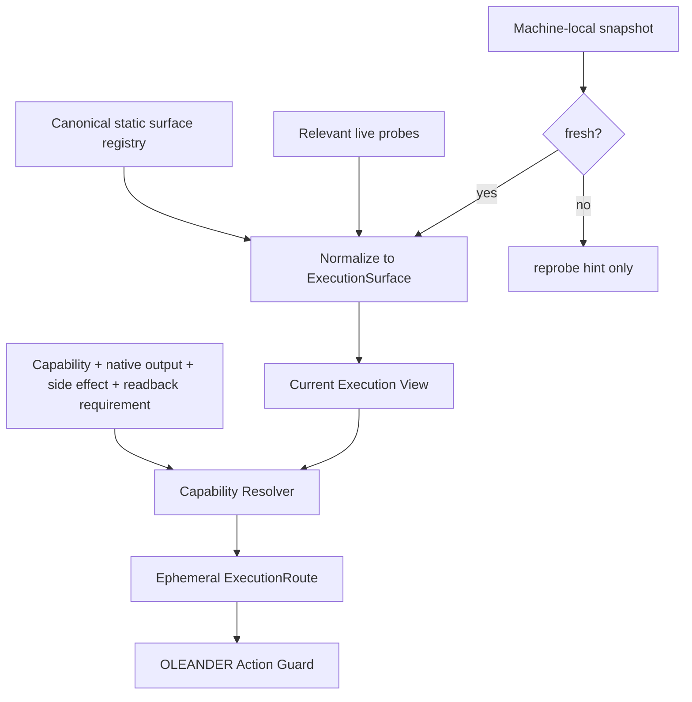

`OLEANDER_INTEGRATION_REGISTRY_CURRENT.json` is intentionally treated as machine-local runtime evidence. A stale snapshot cannot produce `AVAILABLE`; it produces `UNKNOWN` and a reprobe requirement.

Normalized `ExecutionSurface` includes at least:

```text
surface_id
provider_id
surface_class
capability_roles
availability
authority_ceiling
mutation_classes
external_disclosure
native_outputs
readback_support
reliability
fallback_surface
version
observed_at
default_production_eligible
canonical_registry_entry
```

All surfaces have `authority_ceiling = EXECUTION_CAPABILITY_ONLY`. Access to an owner-native Notion/GitHub/Drive object does not turn the connector session into that object's authority owner.

`AUTHORITY_MUTATION` / `RELEASE_MUTATION` are therefore **transport classes, not authority ownership**. A capable GitHub/Notion/Vercel surface may carry such an already-authorized operation only after the existing owner-native authority or release gate is verified. Without that gate the resolver holds; with it the selected surface still remains execution-only.

## 8 | Plugin/application topology

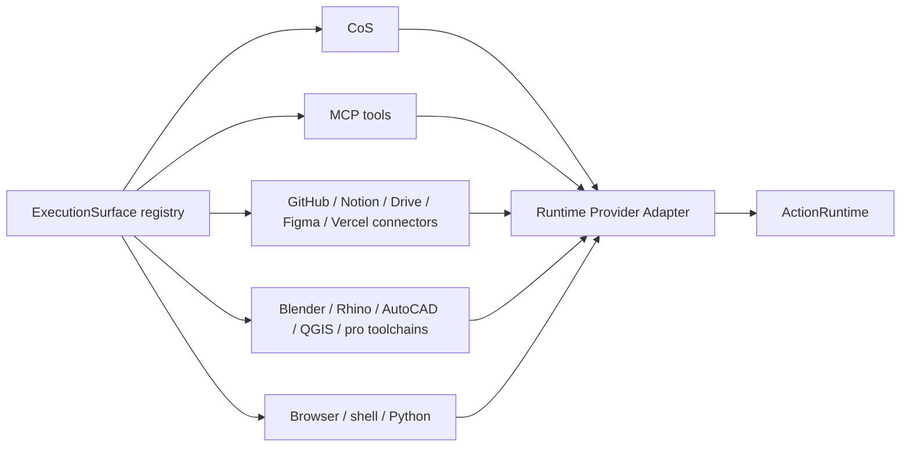

Plugin installation, visibility or tool success never changes Project Current, Knowledge Authority or Design KEEP.

## 9 | Artifact → readback → persistence

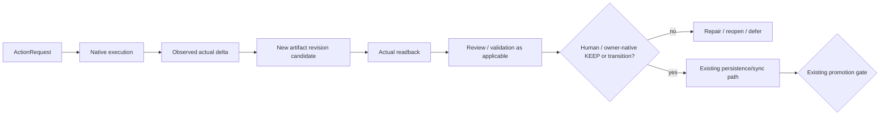

`Artifact existence ≠ Design quality`, and `tool success ≠ artifact/readback pass` remain hard invariants.

## 10 | Recovery path

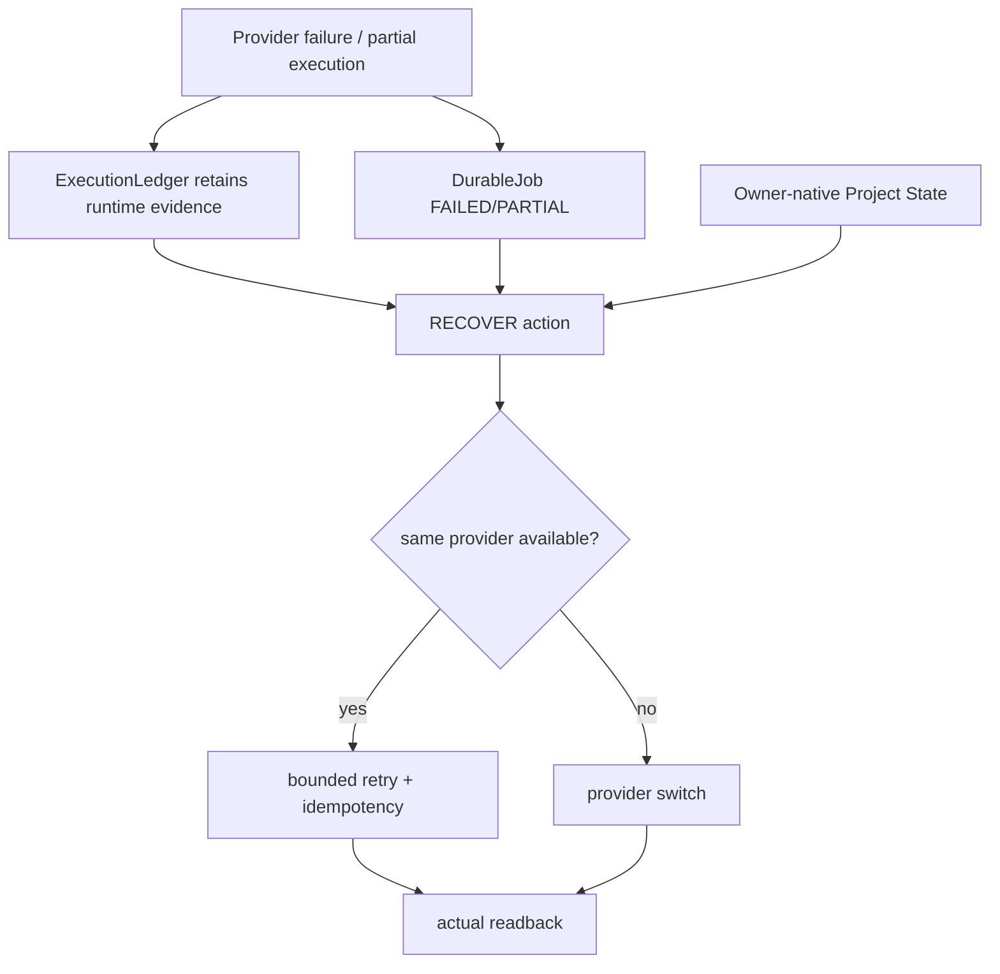

Provider loss may reduce execution continuity, but must not delete or rewrite owner-native Project State.

## 11 | Designer Development and system evolution

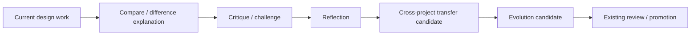

Support is contextual. No permanent competence profile, psychological profile, hidden designer score or inferred permanent taste is introduced. `FEEDBACK ≠ STEER ≠ DECISION ≠ KEEP ≠ PROMOTION`.

## 12 | CoS after Phase 2

CoS remains `COS_NATIVE`, an execution provider and local capability surface. Its responsibilities are local filesystem/process/tool/plugin transport, workers, session continuity, runtime health and execution observations. It does not own Project State, Project Current, Knowledge Authority, Design Decision, Artifact Current, professional PASS or Promotion.

Natural user commands remain product semantics:

```text
“继续”       → CONTINUE on current valid frontier
“恢复”       → RECOVER after failure/partial/conflict when applicable
“从文件继续” → resolve owner-native authority/materialization first, then execution session
“只读审查”   → READ_ONLY ActionRequest; still subject to sensitive-disclosure guard
“混合 A+B”   → Human steer/decision input; not a provider-side merge authority
```

Internal runtime IDs remain hidden unless they are necessary to resolve a real blocker.

## 13 | Component disposition

Machine-readable inventory: `OLEANDER_SYSTEM_COMPONENT_DISPOSITION_v0.2.json`.

The dominant refactor pattern is **KEEP owner-native semantics, DECOUPLE execution providers, REFINE interfaces/resolution**. No existing Current or historical evidence is silently rewritten.

## 14 | Implemented in Phase 2

This phase adds:

1. `ExecutionLedger`, `ActionRuntime`, `DurableJob` reference implementation;
2. normalized `ExecutionSurface` contract;
3. static registry + stale-aware machine-local observation + live observation overlay;
4. capability resolver that only routes a currently verified surface;
5. stronger connector authority ceilings;
6. system component disposition matrix;
7. architecture lint/tests for provider authority leakage and stale-environment misuse.

## 15 | Does not prove

This architecture does not prove all historical runtime code has migrated, any external provider is production-ready, all applications have live probes, CAD/BIM/professional correctness, external customer validation, Design KEEP, professional PASS or Promotion. Those remain separate owner-native gates and later implementation work.
