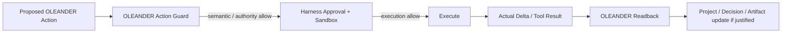
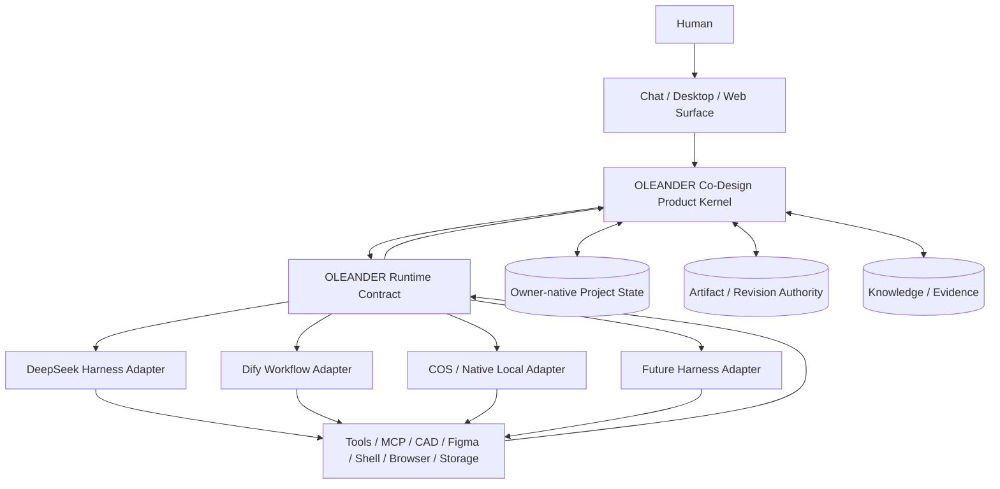

# OLEANDER Execution Fabric / Harness Architecture v0.3.3

[← v0.3 Package](README.md) · [← Master PRD](OLEANDER_MASTER_PRD_v0.3.0.md) · [← Integrations](nodes/N12_INTEGRATIONS.md)

**State:** `WORKING ARCHITECTURE / NON-AUTHORITY / SYSTEM ALIGNMENT OPEN`

> OLEANDER 应当成为 **harness-agnostic co-design product kernel**。Agent harness / workflow platform 是可替换执行底座，不拥有 Project State、Design Decision、Artifact authority、Design KEEP、professional PASS 或 Promotion。

---

# 1｜Architecture Decision

不把 OLEANDER 重写为 Dify workflow，也不把 OLEANDER 等同于 DeepSeek Harness。

采用：

```text
Human / Chat Surface
        ↓
OLEANDER Co-Design Product Kernel
        ↓
OLEANDER Runtime Contract / Execution Fabric
        ↓
Harness / Workflow Provider Adapters
        ↓
Tools / Models / Sandbox / Storage / Scheduling / MCP
```

Project Truth / Decision / Artifact authority remain owner-native and are read/written through explicit OLEANDER contracts.

---

# 2｜What OLEANDER owns

OLEANDER product semantics remain canonical for:

- Design Situation / Brief；
- Current Design Question；
- Search-space Map；
- AI Option Triage semantics；
- Design Synthesis semantics；
- persistent Design Decision；
- Project State / Current semantics；
- Design Relation；
- Artifact identity / revision / intended-vs-actual delta contract；
- Action Guard policy；
- Human decision rights；
- Evidence / Claim Ceiling；
- Verification / Validation semantics；
- Whole-design Check；
- Design Quality / Design KEEP separation；
- Evolution / learning governance。

These must not be redefined by a harness provider's native concepts.

---

# 3｜What the Execution Fabric owns

The Execution Fabric provides replaceable runtime capabilities:

```text
ModelProvider
ToolRegistry / ToolExecutor
SessionRuntime
Sandbox
ExecutionApproval
File / Process Execution
Subagent / Delegation
Scheduler / Jobs
Storage Adapter
Workflow Executor
Telemetry / Trace
UI / Surface Adapter
```

The provider may implement these capabilities differently, but must satisfy the same OLEANDER Runtime Contract.

---

# 4｜Hard Separations

```text
Harness Session ≠ Project State
Harness Event Log ≠ Project Current
Harness Approval ≠ Human Design Decision
Harness Tool Permission ≠ OLEANDER Action Guard
Workflow Node Success ≠ Artifact Success
Agent Completion ≠ Design Completion
Runtime Replay ≠ Project Truth
Plugin Capability ≠ Product Authority
Harness Plugin Granularity ≠ OLEANDER Skill Granularity
Workflow DAG ≠ Professional Design Process
```

Provider modularity is an infrastructure concern. It does **not** justify creating a new OLEANDER Skill / product node for every tool, issue, prompt pattern or design exception. Reuse / composition / parameterization remain preferred.

## Dual-guard model



OLEANDER Action Guard answers **should this product action be allowed?**
Harness approval/sandbox answers **may this runtime operation execute in this environment?**

Neither substitutes for the other.

---

# 5｜Provider Evaluation

## DeepSeek Harness — candidate reference runtime

Potential fit:
- plugin-first capability composition；
- replaceable model/tool/session/loop/sandbox/storage/UI capabilities；
- append-only session events；
- resume / fork / replay / trace；
- guarded tool execution；
- explicit user approval；
- sandbox policy；
- local-first execution。

OLEANDER usage:

```text
OLEANDER Runtime Contract
        ↓
DeepSeek Harness Adapter
        ↓
Cordis capability seams / session / tools / sandbox / approval
```

Hard boundary:
- DeepSeek Harness session log is runtime evidence/history, not OLEANDER Project State；
- Cordis plugin config does not become product authority；
- OLEANDER must be able to run without this provider；
- provider version must be pinned and compatibility-tested while upstream APIs remain pre-stable。

Official references:
- https://www.deepseek.com/harness/en/
- https://github.com/deepseek-ai/deepseek-harness
- https://deepseek-harness.github.io/deepseek-harness/en/reference/

## Dify — optional workflow / RAG / pilot provider

Potential fit:
- visual workflow orchestration；
- model management；
- RAG / knowledge pipeline；
- agent/workflow nodes；
- application APIs；
- run logs / observability integrations；
- fast external-pilot composition。

OLEANDER usage:

```text
OLEANDER bounded workflow request
        ↓
Dify Workflow Adapter
        ↓
Dify Workflow / RAG / App
        ↓
Typed result
        ↓
OLEANDER validates / binds / readbacks
```

Good candidates:
- evidence ingestion / preprocessing；
- bounded research pipeline；
- structured extraction；
- notification / admin flows；
- external pilot UI/API；
- workflow prototypes before native implementation。

Do **not** use Dify as:
- canonical Project State；
- Design Decision store；
- artifact lineage authority；
- universal Session Kernel；
- Human authority engine；
- Design Quality authority。
- a canonical visual DAG for domain-native design process。

Official references:
- https://docs.dify.ai/
- https://github.com/langgenius/dify

---

# 6｜Recommended Target Architecture



This keeps OLEANDER portable while allowing a stronger runtime to replace bespoke low-level plumbing.

## Candidate system-management implementation?2026-09-26

The repository now contains a candidate implementation of this separation:

```text
OLEANDER_SYSTEM_MANIFEST_v0.1
        ?
OLEANDER System Context Envelope
        ?
oleander_system_gateway.py
        ?
existing Resolver / Runtime Bridge
        ?
OLEANDER_COS_HARNESS_ADAPTER_v0.1
        ?
CoS session / workers / plugins / tools
```

The same gateway is exposed through `oleander_system_mcp.py` and has been connected successfully with the same MCP Client SDK used by CoS. This is candidate implementation evidence only: it proves the seam can be consumed without giving CoS Project/Knowledge/Promotion authority; it does not close real provider-switch, real-artifact or production-readiness evidence.

---

# 7｜Runtime Contract

Every harness provider must implement a common contract.

## Required capability groups

| Capability | Required behaviour |
|---|---|
| Session | create / resume / continue / recover / fork identity without becoming Project State |
| Model | provider-neutral request/stream interface |
| Tool | scoped tool registry + typed input/output |
| Approval | fail-closed execution approval when required |
| Sandbox | bounded filesystem/process/network execution where applicable |
| Trace | durable enough execution trace for replay/readback/audit |
| Storage | explicit locator + provenance; no implicit Project Current |
| Jobs | bounded background / scheduled work with observable status |
| Subagent | scoped delegation with parent/child lineage |
| Health | capability/degradation state surfaced to N14 |

## Optional capability groups

- visual workflow；
- RAG pipeline；
- hosted UI；
- cloud collaboration；
- workflow template marketplace。

Optional capabilities must not become hidden launch requirements for the core product.

---

# 8｜Runtime Event Mapping

OLEANDER should adopt an append-only **Execution Ledger** projection, separate from Project State.

```text
Harness Runtime Event
→ normalize
→ OLEANDER Execution Event
→ link to action_id / session_id / tool_call / artifact revision
→ readback / audit / replay
```

Only an explicit product transition may promote execution evidence into:
- Project State；
- Design Decision；
- Artifact Current；
- validation evidence；
- completion claim。

---

# 9｜Provider Conformance Tests

Any provider adapter must pass the same behavioural suite:

1. CONTINUE / RESUME / RECOVER semantics；
2. exact action/referent binding；
3. Action Guard cannot be bypassed by provider-native approval；
4. read-only provider operation cannot silently disclose protected data；
5. partial tool execution remains partial；
6. actual artifact delta is observable；
7. provider session loss does not corrupt Project State；
8. provider replay cannot manufacture new project truth；
9. provider switch preserves product-level identity and authority；
10. provider outage yields scoped degradation, not global false failure。

---

# 10｜Migration Strategy

## Phase A — Contract first

Define the runtime contract around existing COS/native execution.

Do not introduce a new provider yet.

## Phase B — DeepSeek Harness spike

Implement a narrow adapter for:
- session identity；
- tool execution；
- approval；
- sandbox；
- trace。

Run existing OLEANDER fixtures against both native/COS and DeepSeek Harness adapters.

## Phase C — Provider parity

Only expand the adapter if conformance tests show:
- no authority leakage；
- no Project State substitution；
- no artifact identity loss；
- no degraded readback semantics。

## Phase D — Dify bounded workflow spike

Use Dify only for one bounded workflow such as evidence ingestion or external pilot orchestration.

Reject adoption if it requires Project State / Decision / Artifact authority to migrate into Dify.

---

# 11｜Current Recommendation

```text
OLEANDER semantic/product kernel      KEEP
OLEANDER owner-native authority      KEEP
OLEANDER bespoke low-level runtime   REDUCE OVER TIME

Harness abstraction layer            ADD
DeepSeek Harness adapter             SPIKE / PREFERRED FIRST CANDIDATE
Dify core runtime                    DO NOT ADOPT
Dify bounded workflow adapter        OPTIONAL / LATER
```

The architectural improvement is therefore **not “choose a framework”**.

It is:

> **separate OLEANDER's durable product semantics from replaceable agent execution infrastructure.**
