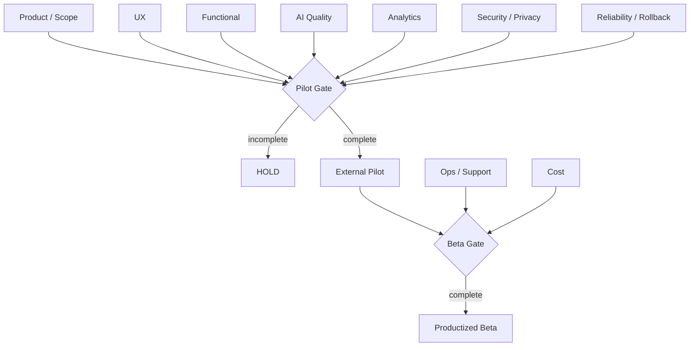

# OLEANDER Launch Readiness Review v0.3.0

[← v0.3 Package](README.md)

**Current recommendation:** `HOLD FOR EXTERNAL PILOT PREPARATION`
**Not production launch-ready.**
**Date:** 2026-09-26

> 本文是产品发布准备检查，不是 Governance Promotion Gate。当前 HOLD 是产品化状态判断，不改变 OLEANDER Current。

---

# Launch Gate Map



---

# 1｜Readiness Summary

| Area | Status | Why |
|---|---|---|
| Product problem definition | PASS_WORKING | strong internal evidence, external evidence incomplete |
| P0 scope | PASS_WORKING | cutline defined |
| Detailed functional requirements | PASS_WORKING | v0.2 Feature Specs + v0.3.2/v0.3.3 Requirement Deltas |
| Traceability | PASS_WORKING | 141/141 v0.2 feature mapping + v0.3.x atomic-node delta trace |
| v0.3.2 co-design content delta | PASS_WORKING_SPEC | Search-space / Triage / Synthesis / Decision / Artifact Action / Action Guard / Designer Development specified |
| v0.3.2 system implementation parity | OPEN | Markdown requirements revised first; runtime/system alignment not yet claimed |
| v0.3.3 Execution Fabric architecture | PASS_WORKING_SPEC | provider-neutral Runtime Contract + N12D Harness Adapter specified |
| v0.3.3 runtime provider conformance | OPEN | native/COS contract baseline and external harness spike not yet run |
| Internal interaction semantics | PASS_CANDIDATE | fixture/regression evidence exists |
| Real artifact loop | PARTIAL | candidate trials exist; external users not closed |
| External user validation | OPEN | not yet run |
| Longitudinal retention/value | OPEN | not yet measured |
| Analytics implementation | OPEN | metric/event contract only |
| Security / privacy | OPEN | owner and policy not established |
| Operational support | OPEN | not established |
| Cost model | OPEN | not measured for scaled use |
| Multi-human collaboration | PARTIAL / OPEN | semantics exist, real pilot needed |
| Plugin-off destructive continuity | OPEN | real destructive test needed |
| Production launch | HOLD | prerequisites incomplete |

---

# 2｜Customer Readiness

## Required
- first target persona frozen
- pilot recruitment criteria
- explicit problem evidence
- baseline workflow captured
- external consent / research protocol
- success thresholds frozen

## Current
- persona: working definition exists
- problem evidence: internal strong
- external interview evidence: OPEN
- pilot sample: OPEN
- thresholds: TBD

**Status:** HOLD

---

# 3｜UX Readiness

## Must verify
- first 30 seconds resume comprehension
- “继续” behaviour
- “这个不对” behaviour
- ambiguous referent clarification
- compare overload
- Human stop precision
- progressive disclosure
- no governance leakage

**Current:** internally specified, external usability not run.

**Status:** PARTIAL

---

# 4｜Functional Readiness

P0 capabilities:
- Resume
- Continue / Recover semantic separation
- Design Situation / Brief
- Current Question
- Search-space Map
- Explore + AI Triage
- Compare
- persistent Design Decision
- Human steer
- Design Synthesis
- Artifact identity
- Artifact Action / intended vs actual delta
- Readback
- Whole-design Check
- Local recovery
- Action Guard
- Continuation
- Harness / Runtime Adapter contract
- Execution Ledger normalization

**Current:** legacy/candidate mechanisms cover substantial v0.3.1 behaviour. The newly specified v0.3.2 co-design semantics are **not yet claimed system-complete**. v0.3.3 adds an additional implementation requirement: runtime execution must be separated behind a provider-neutral contract before DeepSeek Harness, Dify or another provider can be treated as core infrastructure.

**Status:** PARTIAL

---

# 5｜AI Quality / Eval Readiness

## Required eval dimensions
- intent classification
- action-level separation
- referent accuracy
- compound action preservation
- material distinctness
- search-space coverage / gap detection
- AI option triage without hiding real value trade-offs
- synthesis lineage / conflict preservation
- persistent Design Decision reconstruction
- intended-vs-actual artifact delta integrity
- whole-design regression detection
- hallucinated authority
- false completion
- state recovery
- stale / unauthorized action prevention
- sensitive external read / disclosure control
- harness session ≠ Project State invariant
- provider approval cannot bypass Action Guard
- provider switch preserves product identities
- execution replay cannot manufacture Project Truth
- Human stop precision
- domain claim ceiling

## Required change management
Every model/provider change should record:
- model/version
- eval suite run
- regression delta
- known behaviour changes
- rollback/fallback

**Status:** PARTIAL

---

# 6｜Analytics Readiness

## Must exist before external pilot
- event schema implementation
- project/session correlation
- correction capture
- readback linkage
- Human steer linkage
- continuation outcome evaluator
- privacy classification
- data retention decision

**Current:** spec complete, implementation not evidenced here.

**Status:** OPEN

---

# 7｜Reliability / Recovery

Must test:
- session interrupted
- worker failure
- tool unavailable
- artifact missing
- stale checkpoint
- external write partial success
- plugin removed
- provider unavailable

For each:
```text
WHAT FAILED
WHAT REMAINS VALID
WHAT IS BLOCKED
WHAT FALLBACK EXISTS
WHAT HUMAN MUST KNOW
```

**Status:** PARTIAL / additional real tests required

---

# 8｜Security / Privacy

Before broader external data:
- data inventory
- data classification
- connector permission scope
- retention
- deletion
- secrets/token handling
- external provider disclosure
- least privilege
- auditability
- incident owner
- organization boundary

**Current:** not a closed product baseline.

**Status:** OPEN — blocker for broad beta

---

# 9｜Operations / Support

Before beta:
- support channel
- incident severity
- ownership
- user-facing degraded messaging
- rollback procedure
- known issue registry
- release notes
- migration strategy
- recovery runbook

**Status:** OPEN

---

# 10｜Rollout Plan

## Pilot rollout
- invite-only
- one primary use case
- explicit project consent
- strong observability
- manual support available
- no silent irreversible external actions

## Expansion
Only after:
- pilot metrics reviewed
- guardrails clean
- highest-friction issues fixed
- security/privacy scoped
- support burden understood

---

# 11｜Rollback Plan

Rollback can occur at multiple layers:

## Model behaviour rollback
Return to prior verified model/config if regression.

## Feature rollback
Disable newly introduced autonomous path.

## Integration rollback
Disconnect failing connector and continue degraded.

## Product release rollback
Return pilot user to previous stable workflow without losing owner-native Current/artifacts.

**Hard rule**
Rollback must not require deleting valid project truth.

---

# 12｜Go / No-Go Checklist

## GO requires all
- [ ] target cohort confirmed
- [ ] pilot consent/privacy ready
- [ ] event telemetry implemented
- [ ] success thresholds frozen
- [ ] P0 end-to-end path passes
- [ ] real artifact readback works
- [ ] action guard tested across write + external read/disclosure + irreversible/cost escalation paths
- [ ] no unresolved launch-blocking security issue
- [ ] rollback path tested
- [ ] support owner assigned

## Current result
Not all boxes are satisfied.

**Verdict:** `HOLD_FOR_EXTERNAL_PILOT_PREPARATION`

---

# 13｜Post-launch / Pilot Review

Within each pilot cycle review:
- VPCR
- correction
- unnecessary stops
- unauthorized actions
- readback integrity
- material divergence
- local recovery
- qualitative user pain
- cost
- support burden

Decision:
`CONTINUE / ITERATE / HOLD / REFRAME / STOP`.

No successful launch is treated as product completion.
