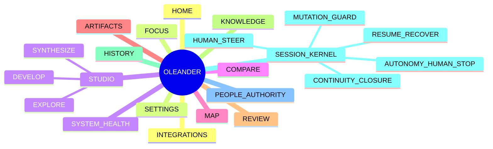

# OLEANDER Master PRD v0.3.0

[← v0.3 Package](README.md)

**Product:** OLEANDER Human–AI Design Operating System  
**Status:** `WORKING PRD / PRE-EXTERNAL-PILOT / NON-AUTHORITY`  
**Product Owner:** Jiaosong  
**Target release:** External Pilot — date TBD  
**Last updated:** 2026-09-26  
**Detailed functional baseline:** [PRD v0.2.0](../OLEANDER_DESIGN_COLLABORATION_PRD_v0.2.0.md)  
**Traceability:** [v0.2 Matrix](../OLEANDER_PRD_TRACEABILITY_MATRIX_v0.2.0.md)

---

## Graph-first product model

Detailed product-node definitions now live in the node graph:

- [Product Node Graph](nodes/README.md)
- [Visual Product Maps](maps/README.md)



**Document rule:** Master PRD owns scope, decisions, priorities and release contract. Each first-class product node owns its own behaviour document. Feature specs and traceability are downstream detail/provenance views.

---

# 0｜Document Control

| Item | Current state |
|---|---|
| Product decision owner | Product Owner / Jiaosong |
| Design owner | Product Owner / Design Author in current solo stage |
| Engineering owner | Unassigned for productized build |
| AI / Eval owner | Current candidate owner; future role unassigned |
| Security / Privacy owner | Unassigned |
| Domain professional approver | Per domain / not globally assigned |
| Launch approver | Not established |
| PRD status | Working |
| External pilot | Not started |
| Production launch | Not approved |

## Approval semantics

`APPROVED PRD` 未来只表示产品需求进入 build baseline。

它不等于：
- Current Architecture promotion；
- professional approval；
- Design KEEP；
- production launch；
- commercial validation。

---

# 1｜Decision Summary

## Decision to make

是否以以下 P0 loop 作为 OLEANDER v1 的唯一 launch-critical core：

```text
RESUME VERIFIED FRONTIER
→ FRAME / RECOVER CURRENT QUESTION
→ EXPLORE MATERIAL ALTERNATIVES
→ MAKE REAL EDITABLE ARTIFACT
→ READBACK
→ HUMAN STEER WHEN CONSEQUENTIAL
→ SECOND-ROUND DELTA
→ READBACK
→ CONTINUE NEXT SESSION
```

## Why this cut

它同时验证 OLEANDER 最核心的四个产品假设：
1. Project continuity 比 chat continuity 更有价值；
2. AI autonomy 可以在 Human authority 内提高效率；
3. design decision 需要真实 artifact，而不是文本建议；
4. readback / lineage 可以提升长期信任。

## Explicitly deferred

- team workspace；
- enterprise RBAC；
- monetization；
- broad cloud integrations；
- marketplace；
- large multi-agent UI；
- auto maturity scoring；
- generic AI critic score；
- every-domain professionalization。

---

# 2｜Problem Definition

## Problem statement

长期复杂设计项目中，AI 的局部能力很强，但协作可靠性不足：

> **系统无法稳定保持“当前要解决什么、什么是真的、什么能改、什么已经改变、用户真正决定了什么、下一次从哪里继续”。**

## Evidence maturity

| Evidence | Current maturity |
|---|---|
| Owner longitudinal use | OBSERVED |
| Multiple real design projects | OBSERVED |
| Repeated continuity / stale-state failures | OBSERVED |
| Interaction kernel fixtures | OBSERVED internally |
| Real-artifact candidate trials | OBSERVED internally |
| External target-user interviews | OPEN |
| External longitudinal pilot | OPEN |
| Market willingness-to-pay | OPEN |
| Large-scale retention | OPEN |

---

# 3｜Goals

## G1 Verified continuity
用户重新进入后能够恢复正确 frontier。

## G2 Useful autonomy
可逆、低风险、已授权工作不需要 Human 每一步确认。

## G3 Human control
高影响 value / authority / irreversible decision 保留给 Human。

## G4 Material exploration
候选真正改变 mechanism / relation / consequence。

## G5 Reality loop
重要 design claim 绑定真实 artifact / revision / readback。

## G6 Local recovery
失败只重开受影响范围。

## G7 Cross-domain portability
同一 interaction kernel 至少在两个不同专业领域成立，同时保留 domain-native process。

---

# 4｜Success Criteria

所有数值阈值在外部 pilot 前冻结。当前只定义 metric contract，不伪造目标。

## Launch-critical outcome

**VPCR — Verified Productive Continuation Rate**

满足以下全部条件的 eligible re-entry session：
1. frontier 被正确恢复；
2. Human 无需纠正关键 Current / artifact / decision object；
3. 至少一个 frontier-aligned next action 完成；
4. material artifact mutation 有 actual readback；
5. session 无 unauthorized action。

## Launch-blocking guardrails

必须满足：
- Unauthorized Action Rate = 0
- READ_ONLY Mutation Count = 0
- AI-owned Design KEEP Count = 0
- AI-owned Promotion Count = 0
- Unread Artifact Completion Claim Count = 0
- Known stale checkpoint material write = 0

---

# 5｜Primary User

## P0 Persona

**Independent / Lead Designer using AI for a multi-day professional project**

Characteristics：
- 每周多次使用 AI；
- project > single session；
- multiple artifacts / versions；
- meaningful professional judgment；
- wants AI to make progress, not just answer；
- wrong Current or wrong mutation has real cost。

## P1 Persona

Domain professional / integrator participating in a shared design project.

## Not initial target

- casual one-shot AI users；
- users seeking only image generation；
- teams needing only task/project management；
- users with no persistent artifact / decision workflow。

---

# 6｜Prioritized Use Cases

| Rank | Use Case | Why launch-critical | Scope |
|---|---|---|---|
| UC-01 | Resume long-running project | Core differentiation | P0 |
| UC-02 | Continue reversible work | Tests autonomy | P0 |
| UC-03 | Explore distinct directions | Tests design value | P0 |
| UC-04 | Human SELECT / MODIFY / MIX / REJECT / DEFER | Tests control | P0 |
| UC-05 | Real artifact + readback | Tests trust | P0 |
| UC-06 | Repair without reset | Tests continuity | P0 |
| UC-07 | Reframe problem | Tests design intelligence | P1 |
| UC-08 | Multi-domain change impact | Tests integration | P1 |
| UC-09 | Independent review | Tests quality system | P1 |
| UC-10 | Multi-human authority conflict | Higher complexity | P1 |
| UC-11 | Cross-project learning | Long-term leverage | P2 |
| UC-12 | Team / enterprise workspace | Scale layer | P2 |

---

# 7｜MVP Scope Contract

## IN

- Project Resume
- Current Design Question / Frontier
- Design Value / Constraint / Assumption distinction
- Material option exploration
- Compare mode
- typed/revisioned Human steering
- Native/editable artifact binding
- revision identity
- actual readback
- critique → action
- local revision scope
- reversible auto-advance
- mutation guard
- session reconstruction
- separated closure

## OUT

- full collaborative permissions UI
- commercial billing
- broad provider marketplace
- all cloud storage products
- autonomous validation
- professional certification
- universal domain process
- large-scale analytics dashboard
- generalized design quality score

## Cut-line rule

A feature enters P0 only if removing it makes one of these impossible:
- verified resume；
- meaningful Human steer；
- real artifact loop；
- safe reversible autonomy；
- reliable continuation。

---

# 8｜Product Experience Contract

## 8.1 First 30 seconds after project entry

User should understand:
- Current Question
- Current Direction
- Frontier
- Active Artifact
- Critical Open
- Next Action

User should not need:
- internal runtime namespace；
- governance layer names；
- agent logs；
- receipt schema。

## 8.2 When AI should act

Act automatically when:
- action is reversible；
- scope is known；
- owner rule permits；
- current carrier is fresh；
- no Human-only decision is crossed。

## 8.3 When AI should stop

Stop when:
- consequential referent ambiguous；
- Human-only value decision exposed；
- authority escalation；
- irreversible / external publish；
- specialist review required；
- multi-human rights conflict；
- no truthful artifact substitute；
- requested scope complete。

## 8.4 When user says “this is wrong”

System must:
1. preserve raw feedback；
2. avoid global preference inference；
3. inspect actual artifact；
4. form multiple cause hypotheses；
5. generate materially different repair directions where useful；
6. request steer only when Human choice is real。

---

# 9｜AI Behaviour Requirements

## AI-01 Grounding
Project-specific claims must derive from owner-native Current / evidence / artifact or be marked as inference.

## AI-02 State honesty
Unknown remains unknown.

## AI-03 Authority
Confidence does not grant authority.

## AI-04 Referential integrity
Consequential actions bind exact object + revision + lineage.

## AI-05 Action decomposition
Compound Human actions remain clause-scoped.

## AI-06 Autonomy
Reversible work may continue without repeated confirmation.

## AI-07 No silent preference learning
Session feedback does not become durable taste profile.

## AI-08 No false completion
Tool success / file existence / model response is not “done” without appropriate readback.

## AI-09 No forced convergence
Multiple viable directions may remain open.

## AI-10 Domain humility
OPEN professional process cannot produce professional PASS.

---

# 10｜Functional Requirement Baseline

The detailed 141 feature-level requirements remain in v0.2 Feature Specs.

For v0.3 release management they are grouped into release Epics:

| Epic | Product areas | Release priority |
|---|---|---|
| EP-01 Resume & Current | HOME / FOCUS / HISTORY / Session | P0 |
| EP-02 Explore & Compare | STUDIO / COMPARE | P0 |
| EP-03 Artifact Reality Loop | ARTIFACTS / REVIEW | P0 |
| EP-04 Human Control | Session Kernel / PEOPLE | P0 |
| EP-05 Local Recovery | MAP / REVIEW / HISTORY | P0 |
| EP-06 Knowledge Boundaries | KNOWLEDGE / FOCUS | P1 |
| EP-07 Domain Integration | MAP / Domain Adapter | P1 |
| EP-08 Independent Review | REVIEW | P1 |
| EP-09 Designer Development | Session / Learning | P1 |
| EP-10 Cross-project Learning | HISTORY / KNOWLEDGE | P2 |

---

# 11｜Acceptance Standard

Every P0 Epic must define:

```text
USER SCENARIO
PRECONDITION
OWNER-NATIVE INPUT
ACTION
VISIBLE RESULT
MUTATION
READBACK
FAILURE MODE
GUARDRAIL
EVENTS
PASS / HOLD CRITERIA
```

Detailed acceptance is linked rather than duplicated.

---

# 12｜Analytics Requirements

Telemetry must:
- link events to project / session / object identity without becoming authority；
- support session outcome reconstruction；
- distinguish product behaviour from design truth；
- capture correction / clarification / stop / block；
- connect resume events to downstream productive outcome；
- support privacy minimization before external pilot。

Required launch telemetry:
- resume start / resolve / correction
- action classification
- Human stop
- mutation guard
- artifact revision
- readback
- Human steer
- second-round outcome
- session close
- continuation outcome

Metric definitions: [Metrics & Experimentation](OLEANDER_METRICS_EXPERIMENTATION_v0.3.0.md).

---

# 13｜Non-functional Requirements

## NFR-01 Reliability
No known stale state may silently authorize material mutation.

## NFR-02 Recoverability
Session / plugin / worker failure must not destroy owner-native project truth.

## NFR-03 Performance
Resume should provide a useful progressive result before deep trace resolution completes. Exact latency budget TBD after prototype measurement.

## NFR-04 Privacy
External pilot requires explicit data inventory, retention, access and connector scope review.

## NFR-05 Security
External side effects require explicit authorization model and least-privilege connector/tool scope.

## NFR-06 Observability
Material action path must be diagnosable without requiring user to inspect raw internal logs.

## NFR-07 Accessibility
Future UI surfaces require accessibility acceptance criteria before public product launch; not yet specified.

## NFR-08 Cost
Model/tool cost per productive continuation must be observable before scaled pilot. Budget TBD.

## NFR-09 Portability
Core project continuity cannot depend on one chat surface.

## NFR-10 Degraded Operation
Missing tool / integration reduces claim and capability, not truthfulness.

---

# 14｜Dependencies

Launch-critical:
- reliable owner-native Current resolver
- artifact identity / revision
- readback surface
- Human action parser
- mutation guard
- telemetry
- at least one authentic domain workflow
- external pilot recruitment

Non-launch-critical:
- cloud storage breadth
- team workspace
- broad third-party connectors
- advanced dashboards

Full dependency register: [Risk, Dependency & RACI](OLEANDER_RISK_DEPENDENCY_RACI_v0.3.0.md).

---

# 15｜Rollout Strategy

## Stage 0 Internal Reference
Owner-led real projects + fixtures.

## Stage 1 Closed Design Pilot
Small external cohort, one primary domain + one transfer domain.

## Stage 2 Longitudinal Pilot
Multi-week re-entry, continuity and failure recovery.

## Stage 3 Multi-human Pilot
Designer / client / specialist / reviewer rights.

## Stage 4 Productized Beta
Only after security, privacy, support and operational readiness.

No stage automatically implies Current Architecture promotion.

---

# 16｜Go / Hold / No-Go

## GO to next pilot stage only if
- current stage exit criteria pass；
- no launch-blocking guardrail violation；
- key telemetry complete；
- unresolved risk has owner and bounded exposure；
- Human feedback supports continuation of hypothesis。

## HOLD if
- data insufficient；
- key dependency unavailable；
- security/privacy owner missing for external data；
- external pilot cannot truthfully exercise core artifact loop。

## NO-GO / Reframe if
- continuity is not valued；
- structure overhead exceeds recovered value；
- users reject Human-stop/autonomy model；
- real-artifact integration is not viable；
- domain portability fails repeatedly。

Detailed status: [Launch Readiness Review](OLEANDER_LAUNCH_READINESS_REVIEW_v0.3.0.md).

---

# 17｜Open Decisions

| ID | Decision | Owner | Needed before |
|---|---|---|---|
| OD-01 | First external beachhead domain | Product | pilot recruitment |
| OD-02 | Pilot user count / sample design | Product / Research | experiment freeze |
| OD-03 | Minimum UI surface vs Chat-first | Product / Design | prototype |
| OD-04 | Telemetry data retention | Product / Privacy | external pilot |
| OD-05 | Model/provider fallback | AI / Eng | longitudinal pilot |
| OD-06 | Artifact integration depth | Product / Eng | build scope |
| OD-07 | Pilot success thresholds | Product / Analytics | pilot start |
| OD-08 | Support / incident model | Product / Ops | beta |
| OD-09 | Pricing / business model | Product / Business | post-value validation |

---

# 18｜Source of Truth

Product definition hierarchy:

```text
Working Backwards Brief
→ Master PRD
→ v0.2 Feature Specs
→ Traceability Matrix
→ Metrics / Experiments
→ Roadmap
→ Launch Readiness
```

Architecture / Project Truth hierarchy remains owned by OLEANDER governance/runtime and is not changed by this PRD.