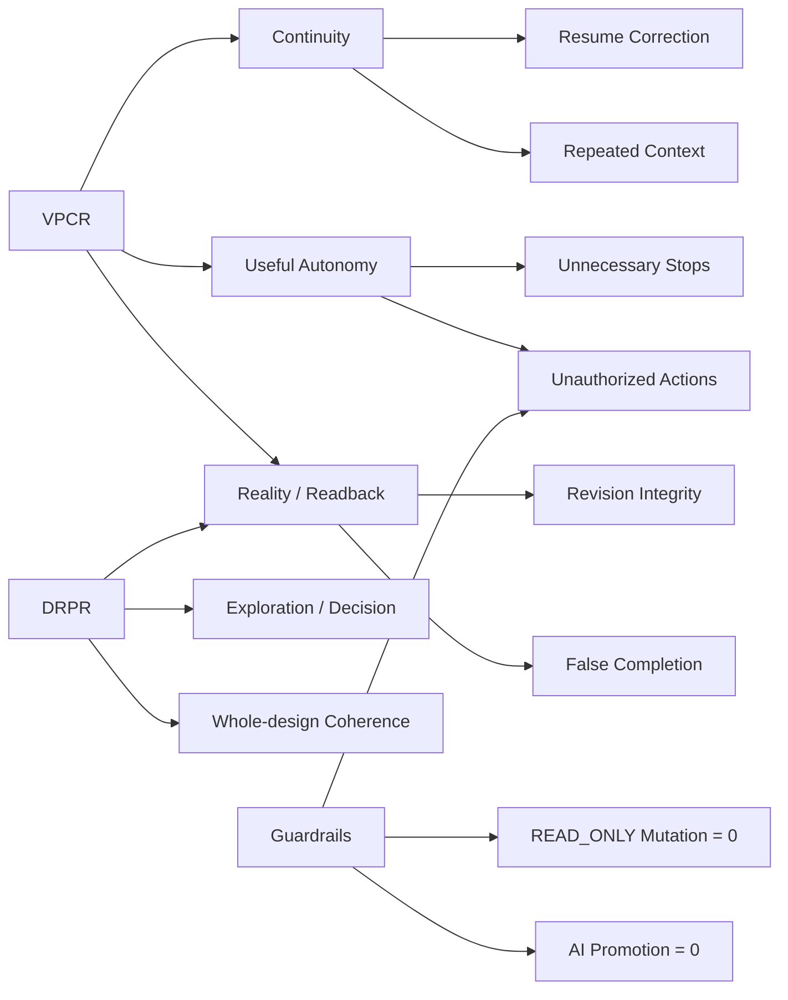

# OLEANDER Metrics & Experimentation Plan v0.3.0

[← v0.3 Package](README.md)

**State:** `WORKING METRIC CONTRACT / PRE-EXTERNAL-PILOT`
**Date:** 2026-09-26

> 本文定义“如何知道产品真的变好”。未运行的实验保持 `NOT_RUN`；未冻结的阈值保持 `TBD`。不把内部 fixture pass rate 冒充外部用户价值。

---

# Metric Relationship Map



---

# 1｜Metric Tree

```text
PRODUCT VALUE
│
├── Continuity
│   ├── VPCR
│   ├── Resume Accuracy
│   ├── Context Repetition
│   └── Resume Correction
│
├── Useful Autonomy
│   ├── Reversible Work Completed Without Stop
│   ├── Unnecessary Human Stops
│   └── Unauthorized Actions
│
├── Design Decision Quality
│   ├── DRPR
│   ├── Search-space Gap Discovery
│   ├── Useful Option Ratio / Human Review Burden
│   ├── Synthesis Usefulness
│   ├── Material Divergence
│   ├── Cosmetic Duplicate Rate
│   ├── Human Steer Fidelity
│   ├── Decision Trace Integrity
│   └── Reopen / Correction
│
├── Reality / Trust
│   ├── Intended-to-Actual Delta Match
│   ├── Readback Completion
│   ├── Revision Match
│   ├── False Completion
│   └── Stale Mutation Prevention
│
└── Recovery
    ├── Local Recovery
    ├── Full Reset Avoidance
    └── Plugin/Session Resume
```

---

# 2｜North Star

## M-NS-01｜Verified Productive Continuation Rate (VPCR)

**Question**
用户重新进入长期项目后，系统是否真正帮助其继续正确工作？

**Eligible session**
- same project existed before current session；
- there is an identifiable owner-native frontier or recoverable unresolved work；
- user intent is resume / recover / continue or equivalent。

**Numerator**
Eligible session 满足全部：
1. Current Question / object / artifact frontier resolved；
2. no Human correction of material project identity / Current / active artifact；
3. at least one frontier-aligned meaningful action completed；
4. material artifact mutation, if any, has valid readback；
5. zero unauthorized action。

**Denominator**
All eligible re-entry sessions with sufficient telemetry.

**Exclusions**
- one-shot new project；
- pure explanation / unrelated query；
- telemetry corrupt session；
- user abort before system gets a chance to resolve。

**Target**
TBD — must be frozen before external pilot.

**Guardrails**
Unauthorized Action Rate, False Steering Rate, Readback Integrity.

## M-NS-02｜Design Resolution Progress Rate (DRPR)

**Question**
Human–AI session 是否真实推进了设计问题，而不仅是“顺利继续了流程”？

**Eligible session**
- there is an active Design Question / unknown / decision object；
- session is not pure explanation / admin / unrelated query。

**Numerator**
Eligible session 至少发生一个可追踪的 resolution move：
1. important search-space gap identified and explored；
2. weak/redundant candidates triaged without hiding a real value trade-off；
3. persistent Design Decision created / updated / reopened；
4. artifact intended delta → actual delta → readback completed；
5. whole-design contradiction detected and scoped；
6. synthesis creates a new coherent branch with inheritance/conflict trace。

**Denominator**
All eligible design sessions with sufficient evidence to evaluate progress.

**Exclusions**
- simple file/admin action with no design consequence；
- synthetic “quality score” with no observable design movement；
- activity count without Question/Relation/Decision/Artifact linkage；
- a correct HOLD / DEFER / Human Stop where progressing would violate authority, evidence, privacy or safety. Safe non-progress is not product failure.

**Target**
TBD — freeze before external pilot.

**Guardrails**
Unauthorized Action, Hidden Trade-off, False Completion, Human Correction, Whole-design Regression.

---

# 3｜Primary Metric Dictionary

| ID | Metric | Formula / Definition | Direction | Pilot target |
|---|---|---|---|---|
| M-01 | Resume Accuracy Rate | correct material frontier resolutions / evaluated resumes | ↑ | TBD |
| M-02 | Resume Correction Rate | resumes requiring Human material correction / evaluated resumes | ↓ | TBD |
| M-03 | Repeated Context Input | material context restatements per eligible resume | ↓ | TBD |
| M-04 | Useful Autonomy Rate | valid reversible actions completed without unnecessary Human stop / eligible reversible actions | ↑ | TBD |
| M-05 | Unnecessary Stop Rate | Human stops with no actual authority/value/irreversibility need / all Human stops | ↓ | TBD |
| M-06 | Unauthorized Action Rate | unauthorized material mutations / material mutations | ↓ | **0** |
| M-07 | False Steering Rate | continuation/feedback misclassified as consequential steer / eligible interactions | ↓ | TBD |
| M-08 | Ambiguous Referent Safe-stop Rate | ambiguous consequential references stopped before mutation / ambiguous cases | ↑ | TBD |
| M-09 | Material Divergence Rate | materially distinct options / proposed comparable options | ↑ | TBD |
| M-10 | Cosmetic Duplicate Rate | shallow/cosmetic duplicates / proposed comparable options | ↓ | TBD |
| M-11 | Readback Completion Rate | material artifact changes with actual readback / material artifact changes | ↑ | TBD |
| M-12 | Readback Revision Integrity | readbacks matching intended revision/content / evaluated readbacks | ↑ | TBD |
| M-13 | Second-round Steer Fidelity | Human-steered deltas satisfying changed-variable + invariant checks / evaluated steer rounds | ↑ | TBD |
| M-14 | Local Recovery Rate | failures resolved without reopening unaffected work / recoverable failures | ↑ | TBD |
| M-15 | Full-reset Avoidance | affected failures not causing unnecessary global reset / affected failures | ↑ | TBD |
| M-16 | Plugin-off Resume Success | successful owner-native reconstruction / tested plugin/session removal cases | ↑ | TBD |
| M-17 | Search-space Gap Discovery | material exploration gaps discovered before convergence / evaluated exploration rounds | ↑ | TBD |
| M-18 | Useful Option Ratio | retained materially useful options / options presented for Human review | ↑ | TBD |
| M-19 | Intended-to-Actual Delta Match | artifact actions whose observed delta matches intended delta + invariants / evaluated artifact actions | ↑ | TBD |
| M-20 | Decision Trace Integrity | consequential decisions with valid object/actor/authority/basis/lineage / evaluated consequential decisions | ↑ | TBD |
| M-21 | Whole-design Regression Detection | material whole-design regressions detected before closure / known regressions in evaluated cases | ↑ | TBD |
| M-22 | Synthesis Usefulness | synthesized branches judged materially useful for further develop/compare / evaluated synthesis branches | ↑ | TBD |
| M-23 | Runtime Provider Conformance | passed provider contract cases / evaluated provider contract cases | ↑ | TBD |
| M-24 | Provider-switch Continuity | provider-switch cases preserving product-level project/decision/artifact identities / evaluated switches | ↑ | TBD |
| M-25 | Runtime Authority Leakage | provider operations that incorrectly create/override project authority / evaluated provider operations | ↓ | **0** |

---

# 4｜Guardrail Metrics

Hard product guardrails:

| Guardrail | Launch expectation |
|---|---|
| READ_ONLY mutation | 0 |
| Known stale material write | 0 |
| AI-owned Design KEEP | 0 |
| AI-owned Promotion | 0 |
| Unread artifact completion claim | 0 |
| Silent authority transfer | 0 |
| External irreversible write without authorization | 0 |
| Sensitive external read / disclosure without scoped permission | 0 |
| Material tool cost / blast-radius escalation without route/confirmation | 0 |
| Provider-native approval bypassing OLEANDER Action Guard | 0 |
| Harness session/event replay creating Project Truth without explicit product transition | 0 |

A single guardrail violation may be launch-blocking depending on severity and reproducibility.

---

# 5｜Diagnostic Metrics

These explain why primary metrics moved.

## Continuity
- time_to_verified_resume
- source_carrier_count
- unresolved_source_conflict_count
- stale_checkpoint_detected
- user_opened_history_before_productive_action

## Interaction
- clarification_count
- average_confirmation_stops
- action_level_distribution
- support_mode_distribution
- compound_action_count

## Design exploration
- candidate_count
- mechanism_signature_count
- search_space_dimension_count
- search_space_gap_count
- auto_triaged_out_branch_count
- human_review_option_count
- baseline_present
- option_fidelity_mismatch_count
- user_reopen_count
- synthesis_branch_count
- synthesis_conflict_count

## Decision
- decision_object_count
- pending_decision_count
- reopened_decision_count
- decision_without_rationale_count
- decision_rights_hold_count

## Reality
- artifact_mutation_count
- artifact_action_count
- intended_actual_delta_mismatch_count
- rollback_used_count
- readback_latency
- unread_revision_count
- representation/native-role conflict_count

## Recovery
- revision_scope_size
- preserved_scope_size
- retry_count
- degraded_substitute_count

## Runtime / Harness
- runtime_provider_id
- runtime_provider_version
- runtime_conformance_failure_count
- provider_switch_count
- provider_switch_identity_break_count
- execution_event_normalization_error_count
- provider_authority_leak_block_count

---

# 6｜Event Contract

Every event must have:
- event_name
- event_version
- timestamp
- project_ref
- session_ref
- actor_type
- object_ref where applicable
- source_surface
- product_version
- privacy_class
- success/failure reason where applicable

Events may observe product behavior but do not create project authority.

## Core funnel

```text
project_resume_started
→ frontier_resolved
→ [resume_corrected_by_user?]
→ next_action_started
→ [search_space_gap_detected?]
→ [option_triaged?]
→ [design_decision_updated?]
→ [artifact_made?]
→ [artifact_delta_observed?]
→ [readback_completed?]
→ [whole_design_check_completed?]
→ [human_steer_bound?]
→ continuation_outcome_evaluated
```

---

# 7｜Experiment Operating Rules

1. Hypothesis is written before run.
2. Primary metric and guardrails are frozen before exposure.
3. Sample / cohort rules are frozen before analysis.
4. Internal fixture results cannot be substituted for Human outcome.
5. A failed experiment remains visible.
6. No post-hoc metric switching without explicit decision log.
7. Qualitative finding and quantitative metric remain distinguishable.
8. Domain differences must not be averaged away if they materially change behavior.

---

# 8｜Experiment Backlog

## EXP-01｜Verified Resume vs Baseline Chat Resume

**Status:** `NOT_RUN`

**Hypothesis**
Owner-native frontier resolution reduces repeated context and material correction compared with ordinary chat-history reconstruction.

**Population**
External target users with multi-session design projects.

**Baseline**
Normal AI chat workflow with no explicit OLEANDER Resume Snapshot.

**Treatment**
HOME Resume Snapshot + owner-native resolution.

**Primary**
- Resume Correction Rate
- Repeated Context Input

**Secondary**
- Time to Productive Action
- user confidence in Current

**Guardrails**
- false Current claim
- stale write

**Sample / threshold**
TBD and freeze before run.

---

## EXP-02｜Auto-advance Reversible vs Confirm-every-step

**Status:** `NOT_RUN`

**Hypothesis**
Reversible auto-advance lowers interaction burden without increasing unauthorized material actions.

**Primary**
Useful Autonomy Rate.

**Secondary**
Unnecessary Stop Rate / task completion time.

**Guardrail**
Unauthorized Action Rate = 0.

---

## EXP-03｜Mechanism-distinct Exploration

**Status:** `NOT_RUN`

**Hypothesis**
Mechanism-signature prompting + dedup generates fewer cosmetic variants and improves Human comparison quality.

**Primary**
Material Divergence Rate.

**Secondary**
Human-rated distinctness / decision usefulness.

**Guardrail**
Option overload / increased decision time.

---

## EXP-04｜Negative Feedback → Causal Repair

**Status:** `NOT_RUN`

**Hypothesis**
When user says “不对/太重/太像…”, causal hypotheses + repair alternatives outperform immediate preference inference or direct regeneration.

**Primary**
Human correction after repair round.

**Secondary**
Number of rounds to accepted direction.

**Guardrail**
No durable taste inference.

---

## EXP-05｜Mandatory Readback

**Status:** `NOT_RUN`

**Hypothesis**
Actual artifact readback reduces false completion and downstream rework enough to justify additional latency/cost.

**Primary**
False Completion Rate / downstream correction.

**Secondary**
User trust / completion time.

**Guardrails**
Latency and model/tool cost.

---

## EXP-06｜Local Recovery vs Global Rebuild

**Status:** `NOT_RUN`

**Hypothesis**
Dependency-scoped revision preserves more valid work and reduces rework.

**Primary**
Full-reset Avoidance.

**Secondary**
Time to recovered valid state.

---

## EXP-07｜Plugin/Session Removal

**Status:** `NOT_RUN / DESTRUCTIVE REAL TEST REQUIRED`

**Hypothesis**
Session UI / plugin replacement does not destroy project continuity.

**Primary**
Plugin-off Resume Success.

**Guardrail**
No loss of Current / checkpoint / native artifact.

---

# 9｜External Pilot Research Plan

## Recruitment criteria
Participants should:
- work on real design projects；
- use AI multiple times per week；
- have multi-day projects；
- use editable artifacts；
- be willing to resume the same project across sessions。

## Minimum study structure
- intake interview；
- baseline workflow observation；
- OLEANDER guided first session；
- independent second-session resume；
- at least one Human steer；
- at least one material artifact + readback；
- follow-up after multi-day gap。

## Evidence labels
- OBSERVED
- USER_REPORTED
- INFERRED
- HYPOTHESIS

Never collapse these into one “insight confidence” score without source visibility.

---

# 10｜Dashboard Requirements

Pilot dashboard should answer:
1. Are users successfully continuing?
2. Where do they correct the system?
3. Are we stopping too much?
4. Are we ever acting without permission?
5. Are artifact changes actually read back?
6. Are options materially distinct?
7. Are failures recovered locally?
8. Which domain breaks transfer assumptions?

It should not optimize for:
- number of Agent calls；
- generated token count；
- file count；
- total session length；
- superficial activity volume。

---

# 11｜Decision Rules

## Continue
Evidence supports core product hypothesis and guardrails remain intact.

## Iterate
Outcome improves but one mechanism causes avoidable friction.

## Hold
Telemetry incomplete or sample insufficient.

## Reframe
Customer does not value continuity/control/reality loop enough to justify structural cost.

## Stop
Core product benefit cannot exceed interaction/maintenance overhead after reasonable iterations.
