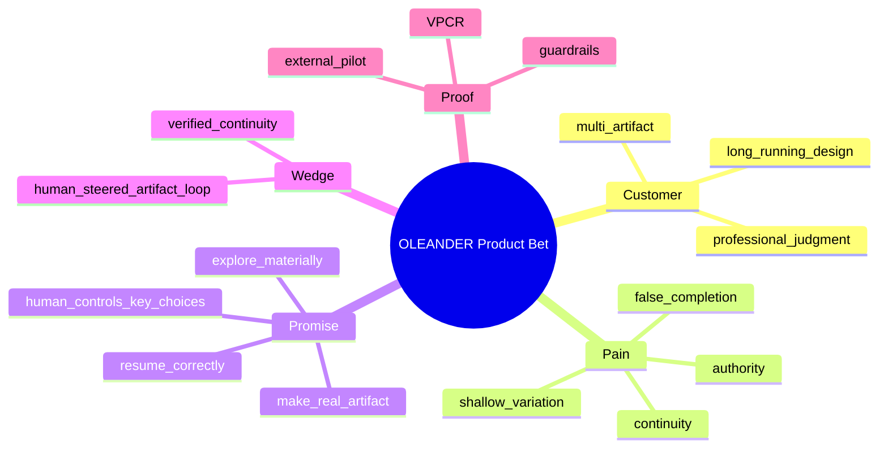

# OLEANDER Product Brief + Working Backwards FAQ v0.3.0

[← v0.3 Package](README.md)

**State:** `WORKING BACKWARDS / INTERNAL PRODUCT DEFINITION / NON-LAUNCH CLAIM`
**Date:** 2026-09-26
**Product Owner:** Jiaosong

> 本文是 Working Backwards 产品定义材料，不是对外发布公告，不表示产品已经商业上线。

---

# Product Strategy Map



---

# 1｜One-page Product Brief

## Customer

第一优先用户：

> **需要持续数天、数周或数月，与 AI 一起完成复杂专业设计工作的设计负责人 / 设计师。**

候选验证领域：
- Architecture / Spatial
- Digital Product / HCD
- Physical Product

External Pilot 的单一 beachhead domain 仍为 **OPEN / TO SELECT**；不能把三个候选领域同时写成已经确定的首发市场切口。

后续扩展：
- Visual / Brand / CMF
- Multidisciplinary Design
- Complex knowledge work

## Customer Problem

现有 AI Chat 在长期设计项目中通常出现：

1. 新会话无法可靠恢复真正 Current；
2. 项目状态散落在聊天、文件、工具、模型记忆中；
3. AI 要么太被动，要么越权；
4. 方案多但 mechanism 差异弱；
5. AI 往往直接生成候选，却不会判断 search space 是否覆盖关键机制，也不会先替 Human 去除明显弱/重复方案；
6. 真实 editable artifact 与讨论脱节，设计意图与实际 artifact delta 之间缺少可核对的 make/edit contract；
7. tool success 被误认为 design success；
8. 事实、推断、假设、设计判断混淆；
9. 多专业 change impact 不透明；
10. 失败后容易全局重做；
11. 用户必须承担大量 orchestration / context reconstruction。

## Customer Promise

> **重新进入项目时不用重新解释；面对新 brief 时能形成真实 Design Situation；探索时 AI 先理解 search space、主动形成并筛选真正不同的方向；需要时能综合出新的 coherent direction；制作时进入真实 artifact 并核对 intended/actual delta；需要决定时把真实 trade-off 交给人；执行之后必须 read back；下一次还能准确继续。**

## Product Bet

如果 OLEANDER 能可靠维护：

```text
Design Question
+ Design Value
+ Design Relation
+ Search Space
+ Design Decision
+ Native Artifact
+ Artifact Action / Delta
+ Human Decision Boundary
+ Readback
+ Continuity
```

那么长期 Human–AI 协作的核心瓶颈会从“Prompt 写得好不好”转变为“项目能否持续推进”。

## Why Now

- 通用模型已经具备研究、生成、代码、视觉、分析和工具调用能力；
- 当前主要失败不再只是模型“不会做”，而是长期状态、权限、continuity、evaluation 与 real-artifact integration；
- Agent 化提高了自动化能力，也同步放大了错误写入、错误 referent、错误 authority 和 false completion 风险；
- 专业设计工作天然跨文件、跨工具、跨专业、跨时间，适合验证长期 Human–AI collaboration。

## Product Differentiation

OLEANDER 不与 CAD / BIM / Figma / IDE 争夺 authoring surface。

它的差异化在于：

> **把设计判断、关系、真实产物、Human authority、证据和长期 continuity 连成一个协作系统。**

## Product Outcome Pair

**Verified Productive Continuation Rate (VPCR)**

用户重新进入长期项目后：
1. 系统恢复正确 frontier；
2. 用户无需纠正关键状态；
3. 本次 session 至少完成一个与 frontier 一致的 material next step；
4. 如果产生 artifact change，存在有效 readback。

VPCR 回答“**能不能正确继续**”，但不能单独代表 Human–AI Co-Design 的产品价值。

**Design Resolution Progress Rate (DRPR)**

eligible design session 中，至少一个 materially important Design Question / unknown / decision object 获得可追踪的真实推进，例如：
1. search-space gap 被发现并形成新的 materially distinct direction；
2. weak/redundant option 被合理 triage，Human attention 聚焦到真实 trade-off；
3. consequential Design Decision 被建立/更新；
4. real artifact intended delta → actual delta → readback 形成闭环；
5. whole-design check 发现并处理局部优化造成的新矛盾。

DRPR **不是 Design Quality Score**，也不允许 AI 用单一分数宣称设计“更好”。

## Current Stage

- Product definition: v0.3.2 working content baseline
- Candidate implementation: v0.3.1-era candidate available; **v0.3.2 content → system alignment OPEN**
- Internal deterministic evaluation: substantial
- Real artifact trials: available
- External user validation: insufficient / OPEN
- Commercial validation: OPEN
- Launch readiness: HOLD

---

# 2｜Product Tenets

## T1 Customer work before system administration
用户首先看到当前设计问题和下一动作，而不是治理结构。

## T2 Project State before conversation memory
Chat memory 可以辅助，不拥有项目 truth。

## T3 Real artifact before assertion
“做了”必须能回到真实 artifact / readback。

## T4 Human authority before maximum automation
自动化最大化不是目标；可信自动化才是。

## T5 Material alternatives before cosmetic variants
方案必须改变机制、关系或 consequence。

## T6 Local recovery before global reset
失败只重开真实受影响范围。

## T7 Domain authenticity before universal workflow
跨领域共享 interaction kernel，不统一专业过程。

## T8 Progress means design resolution
任务数量、文件数量、Agent activity 不代表设计成熟度。

## T9 Evidence limits claim
缺证据降低 claim ceiling，不制造 certainty。

## T10 Reuse before Skill proliferation
优先 compose / parameterize / refactor / benchmark。

---

# 3｜Alternatives Customers Use Today

| Alternative | What it does well | Structural gap for this problem |
|---|---|---|
| General AI Chat | 快速问答、生成、分析 | Conversation ≠ durable Project State |
| Authoring tools | 真实生产、编辑、专业能力 | 不维护跨工具设计判断与 AI collaboration |
| PM / Task tools | 责任、任务、时间管理 | Task closure ≠ design resolution |
| Knowledge bases | 文档沉淀、检索 | Knowledge existence ≠ design applicability |
| Workflow automation | 重复流程、集成 | Rule execution ≠ human design judgment |
| File/version systems | 文件历史、版本 | File history ≠ decision / relation history |
| Design review meetings | 真实专业判断 | rationale / action / continuity 易散失 |

产品机会不是替换这些工具，而是连接它们之间缺失的“设计工作语义”。

---

# 4｜Working Backwards Narrative

## Customer before

一个设计师使用通用 AI 做复杂项目。第一天效果很好；几天后，新会话不知道哪个方案有效、哪个文件是 Current。设计师反复解释背景。AI 根据最后一句话错误理解“继续”，或过早选择方向。它给出多个看似不同的方案，却没有判断 search space 是否真的被覆盖，也不会先淘汰弱/重复方向。生成结果看起来完成，但没有进入 CAD / HTML / model 的真实 editable source，或者没有说明 intended delta 与 actual delta。工具调用成功后，系统说“完成”，设计师仍必须自己重新检查。

## Customer after

设计师进入 OLEANDER，只看到：
- Current Design Question；
- Current Direction / Active Direction Set；
- Current Frontier；
- Active Artifact；
- Critical Open；
- Next High-value Action。

AI 在低风险、可逆范围继续探索和制作；它先检查重要 search-space gap、去除明显弱/重复候选，需要时从多个方向形成新的 synthesis。当出现真正需要价值判断的 trade-off 时才停止。用户可以说“选 B”“不要 A，结合 B/C”“这个不对”。系统把这些话绑定到持续存在的 Design Decision 与明确 revision / lineage。修改时记录 intended delta，执行后核对 actual delta，再重新打开真实 artifact 做 readback，并回到 whole-design check。第二天重新进入时，项目从 owner-native frontier 继续，而不是从聊天历史猜。

## Delight Moment

> 用户第一次在新的会话里只说“继续”，系统先准确 RESUME 项目，再沿恢复后的 frontier CONTINUE 正确下一步，而不需要用户重新解释“我们上次做到哪里”。

---

# 5｜Internal FAQ

## Q1｜为什么不是把 ChatGPT Memory 做得更强？

Memory 适合保存偏好和长期背景，但专业项目需要：
- explicit Current；
- revision identity；
- authority；
- supersession；
- artifact binding；
- decision lineage；
- verification / validation；
- rollback / reopen。

**User memory ≠ Project State。**

## Q2｜为什么不做一个全自动设计 Agent？

因为设计包含：
- value choice；
- professional responsibility；
- irreversible consequence；
- client / specialist conflict；
- incomplete evidence。

OLEANDER 追求 **Autonomy × Control**，不是 autonomous-at-all-costs。

## Q3｜为什么不直接把所有工作都放到 OLEANDER 里？

因为 CAD、BIM、Figma、IDE、simulation、manufacturing 等已经是专业 authoring system。

OLEANDER 应维护：
- semantic intent；
- relation；
- artifact identity；
- readback；
- decision / evidence；

而不是复制所有 authoring capabilities。

## Q4｜产品最重要的 MVP 假设是什么？

> **如果系统能正确恢复 Design Question / Relation / Artifact frontier，并能主动发现探索空白、筛掉弱方案、形成真实 Design Decision、完成 Human-steered artifact delta + readback，用户是否明显减少 orchestration/context reconstruction，同时获得更有效的设计推进？**

## Q5｜为什么现在不能宣称已经 Product-Market Fit？

当前证据主要来自：
- owner-driven real projects；
- internal fixtures；
- regression；
- real-artifact trials；
- independent technical/governance review。

缺少：
- 外部目标用户 cohort；
- longitudinal retention；
- willingness-to-pay；
- scaled support burden；
- commercial usage telemetry。

## Q6｜第一批外部用户应该是谁？

不是所有 AI 用户。

优先：
- 正在做真实复杂项目；
- 每周多次使用 AI；
- 项目跨多天 / 多文件；
- 有明确 professional judgment；
- 对错误 Current / unauthorized mutation 有真实成本；
- 能提供真实 artifact / workflow feedback 的设计者。

## Q7｜什么会让我们停止做当前方向？

出现以下任一结果需要 reframe：

1. 用户并不认为跨会话 continuity 是核心痛点；
2. Resume 的额外结构负担高于重新解释上下文的成本；
3. 用户更希望 AI 只作为临时 ideation tool；
4. Design Relation / Map 的维护成本过高且无法被系统自动吸收；
5. Human stop / authority 机制显著降低效率且不能通过 progressive disclosure 改善；
6. real-artifact integration 成本使产品无法形成可持续价值。

## Q8｜什么是 v1 的“成功”，不是“做完”？

至少需要：
- VPCR 达到预先冻结的 pilot threshold；
- Unauthorized Action Rate = 0；
- Human corrections 明显低于 baseline workflow；
- 至少两个 domain 证明同一 interaction model 可复用；
- Human-steered second round 可稳定形成真实 delta + readback；
- Search Space / AI Triage 不把 Human attention 浪费在明显重复或无效候选上；
- 至少一类真实项目能证明 synthesis / whole-design check 对设计推进有实际价值；
- plugin/session replacement 不破坏 Current；
- pilot 用户愿意在下一项目继续使用。

阈值在外部 pilot 前冻结，当前不伪造具体百分比。

---

# 6｜Top Assumptions to Validate

| ID | Assumption | Risk if false | Validation |
|---|---|---|---|
| A-01 | Long-term continuity is a top pain | Product premise weak | interviews + baseline task |
| A-02 | Users accept explicit Current/Frontier semantics | UX burden too high | prototype test |
| A-03 | Auto-advance reversible work increases value | AI feels unsafe / annoying | controlled workflow test |
| A-04 | Material alternatives improve design decisions | More work, no better decisions | compare study |
| A-04B | Search-space mapping + AI triage reduces Human review burden without hiding real trade-offs | AI overfilters / misses novelty | blinded option review |
| A-04C | Synthesis creates useful emergent directions beyond simple MIX | added complexity, no design value | synthesis compare study |
| A-05 | Mandatory readback increases trust enough to justify latency | UX becomes slow | task completion study |
| A-06 | Relation/dependency semantics can be mostly system-maintained | Map becomes admin burden | longitudinal pilot |
| A-07 | Cross-domain kernel transfers without flattening domains | universalism failure | ≥2 domain exercise |
| A-08 | Users value project recovery enough to return | no retention signal | longitudinal cohort |

---

# 7｜Non-goals

Not v1:
- replace professional authoring tools；
- fully autonomous design；
- universal professional stage model；
- auto award Design KEEP；
- auto Promotion；
- enterprise org suite；
- generic AI marketplace；
- massive Skill catalog；
- permanent psychological / competence profiling；
- claims of professional compliance without qualified evidence。

---

# 8｜Decision Requested

当前产品团队需要继续验证的核心 decision：

> **是否将“Verified Project Continuity + Human-steered Real Artifact Loop”作为 OLEANDER v1 的第一产品楔子，而把 Team、Cloud、Marketplace、Large-scale Agent Orchestration 延后？**

Current recommendation in this working document: **maintain this as the working product hypothesis until external pilot evidence challenges it.**

这不是 Promotion 或 Current Architecture 决定。
