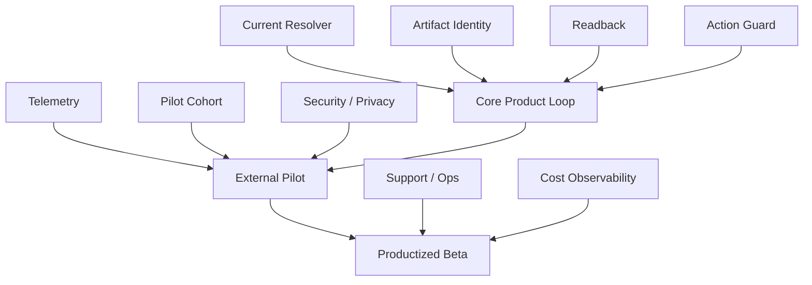

# OLEANDER Risk, Dependency & RACI v0.3.0

[← v0.3 Package](README.md)

**State:** `WORKING PRODUCT OPERATIONS BASELINE`

> 当前项目仍以 Product Owner 主导。未实际存在的团队角色明确标为 `UNASSIGNED`，不伪造组织配置。

---

# Dependency / Risk Map

---

# 1｜RACI Roles

| Role | Current assignment |
|---|---|
| Product Owner | Jiaosong |
| Product Design / UX | Jiaosong / current owner stage |
| Engineering Lead | UNASSIGNED |
| AI / Evaluation Lead | current candidate owner; productized role UNASSIGNED |
| Domain Professional | per project / per domain |
| Security / Privacy | UNASSIGNED |
| Analytics / Research | Product Owner currently; specialist UNASSIGNED |
| Operations / Support | UNASSIGNED |
| GTM / Business | UNASSIGNED |
| Launch Approver | NOT ESTABLISHED |

---

# 2｜RACI Matrix

Legend: R Responsible / A Accountable / C Consulted / I Informed.

| Decision / Workstream | Product | Design | Eng | AI/Eval | Domain | Sec/Privacy | Ops |
|---|---|---|---|---|---|---|---|
| Product vision | A/R | C | I | C | C | I | I |
| P0 scope | A/R | C | C | C | C | I | I |
| UX interaction | A | R | C | C | C | I | I |
| Model behaviour | A | C | C | R | C | I | I |
| Action guard | A | C | R | R | C | C | I |
| Domain professional claim | I | C | I | I | A/R | I | I |
| Artifact integration | A | C | R | C | C | I | I |
| Telemetry | A | C | R | C | I | C | I |
| Privacy / retention | C | I | C | I | I | A/R | I |
| External pilot | A/R | R | C | C | C | C | I |
| Incident response | A | I | R | C | C | C | R |
| Production launch | C | C | C | C | C | C | C; A not yet assigned |

---

# 3｜Launch-critical Dependencies

## D-01 Owner-native Current Resolver
**Why:** Resume and mutation safety depend on it.
**Failure:** wrong Current / wrong object / stale write.
**Owner:** Product + Eng.
**Status:** candidate mechanisms exist; productized dependency OPEN.

## D-02 Artifact Identity + Revision
**Why:** Human steering / review / readback must target exact artifact.
**Failure:** wrong-version review or mutation.
**Owner:** Eng + Product.
**Status:** candidate semantics exist.

## D-03 Readback Surface
**Why:** false completion prevention.
**Failure:** tool success masquerades as design success.
**Owner:** Product / Eng / domain adapter.
**Status:** domain-dependent.

## D-04 Action Guard
**Why:** safe autonomy.
**Failure:** authority-sensitive/stale action, sensitive external disclosure, or unbounded side effect.
**Owner:** Eng + AI/Eval.
**Status:** write/mutation guard candidate mechanisms exist; broader v0.3.2 Action Guard parity for sensitive external read/disclosure, cost, recoverability and blast radius is OPEN.

## D-05 Telemetry Contract
**Why:** cannot measure VPCR or correction.
**Failure:** demo-driven product decisions.
**Owner:** Product / Eng.
**Status:** spec defined; external data not running.

## D-06 External Pilot Cohort
**Why:** owner-only evidence cannot establish market/user value.
**Failure:** overfit product.
**Owner:** Product / Research.
**Status:** OPEN.

## D-07 Domain-native Process
**Why:** cross-domain claims require authentic professional process.
**Failure:** universal workflow distortion.
**Owner:** Domain Professional.
**Status:** varies by domain.

## D-08 Security / Privacy Review
**Why:** external project data may be confidential.
**Failure:** external pilot unsuitable.
**Owner:** UNASSIGNED.
**Status:** OPEN / launch blocker for broader beta.

## D-09 v0.3.2 Product-content → System Parity
**Why:** Markdown now specifies co-design behaviours beyond the current candidate baseline.
**Failure:** product docs imply Search-space / Triage / Synthesis / Decision / Artifact Action / broader Action Guard behaviour that runtime does not actually perform.
**Owner:** Product + Eng + AI/Eval.
**Status:** OPEN — next system revision workstream.

---

# 4｜Risk Register

| ID | Risk | Probability | Impact | Trigger | Mitigation | Owner | Status |
|---|---|---|---|---|---|---|---|
| R-01 | Product overfits owner workflow | H | H | external users correct core assumptions | external cohort + baseline comparison | Product | OPEN |
| R-02 | Structure creates admin burden | M/H | H | users spend time maintaining Map/state | progressive disclosure + auto-capture | Product/Design | OPEN |
| R-03 | AI acts on wrong referent | M | H | ambiguous natural language | typed revisioned binding + fail closed | AI/Eng | CONTROLLED IN CANDIDATE |
| R-04 | AI over-confirms | H | M/H | excessive Human stops | reversible auto-advance | Product/AI | OPEN FOR USER VALIDATION |
| R-05 | AI over-acts | M | H | unauthorized material action / external disclosure | action guard / scoped rights | Eng/AI | HARD GUARD |
| R-06 | Artifact readback too slow/costly | M | M/H | high latency/tool cost | risk-based readback depth | Product/Eng | OPEN |
| R-07 | Design Map becomes maintenance tax | M/H | H | low user engagement | derive relations where possible; only material relations | Product/Design | OPEN |
| R-08 | Cross-domain kernel flattens professions | M | H | generic stage/claim leakage | domain adapter + claim ceiling | Product/Domain | HARD BOUNDARY |
| R-09 | Telemetry becomes shadow Project State | L/M | H | analytics used as truth | explicit non-authority data contract | Product/Eng | CONTROL |
| R-10 | Plugin/session layer becomes single point of truth | M | H | cannot resume after removal | owner-native precedence + destructive test | Eng | OPEN TEST |
| R-11 | External data privacy undefined | H | H | external pilot with confidential files | data inventory + retention/access review | Sec/Privacy | BLOCKER |
| R-12 | Model/provider behaviour changes | M | M/H | regression after model update | eval suite + provider/version logging | AI/Eval | OPEN |
| R-13 | Product metrics optimize activity, not value | M | H | session/file count drives roadmap | VPCR + DRPR + outcome-linked metrics | Product | CONTROL |
| R-14 | False professional confidence | M | H | AI language exceeds evidence | domain claim ceiling + authority labels | Domain/Product | HARD GUARD |
| R-15 | Cost-to-serve too high | UNKNOWN | H | pilot tool/model cost high | cost telemetry before scale | Product/Eng | OPEN |
| R-16 | AI triage removes a valuable novel branch | M | H | Human repeatedly reopens auto-retired options | only auto-retire on explicit invalid/redundant basis; preserve lineage; keep value trade-offs Human-visible | Product/AI | OPEN FOR EVAL |
| R-17 | Synthesis creates persuasive but incoherent collage | M | H | synthesis fails whole-design / domain review | inheritance map + unresolved-conflict trace + whole-design check | Product/AI/Domain | OPEN FOR EVAL |
| R-18 | Artifact action actual delta differs from intended delta | M | H | collateral artifact changes / wrong target | exact target/revision + intended/actual delta + readback + rollback where possible | Eng/Product | HARD GUARD TARGET |
| R-19 | Action Guard is either incomplete or too blocking | M | H | sensitive disclosure slips through or reversible work repeatedly stops | separate risk dimensions; scoped HOLD; guardrail tests for write/read/disclosure/cost/blast radius | Eng/AI/Sec | OPEN FOR SYSTEM ALIGNMENT |

---

# 5｜Risk Acceptance Rules

## Launch-blocking
Any reproducible:
- unauthorized material action
- READ_ONLY mutation
- silent authority transfer
- known stale write
- false professional PASS
- external data exposure beyond approved scope

## Pilot-blocking
- telemetry cannot reconstruct outcome
- no real artifact/readback path
- no external user consent/data boundary
- inability to distinguish Current from derivative

## Can remain OPEN in pilot
- advanced team UI
- monetization
- broad integrations
- cross-project learning automation
- automatic maturity scoring

---

# 6｜Dependency Review Cadence

Before each milestone:
1. check status；
2. check owner；
3. check changed upstream；
4. check whether dependency is hard or soft；
5. check fallback；
6. update Decision Log if cutline changes。

A dependency without owner cannot be considered resolved.
