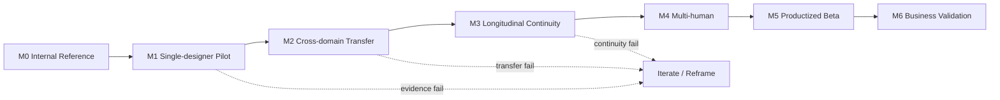

# OLEANDER Roadmap & Release Plan v0.3.0

[← v0.3 Package](README.md)

**State:** `WORKING ROADMAP / OUTCOME-BASED / DATES TBD`

---

# Roadmap Node Map



---

# 1｜Roadmap Principle

Roadmap is not a feature calendar.

Each milestone must prove a product hypothesis and has an exit condition.

```text
MILESTONE
→ HYPOTHESIS
→ SCOPE
→ EVIDENCE
→ EXIT CRITERIA
→ NEXT INVESTMENT DECISION
```

---

# 2｜Sequencing Logic

Order is driven by:
1. customer value；
2. dependency；
3. reversibility；
4. risk；
5. evidence gap；
6. cost of wrong investment。

The sequence deliberately avoids building team/cloud/platform breadth before core Human–AI collaboration is validated.

---

# 3｜Milestone M0 — Internal Reference Kernel

**Objective**
Prove interaction semantics, owner-native continuity and the v0.3.2 co-design content model in controlled conditions.

**In scope**
- four-axis input model
- CONTINUE / RESUME / RECOVER separation
- Design Situation / Brief framing
- search-space mapping
- AI option triage
- typed/revisioned referents
- compound Human actions
- branch lineage
- persistent Design Decision
- generative Design Synthesis
- action guard
- computed Human stop
- Artifact Action intended/actual delta + readback proof
- whole-design check
- domain adapters
- deterministic regression

**Exit**
- no known action-level collapse
- stale/unauthorized consequential action path blocked
- current-session CONTINUE does not unnecessarily trigger full RESUME
- search-space / triage / synthesis reference cases exist
- persistent Decision survives session reconstruction in reference cases
- Artifact Action can prove intended delta → actual delta → readback
- whole-design regression reference case exists
- reference fixtures pass
- real-artifact reference cases exist
- known partials explicitly recorded

**Current state**
Substantial candidate evidence exists for the pre-v0.3.2 interaction/runtime baseline. v0.3.2 content-delta system parity—especially Search-space Map, AI Option Triage, persistent Design Decision, generative Synthesis, Artifact Action intended/actual delta, broader Action Guard and Whole-design Check—remains **OPEN** until the system is revised and rereviewed. None of this is equivalent to external product validation.

---

# 4｜Milestone M1 — Single-designer Closed Pilot

**Objective**
Prove VPCR + DRPR and the Human–AI co-design/reality loop with external designers.

**P0 scope**
- HOME Resume
- FOCUS Design Situation + Current Question
- STUDIO Search-space / Explore / AI Triage
- COMPARE
- persistent Design Decision
- Human steer
- Develop / Synthesize
- Artifact Action + Readback
- Whole-design Check
- Local revision
- Session resume
- telemetry

**Explicitly out**
- team workspace
- enterprise permissions
- advanced cloud layer
- monetization

**Exit criteria**
- frozen pilot metrics evaluated
- no launch-blocking guardrail violation
- at least one user successfully completes cross-session Human-steered artifact loop
- at least one user completes a search-space → triage → decision/develop/synthesis → artifact/readback loop
- DRPR can be evaluated without using a synthetic design-quality score
- qualitative evidence that Resume provides value
- qualitative evidence that triage/synthesis reduces orchestration or improves design progress rather than adding ceremony
- major UX friction documented

**Decision after M1**
Continue / iterate / reframe.

---

# 5｜Milestone M2 — Cross-domain Transfer

**Objective**
Prove interaction kernel transfers without flattening professional process.

**Scope**
- primary domain + second structurally different domain
- domain adapters
- professional claim ceilings
- domain-native artifact/readback

**Exit**
- same Human interaction semantics usable in both domains
- no universal-stage leakage
- domain OPEN cannot produce false professional PASS
- transfer friction documented

---

# 6｜Milestone M3 — Longitudinal Continuity

**Objective**
Prove value persists over time, not just demo sessions.

**Scope**
- multi-day / multi-week project
- repeated re-entry
- stale state handling
- plugin/session replacement
- project learning candidates

**Exit**
- VPCR measured over repeated sessions
- repeated context input trend known
- plugin/session replacement tested
- failure recovery works without full reset in representative cases

---

# 7｜Milestone M4 — Multi-human Collaboration

**Objective**
Test scoped decision rights across Designer / Client / Specialist / Reviewer.

**Scope**
- PEOPLE
- role / responsibility
- conflict hold
- independent review
- handoff

**Exit**
- latest-message authority bug absent
- conflict affects only scoped effect
- independent review remains independent
- downstream teams can challenge upstream input

---

# 8｜Milestone M5 — Productized Beta

**Objective**
Make product safe and supportable for broader use.

**Required before entry**
- external pilot value established
- stable core workflow
- security/privacy owner assigned
- operational telemetry complete
- support model
- incident / rollback path
- data retention policy
- cost observability

**Possible scope**
- durable workspace UX
- selected cloud integrations
- team collaboration
- admin / access
- onboarding

---

# 9｜Milestone M6 — Business Validation

**Objective**
Determine sustainable product model.

**Questions**
- willingness to pay
- buyer vs user
- seat vs usage vs project pricing
- cost-to-serve
- onboarding cost
- support burden
- retention
- domain-specific packaging

No pricing is specified before value validation.

---

# 10｜P0 / P1 / P2 Cut

## P0 — Core Product Truth
- verified resume
- Current Question / Frontier
- material exploration
- Human steer
- exact referent / revision
- real artifact
- readback
- local recovery
- safe auto-advance
- action guard
- telemetry

## P1 — Strong Product Value
- Design Map impact
- Knowledge applicability
- independent review
- multi-domain adapter
- designer-development support
- multi-human rights

## P2 — Scale / Leverage
- team workspace
- cross-project learning
- broad connectors
- enterprise admin
- monetization
- marketplace

---

# 11｜Dependency Order

```text
Owner-native Resume
    ↓
Current Question / Object
    ↓
Human Action Binding
    ↓
Artifact Identity / Revision
    ↓
Readback
    ↓
Second-round Proof
    ↓
Outcome Metrics
    ↓
External Pilot
    ↓
Longitudinal / Multi-human
    ↓
Productized Beta
```

Cloud breadth does not sit on the critical path to initial product-value proof.

---

# 12｜Roadmap Change Rule

Roadmap changes require:
- new evidence；
- dependency change；
- risk change；
- customer learning；
- architecture constraint；
- business constraint。

“某功能看起来高级”不是加速进入 roadmap 的理由。

Any roadmap change affecting P0 cutline must be recorded in Product Decision Log.
