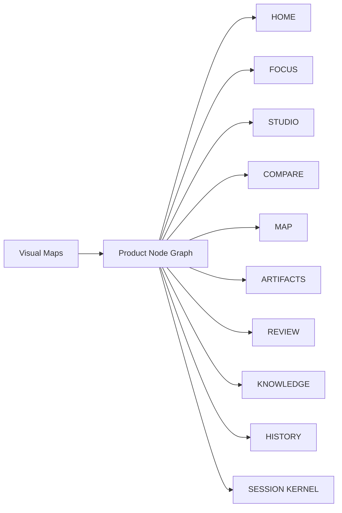

# OLEANDER Product Operating Package v0.3.2

[← Product Docs](../README.md) · [← OLEANDER](../../README.md)

**Package content revision:** v0.3.2. Some stable component filenames still contain `v0.3.0` to avoid unnecessary path churn; current behavioural deltas are explicit in [Requirement Delta v0.3.2](OLEANDER_REQUIREMENT_DELTA_v0.3.2.md) and the v0.3.2 Node/Trace layer.

**State:** `WORKING PRODUCT PACKAGE / NON-AUTHORITY / PRE-EXTERNAL-USER-VALIDATION`
**Date:** 2026-09-26
**Product Owner:** Jiaosong

> 本目录不是新的 OLEANDER Current / Project State / Governance / Artifact Registry / Professional Process / Promotion Authority。它是面向产品决策、跨职能协作、研发交付、验证和发布准备的产品工作层。

---

# 0｜Graph-first Reading Layer

## [Product Node Graph](nodes/README.md)
- [Requirement Delta v0.3.2](OLEANDER_REQUIREMENT_DELTA_v0.3.2.md)
- [Atomic Node Index](nodes/ATOMIC_NODE_INDEX.md)
- [Node Registry](nodes/NODE_REGISTRY.md)
- [Node Traceability Matrix](nodes/NODE_TRACEABILITY_MATRIX_v0.3.2.md)
- [Node Relation Schema](nodes/NODE_RELATION_SCHEMA_v0.3.2.md)
- [Visual Maps — one core map per document](maps/README.md)

v0.3.2 内部产品定义现在采用：

> **ONE LOGICAL PRODUCT NODE → ONE PRIMARY NODE DOCUMENT**

**100 product node documents（23 primary + 77 atomic） · 15 independent Mermaid map docs · 1 node registry · 1 node traceability matrix**

先看总图，再点节点进入单节点文档：



- [Node Documentation Contract](nodes/NODE_DOCUMENTATION_CONTRACT.md)
- [Visual Product Maps](maps/README.md)

### 文档层级

```text
STRATEGY / DECISION DOC
        ↓
PRODUCT NODE GRAPH
        ↓
ONE NODE = ONE PRIMARY DOC
        ↓
FEATURE / REQUIREMENT IDs
        ↓
ACCEPTANCE / TRACE / EVAL
```

原 v0.2 Feature Specs 继续作为**跨多个 Feature 的详细 composite specification / provenance view**，但不再承担“每个产品节点的唯一正文”。具体节点定义以 `v0.3/nodes/` 为主。

---

# 1｜为什么需要这一层

OLEANDER v0.2 已经把需求细化到 User Need、Product Area、Feature、Flow、Object、Interface、Acceptance 和 Traceability。

v0.3 不再通过“继续增加功能说明”提升专业度，而是补齐一个成熟产品团队真正需要的**决策与交付闭环**：

```text
CUSTOMER PROBLEM
→ PRODUCT STRATEGY
→ DECISION
→ PRD
→ FEATURE / UX SPEC
→ METRIC CONTRACT
→ EXPERIMENT
→ ROADMAP / SCOPE CUT
→ OWNER / DEPENDENCY
→ BUILD
→ EVAL / QA
→ LAUNCH READINESS
→ ROLLOUT / ROLLBACK
→ POST-LAUNCH LEARNING
→ NEXT DECISION
```

---

# 2｜文档地图

## 2.1 Working Backwards / Product Strategy

### [Product Brief + Working Backwards FAQ](OLEANDER_PRODUCT_BRIEF_PRFAQ_v0.3.0.md)

回答：
- 为什么现在做；
- 谁是第一优先用户；
- 用户问题是什么；
- OLEANDER 与现有替代方案的差异是什么；
- 什么不做；
- 关键产品 tenets；
- 哪些假设必须先验证。

---

## 2.2 Master PRD

### [Master PRD v0.3.0](OLEANDER_MASTER_PRD_v0.3.0.md)

回答：
- 决策状态；
- Scope / Cut line；
- 用户与核心 Use Cases；
- Product Requirements；
- UX / Interaction requirements；
- AI behaviour requirements；
- NFR；
- Dependencies；
- Acceptance；
- Release gates。

详细 Feature 仍复用 v0.2：

- [HOME + FOCUS](../features/PRD_HOME_FOCUS_v0.2.0.md)
- [STUDIO + COMPARE](../features/PRD_STUDIO_COMPARE_v0.2.0.md)
- [MAP + ARTIFACTS](../features/PRD_MAP_ARTIFACTS_v0.2.0.md)
- [REVIEW + KNOWLEDGE + HISTORY](../features/PRD_REVIEW_KNOWLEDGE_HISTORY_v0.2.0.md)
- [SESSION KERNEL + CONTINUITY](../features/PRD_SESSION_KERNEL_CONTINUITY_v0.2.0.md)

---

## 2.3 Metrics / Analytics / Experimentation

### [Metrics & Experimentation Plan](OLEANDER_METRICS_EXPERIMENTATION_v0.3.0.md)

回答：
- North Star 如何精确定义；
- Numerator / Denominator 是什么；
- 哪些是 leading / guardrail / diagnostic metrics；
- 事件如何串成 outcome；
- 真实用户实验怎么跑；
- 什么情况下实验结果不成立。

---

## 2.4 Roadmap / Scope / Release

### [Roadmap & Release Plan](OLEANDER_ROADMAP_RELEASE_PLAN_v0.3.0.md)

回答：
- P0 / P1 / P2；
- 为什么按这个顺序；
- 每个里程碑的 exit criteria；
- 什么明确不进当前版本；
- 什么时候扩展 Cloud / Team / Integrations。

---

## 2.5 Ownership / Risk / Dependency

### [Risk, Dependency & RACI](OLEANDER_RISK_DEPENDENCY_RACI_v0.3.0.md)

回答：
- 谁负责；
- 谁拥有最终 decision；
- 依赖什么；
- 哪些风险会阻止 launch；
- 哪些风险只需要监测；
- 单人项目阶段和未来团队阶段如何区分。

---

## 2.6 Customer / Market Validation

### [Customer & Market Validation Plan](OLEANDER_CUSTOMER_MARKET_VALIDATION_PLAN_v0.3.0.md)

回答：
- 外部用户如何招募；
- problem interview / workflow observation / longitudinal pilot 怎么做；
- 哪些市场结论当前不能声称；
- 什么时候才进入 TAM / pricing / business-model 验证。

---

## 2.7 Launch Readiness

### [Launch Readiness Review](OLEANDER_LAUNCH_READINESS_REVIEW_v0.3.0.md)

回答：
- Customer / UX / Functional / AI Quality / Reliability / Analytics / Security / Ops / Docs 是否 ready；
- Go / Hold / No-Go 条件；
- rollout 和 rollback；
- 当前哪些项仍是 OPEN。

---

## 2.8 Decision Governance

### [Product Decision Log](OLEANDER_PRODUCT_DECISION_LOG_v0.3.0.md)

记录：
- 已决定什么；
- 为什么；
- 哪些 alternative 被放弃；
- 什么变化会触发 reopen；
- 谁拥有该 decision。

---

## 2.9 Product Review Bar

### [Product Review Bar](OLEANDER_PRODUCT_REVIEW_BAR_v0.3.0.md)

用于 PM / Design / Eng / AI / Domain Reviewer 统一判断：这是不是一个真正 decision-ready / build-ready / pilot-ready / launch-ready 的产品要求，而不是“文档写得很长”。

---

# 3｜阅读方式

## 面试官 / PM Reviewer

1. Product Brief
2. Master PRD
3. Metrics & Experimentation
4. Launch Readiness
5. 任选一份 Feature Spec 深入

重点不是文档数量，而是看是否形成：

```text
Problem
→ Decision
→ Requirement
→ Owner
→ Metric
→ Evidence
→ Release Gate
```

## 设计 / UX Reviewer

1. Master PRD 的 Use Case / UX Contract
2. STUDIO + COMPARE
3. HOME + FOCUS
4. MAP + ARTIFACTS
5. REVIEW

## AI / Agent PM Reviewer

1. Product Brief
2. Session Kernel
3. Metrics & Experimentation
4. AI Quality / Guardrails
5. Launch Readiness

## Engineering / Tech Lead

1. Master PRD
2. Risk / Dependency / RACI
3. Traceability Matrix
4. Feature Specs
5. Candidate implementation

---

# 4｜Professional Bar

本套产品包要求任何 P0 功能至少能回答：

```text
WHY THIS EXISTS
WHO NEEDS IT
WHAT DECISION IT ENABLES
WHAT IS IN / OUT
WHO OWNS IT
WHAT DEPENDENCIES EXIST
WHAT CAN FAIL
WHAT DATA PROVES SUCCESS
WHAT GUARDRAIL MUST NOT REGRESS
WHAT RELEASE GATE IT BLOCKS
HOW WE ROLLBACK / RECOVER
```

如果回答不了，它还不是 release-ready requirement。

---

# 5｜Truthfulness Rule

当前 OLEANDER 有大量真实内部验证与候选实现，但仍不能把以下内容伪造成已成立：

- 大规模商业 adoption；
- DAU / retention；
- 外部用户长期留存；
- 付费意愿；
- 企业安全合规完成；
- 所有专业 domain production-ready；
- production SLO 已达到；
- 全量 rollout 成功。

这些必须通过后续真实用户、运营与产品化验证获得。
