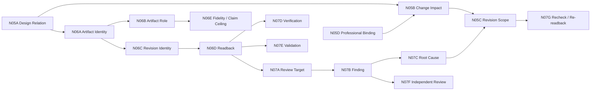

# M12｜MAP + ARTIFACT + REVIEW Detail

[← Visual Maps](README.md) · [← Node Graph](../nodes/README.md)

**Purpose:** 关系、artifact、readback、finding、verification/validation 的细节点图

> This map is a view of product nodes and relations. It does not create a new authority or state.

## Reading Rule

沿图进入 Node Docs 阅读 behaviour、acceptance、authority、metric 和 open questions；不要把图中的箭头解释成 ownership，边语义见 [Node Relation Schema](../nodes/NODE_RELATION_SCHEMA_v0.3.1.md)。
