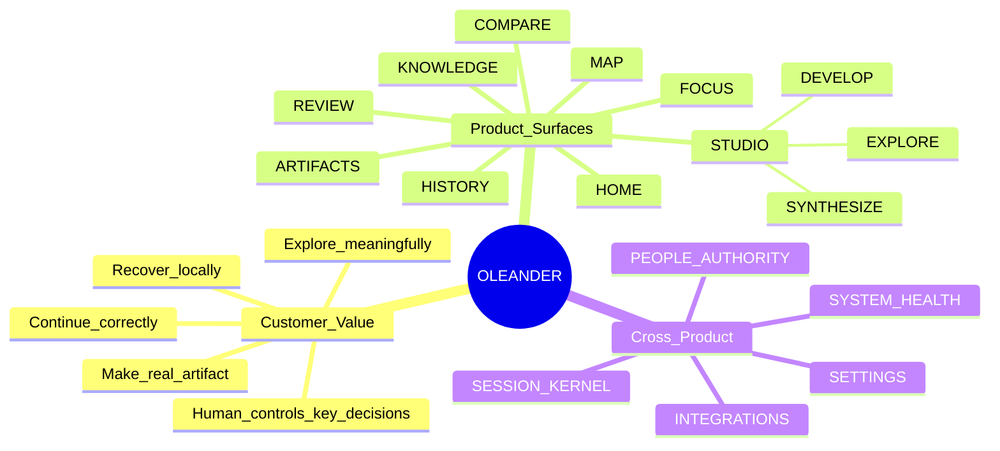
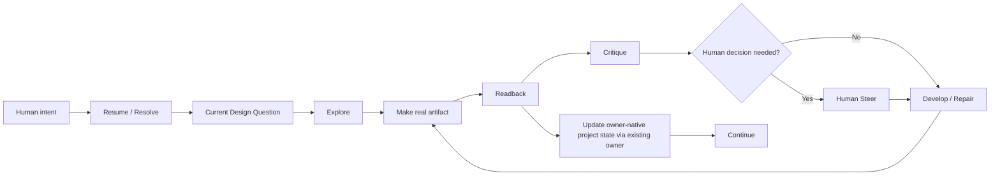
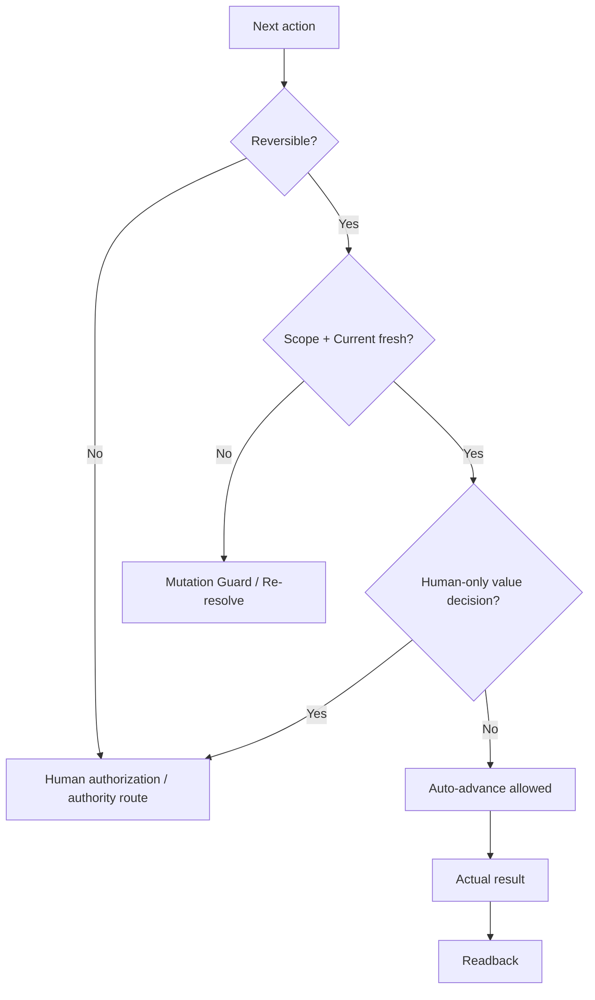
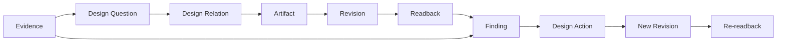
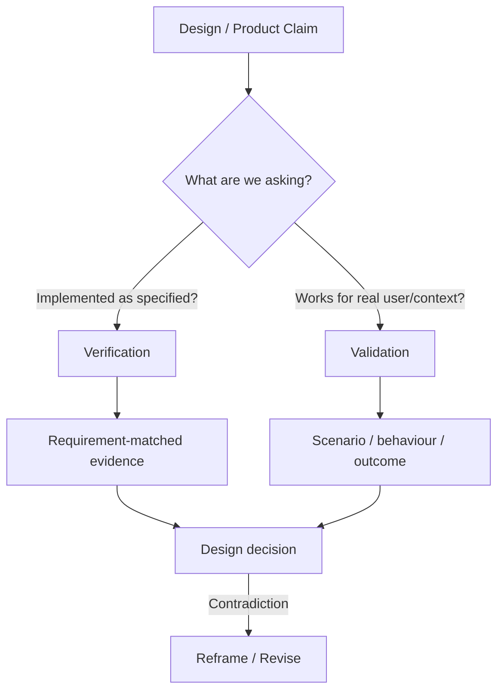
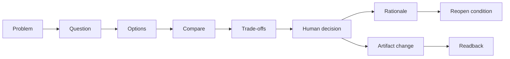
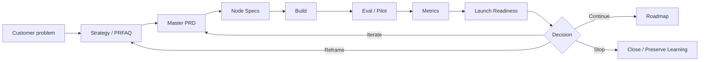
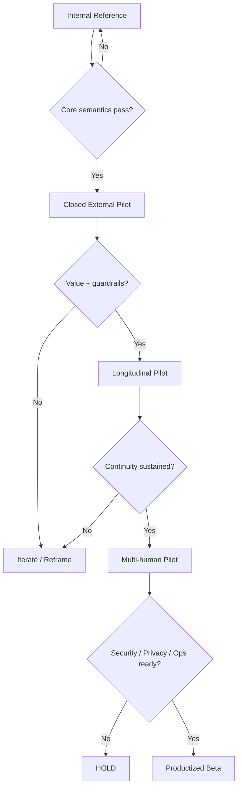
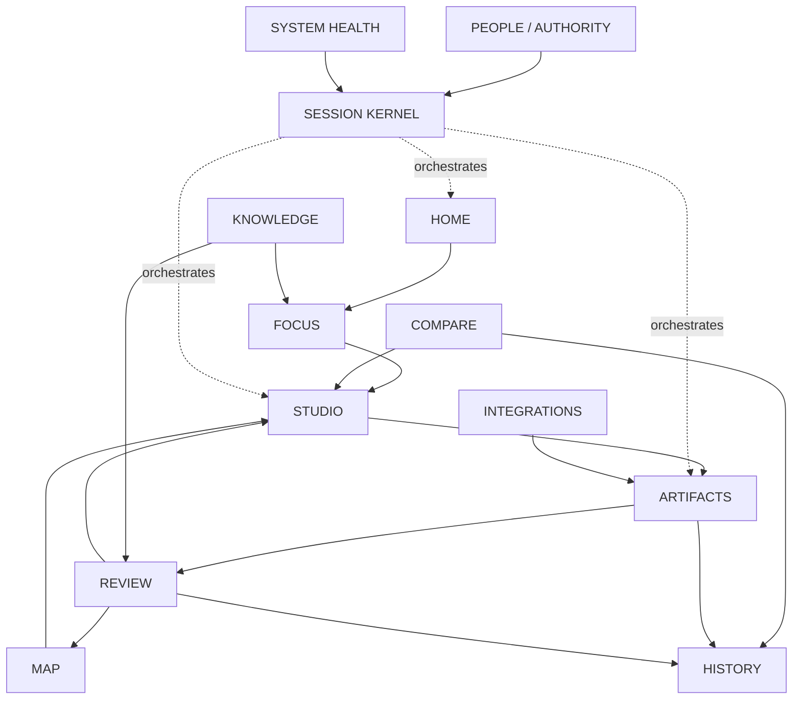

# OLEANDER Visual Product Maps v0.3

[← v0.3 Package](../README.md) · [Node Graph](../nodes/README.md)

> Maps are **views of nodes and relations**, not new product authorities.

---

# Map 01｜Product Mindmap

---

# Map 02｜Core Human–AI Loop

---

# Map 03｜Autonomy × Control

---

# Map 04｜Artifact Truth Chain

---

# Map 05｜Verification vs Validation

---

# Map 06｜Decision Chain

---

# Map 07｜Product Operating Loop

---

# Map 08｜Release Gates

---

# Map 09｜Node Dependency Backbone

