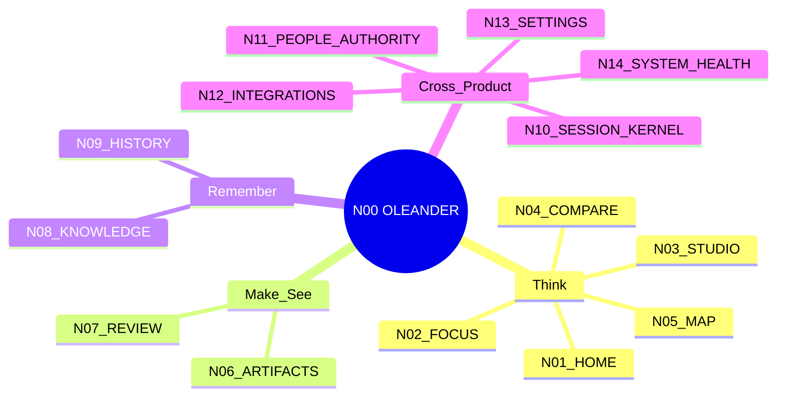
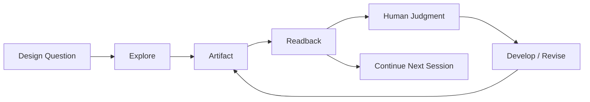

# N00｜PRODUCT SYSTEM

[← Node Graph](README.md)

| Field | Value |
|---|---|
| Node ID | N00 |
| Parent | none |
| Children | N01–N14 |
| Type | Root Product Node |
| User | Product / Design / Eng / AI / Domain |
| Product job | 定义 OLEANDER 产品边界、主节点与跨节点关系 |
| Inputs | Customer problem, product strategy, Current architecture constraints |
| Outputs | Product node graph, scope, node contracts |
| Authority | Product definition only; no Project/Promotion authority |
| Primary metric | VPCR + launch guardrails |
| Release priority | P0 |
| Doc state | WORKING |

## Context Graph

## Core Contract

OLEANDER product value depends on preserving this chain:

## Hard Boundaries

- Conversation ≠ Project State
- Model Memory ≠ Project State
- Artifact existence ≠ Design quality
- Process PASS ≠ Design KEEP
- Tool PASS ≠ Readback PASS
- PRD Node ≠ Architecture Authority
- Session Kernel ≠ Whole Product

## Acceptance

N00 is healthy when:
1. every first-class product node has exactly one primary node doc;
2. parent docs link rather than duplicate child detail;
3. cross-node relation maps resolve without orphan nodes;
4. P0 nodes trace to user need, acceptance and metric;
5. product docs do not introduce shadow Current/Authority.

## Open

- external pilot beachhead domain;
- eventual workspace shell;
- team/multi-human productization;
- enterprise/privacy architecture.
