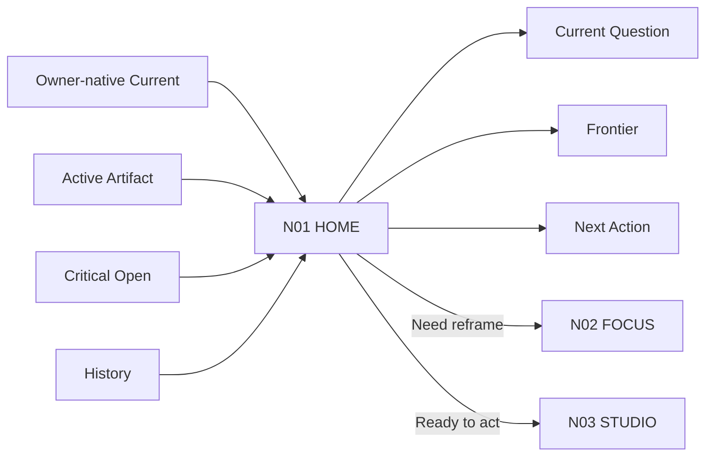
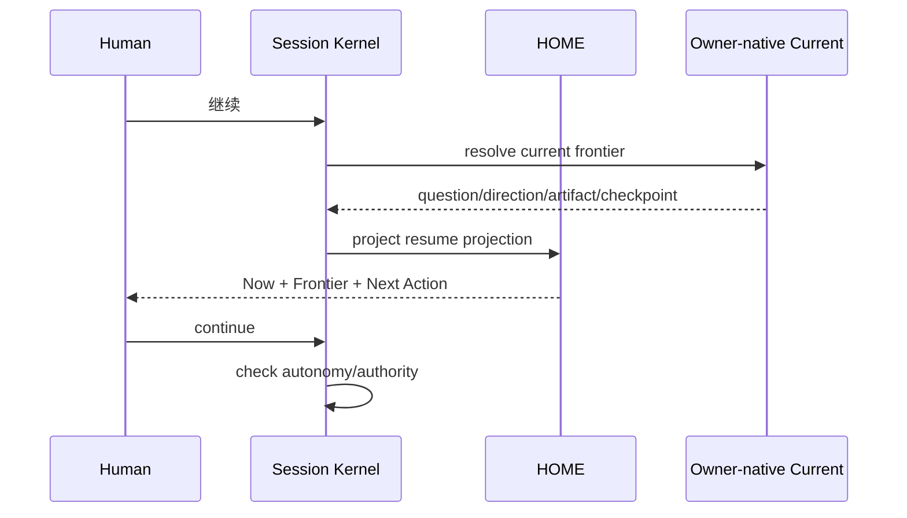
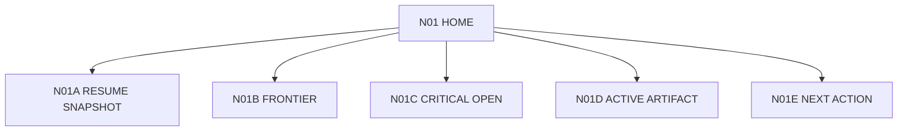

# N01｜HOME

[← Node Graph](README.md) · Parent: [N00](N00_PRODUCT_SYSTEM.md)

| Field | Value |
|---|---|
| Node ID | N01 |
| Parent | N00 |
| Children | N01A, N01B, N01C, N01D, N01E — see [Atomic Children](#atomic-children) |
| Type | Product Surface |
| User | Returning designer / lead |
| Product job | 在最短路径内恢复当前真实设计状态 |
| Inputs | Current Question, Direction, Frontier, Artifact, Critical Open, recent material changes |
| Outputs | Resume Snapshot, Next Action |
| Authority | Read/projection; mutation via Session Kernel + owner rules |
| Primary metric | Resume Accuracy / VPCR |
| Release priority | P0 |
| Doc state | WORKING |

## Node Graph



## Visible First Layer

```text
Current Question
Current Direction
Current Frontier
Critical Open
Active Artifact
What Changed
Next High-value Action
```

## Core Requirements

- HOME-F01 Resume Snapshot
- HOME-F02 Frontier Card
- HOME-F03 Critical Open
- HOME-F04 Active Artifact
- HOME-F05 Recent Design Moves
- HOME-F06 Next Design Actions
- HOME-F07 Resume Confidence / Source Basis
- HOME-F08 What Changed Since Last Session

## Happy Path



## Degraded

- source conflict → show provisional/conflict;
- stale checkpoint → no project write;
- missing artifact → preserve state, mark native unavailable;
- no Current Question → route N02 FOCUS rather than invent truth.

## Acceptance

A returning user can identify the current design question, active artifact and next action without reading chat history.

## Events

`project_resume_started` · `frontier_resolved` · `resume_corrected_by_user` · `resume_degraded`\n\n## Atomic Children



- [N01A｜RESUME SNAPSHOT](atomic/N01A_RESUME_SNAPSHOT.md)
- [N01B｜FRONTIER](atomic/N01B_FRONTIER.md)
- [N01C｜CRITICAL OPEN](atomic/N01C_CRITICAL_OPEN.md)
- [N01D｜ACTIVE ARTIFACT](atomic/N01D_ACTIVE_ARTIFACT.md)
- [N01E｜NEXT ACTION](atomic/N01E_NEXT_ACTION.md)
