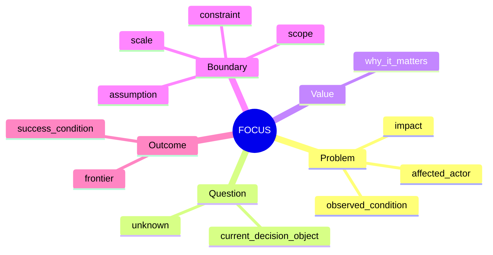
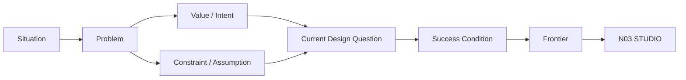
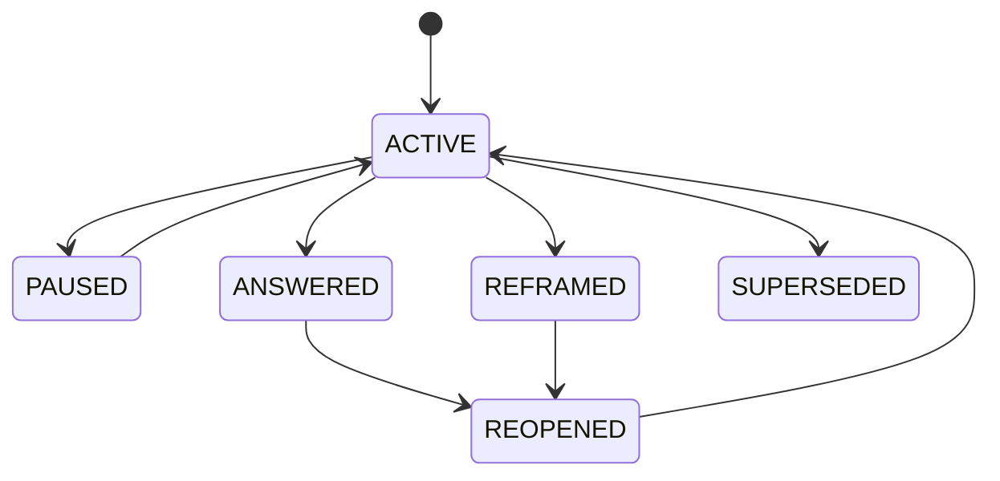

# N02｜FOCUS

[← Node Graph](README.md) · Parent: [N00](N00_PRODUCT_SYSTEM.md)

| Field | Value |
|---|---|
| Node ID | N02 |
| Type | Product Surface |
| Product job | 把模糊处境转成当前可设计、可判断的问题 |
| Inputs | situation, evidence, constraints, assumptions, feedback |
| Outputs | Problem, Current Question, Value, Scope, Success Condition, Frontier |
| Authority | Design Value / consequential reframe remain Human-led |
| Primary metric | Question clarity / Frontier correction |
| Release priority | P0 |
| Doc state | WORKING |

## Mindmap

## Core Flow

## Core Requirements

- FOCUS-F01 Problem Statement
- FOCUS-F02 Current Design Question
- FOCUS-F03 Design Value / Intent
- FOCUS-F04 Scope / Scale
- FOCUS-F05 Constraints / Assumptions
- FOCUS-F06 Success Condition
- FOCUS-F07 Reframe
- FOCUS-F08 Reframe Impact
- FOCUS-F09 Frontier Definition

## Local Question Lifecycle

This is Question-local semantics, not Project State.

## Acceptance

- Question is not a task;
- Value is not implementation;
- Assumption never silently becomes Fact;
- Reframe produces impact map rather than global reset;
- Frontier says what relation/unknown must move next.

## Events

`question_created` · `question_reframed` · `assumption_challenged` · `frontier_confirmed`
