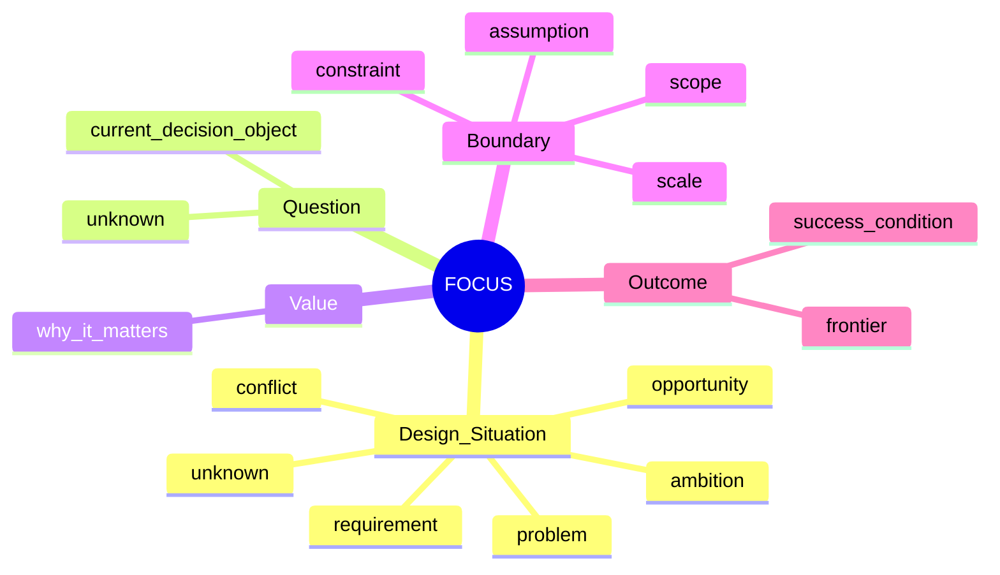
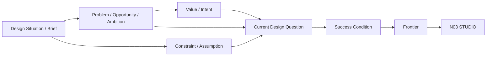
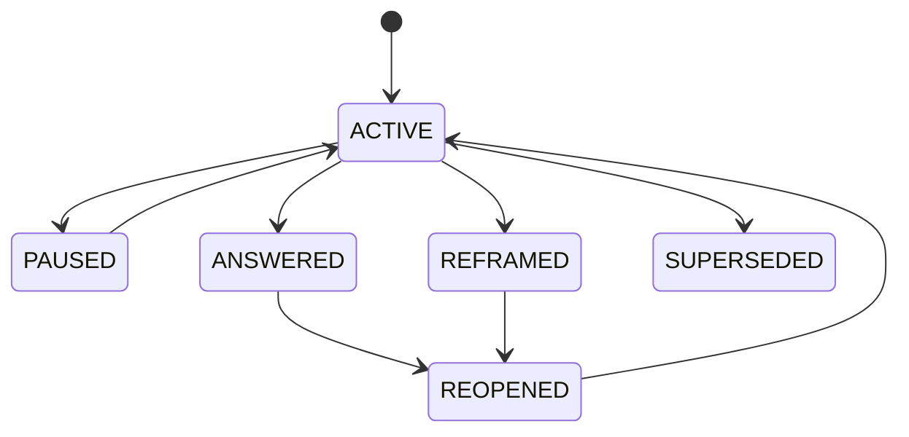
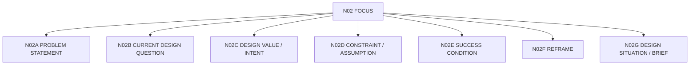

# N02｜FOCUS

[← Node Graph](README.md) · Parent: [N00](N00_PRODUCT_SYSTEM.md)

| Field | Value |
|---|---|
| Node ID | N02 |
| Children | N02A, N02B, N02C, N02D, N02E, N02F, N02G — see [Atomic Children](#atomic-children) |
| Type | Product Surface |
| Product job | 把模糊设计处境或项目 brief 转成当前可设计、可判断的问题 |
| Inputs | design situation, project brief, evidence, constraints, assumptions, feedback |
| Outputs | Design Situation, Problem/Opportunity, Current Question, Value, Scope, Success Condition, Frontier |
| Authority | Design Value / consequential reframe remain Human-led |
| Primary metric | Question clarity / Frontier correction |
| Release priority | P0 |
| Doc state | WORKING |

## Mindmap

## Core Flow

## Core Requirements

- FOCUS-F01 Problem Statement
- FOCUS-F02 Current Design Question
- FOCUS-F03 Design Value / Intent
- FOCUS-F04 Scope / Scale
- FOCUS-F05 Constraints / Assumptions
- FOCUS-F06 Success Condition
- FOCUS-F07 Reframe
- FOCUS-F08 Reframe Impact
- FOCUS-F09 Frontier Definition
- FOCUS-F10 Design Situation / Brief Framing

## Local Question Lifecycle

This is Question-local semantics, not Project State.

## Acceptance

- Question is not a task;
- Problem is not mandatory: a Question may originate from opportunity, ambition, requirement, conflict or unknown;
- Value is not implementation;
- Assumption never silently becomes Fact;
- Reframe produces impact map rather than global reset;
- Frontier says what relation/unknown must move next.

## Events

`question_created` · `question_reframed` · `assumption_challenged` · `frontier_confirmed`

## Atomic Children

- [N02A｜PROBLEM STATEMENT](atomic/N02A_PROBLEM_STATEMENT.md)
- [N02B｜CURRENT DESIGN QUESTION](atomic/N02B_CURRENT_DESIGN_QUESTION.md)
- [N02C｜DESIGN VALUE / INTENT](atomic/N02C_DESIGN_VALUE_INTENT.md)
- [N02D｜CONSTRAINT / ASSUMPTION](atomic/N02D_CONSTRAINT_ASSUMPTION.md)
- [N02E｜SUCCESS CONDITION](atomic/N02E_SUCCESS_CONDITION.md)
- [N02F｜REFRAME](atomic/N02F_REFRAME.md)
- [N02G｜DESIGN SITUATION / BRIEF](atomic/N02G_DESIGN_SITUATION_BRIEF.md)
