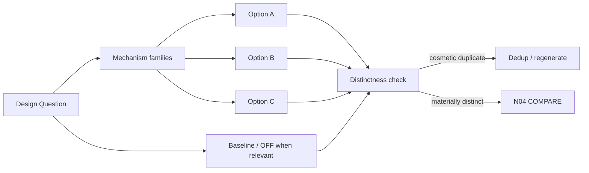

# N03A｜EXPLORE

[← STUDIO](N03_STUDIO.md)

| Field | Value |
|---|---|
| Node ID | N03A |
| Parent | N03 |
| Type | Studio Mode |
| Product job | 形成少量 materially distinct design directions |
| Inputs | Question, Value, Constraints, Evidence |
| Outputs | Option branches + mechanism signatures + artifacts |
| Authority | AI may propose; Human controls consequential selection |
| Primary metric | Material Divergence Rate |
| Release priority | P0 |
| Doc state | WORKING |

## Exploration Graph



## Feature Nodes

- EXP-F01 Create Direction
- EXP-F02 Strategy Statement
- EXP-F03 Relation Difference
- EXP-F04 Alternative Set
- EXP-F05 Search-space Gap
- EXP-F06 Reference Transformation
- EXP-F07 Hold / Continue / Retire
- EXP-F08 Baseline / No-change / OFF
- EXP-F09 Material Distinctness Check

## Branch Contract

Each option carries:
```text
ID
decision_object
mechanism_signature
parent_refs
locked_invariants
artifact_refs
strongest_benefit
strongest_failure_risk
unknowns
branch_status
```

## Acceptance

- cosmetic variation does not count as new option;
- alternatives share a comparable world;
- baseline/OFF appears when causally relevant;
- Human is not asked to choose before differences are materially visible;
- rejected/held alternatives retain lineage.

## Events / Metrics

`option_space_created` · `cosmetic_duplicate_detected` · Material Divergence · Baseline Consideration
