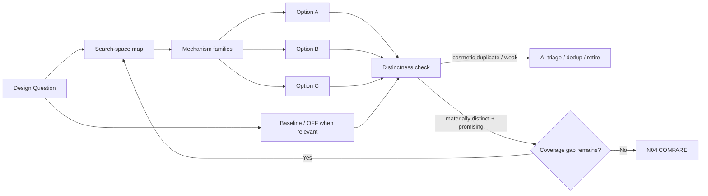
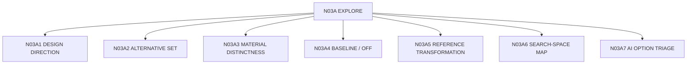

# N03A｜EXPLORE

[← STUDIO](N03_STUDIO.md)

| Field | Value |
|---|---|
| Node ID | N03A |
| Children | N03A1, N03A2, N03A3, N03A4, N03A5, N03A6, N03A7 — see [Atomic Children](#atomic-children) |
| Parent | N03 |
| Type | Studio Mode |
| Product job | 主动规划并探索 design search space，形成少量 materially distinct 且值得推进的方向 |
| Inputs | Question, Value, Constraints, Evidence |
| Outputs | Option branches + mechanism signatures + artifacts |
| Authority | AI may propose; Human controls consequential selection |
| Primary metric | Material Divergence Rate |
| Release priority | P0 |
| Doc state | WORKING |

## Exploration Graph



## Feature Nodes

- EXP-F01 Create Direction
- EXP-F02 Strategy Statement
- EXP-F03 Relation Difference
- EXP-F04 Alternative Set
- EXP-F05 Search-space Gap
- EXP-F06 Reference Transformation
- EXP-F07 Hold / Continue / Retire
- EXP-F08 Baseline / No-change / OFF
- EXP-F09 Material Distinctness Check
- EXP-F10 AI Option Triage / Weak-branch Retirement

## Branch Contract

Each option carries:
```text
ID
decision_object
mechanism_signature
parent_refs
locked_invariants
artifact_refs
strongest_benefit
strongest_failure_risk
unknowns
branch_status
```

## Acceptance

- cosmetic variation does not count as new option;
- exploration explicitly checks uncovered mechanism / relation regions before declaring the option space sufficient;
- AI may triage weak/redundant branches out of the presented set with an explicit reason while preserving lineage; Human REJECT / consequential selection remains Human-owned;
- alternatives share a comparable world;
- baseline/OFF appears when causally relevant;
- Human is not asked to choose before differences are materially visible;
- rejected/held alternatives retain lineage.

## Events / Metrics

`option_space_created` · `search_space_gap_detected` · `option_triaged` · `cosmetic_duplicate_detected` · Material Divergence · Baseline Consideration

## Atomic Children



- [N03A1｜DESIGN DIRECTION](atomic/N03A1_DESIGN_DIRECTION.md)
- [N03A2｜ALTERNATIVE SET](atomic/N03A2_ALTERNATIVE_SET.md)
- [N03A3｜MATERIAL DISTINCTNESS](atomic/N03A3_MATERIAL_DISTINCTNESS.md)
- [N03A4｜BASELINE / OFF](atomic/N03A4_BASELINE_OFF.md)
- [N03A5｜REFERENCE TRANSFORMATION](atomic/N03A5_REFERENCE_TRANSFORMATION.md)
- [N03A6｜SEARCH-SPACE MAP](atomic/N03A6_SEARCH_SPACE_MAP.md)
- [N03A7｜AI OPTION TRIAGE](atomic/N03A7_AI_OPTION_TRIAGE.md)
