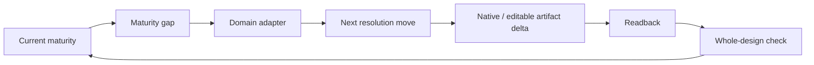
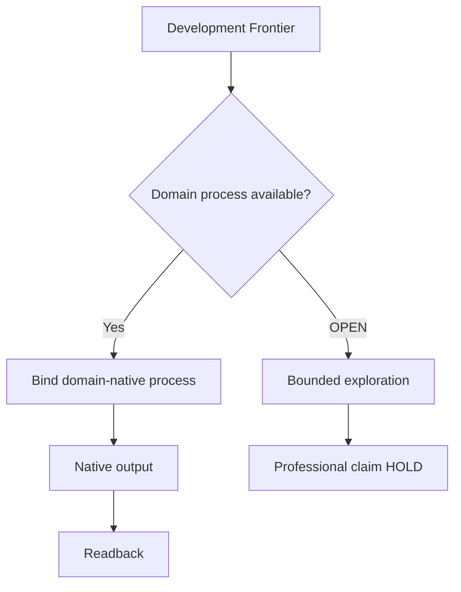
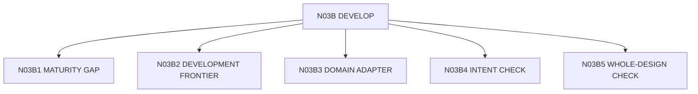

# N03B｜DEVELOP

[← STUDIO](N03_STUDIO.md)

| Field | Value |
|---|---|
| Node ID | N03B |
| Children | N03B1, N03B2, N03B3, N03B4, N03B5 — see [Atomic Children](#atomic-children) |
| Parent | N03 |
| Type | Studio Mode |
| Product job | 把选定方向推进到更高真实专业分辨率 |
| Inputs | Selected direction, Frontier, Findings, Domain process |
| Outputs | Development actions, native/editable artifact deltas |
| Authority | Domain claim remains domain-owned |
| Primary metric | Frontier progression / rework |
| Release priority | P0 |
| Doc state | WORKING |

## Shared Development Loop

The shared layer does **not** prescribe Concept → Geometry → Dimension → Detail as a universal ladder. Architecture, physical product, digital product, brand, visual and CMF use domain-native resolution models through N03B3.

## Feature Nodes

- DEV-F01 Maturity Gap
- DEV-F02 Next Development Frontier
- DEV-F03 Resolution Ladder
- DEV-F04 Professional Depth
- DEV-F05 Intent Check
- DEV-F06 Low-resolution Warning
- DEV-F07 Development Action
- DEV-F08 Domain Adapter Binding
- DEV-F09 Return-to-Whole Check

## Domain Binding

## Acceptance

A development action specifies target relation, intended improvement, artifact target, readback method and domain owner when relevant.

Every material development cycle must return to the whole design before the change is treated as coherent progress.

## Guardrail

Professional depth cannot be inferred from document count or visual finish.

## Atomic Children

- [N03B1｜MATURITY GAP](atomic/N03B1_MATURITY_GAP.md)
- [N03B2｜DEVELOPMENT FRONTIER](atomic/N03B2_DEVELOPMENT_FRONTIER.md)
- [N03B3｜DOMAIN ADAPTER](atomic/N03B3_DOMAIN_ADAPTER.md)
- [N03B4｜INTENT CHECK](atomic/N03B4_INTENT_CHECK.md)
- [N03B5｜WHOLE-DESIGN CHECK](atomic/N03B5_WHOLE_DESIGN_CHECK.md)
