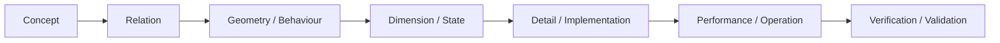
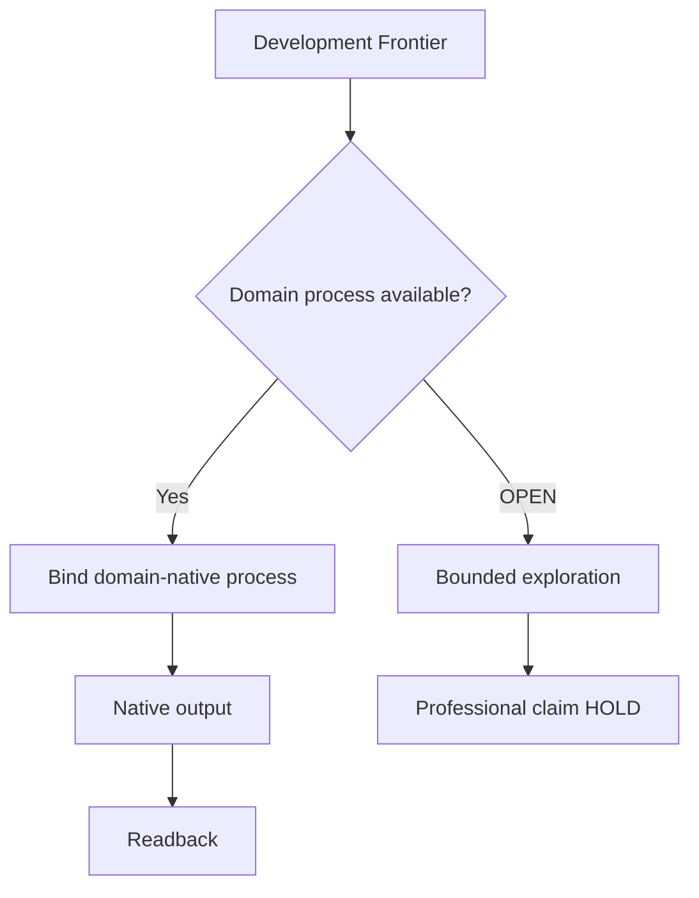

# N03B｜DEVELOP

[← STUDIO](N03_STUDIO.md)

| Field | Value |
|---|---|
| Node ID | N03B |
| Parent | N03 |
| Type | Studio Mode |
| Product job | 把选定方向推进到更高真实专业分辨率 |
| Inputs | Selected direction, Frontier, Findings, Domain process |
| Outputs | Development actions, native/editable artifact deltas |
| Authority | Domain claim remains domain-owned |
| Primary metric | Frontier progression / rework |
| Release priority | P0 |
| Doc state | WORKING |

## Development Ladder

Not every domain follows the same literal ladder; this is a resolution view, not a universal stage model.

## Feature Nodes

- DEV-F01 Maturity Gap
- DEV-F02 Next Development Frontier
- DEV-F03 Resolution Ladder
- DEV-F04 Professional Depth
- DEV-F05 Intent Check
- DEV-F06 Low-resolution Warning
- DEV-F07 Development Action
- DEV-F08 Domain Adapter Binding
- DEV-F09 Return-to-Whole Check

## Domain Binding

## Acceptance

A development action specifies target relation, intended improvement, artifact target, readback method and domain owner when relevant.

## Guardrail

Professional depth cannot be inferred from document count or visual finish.
