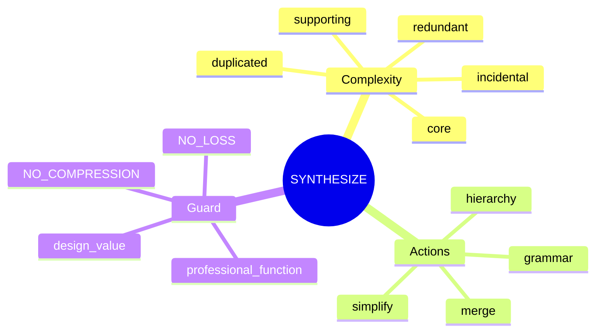
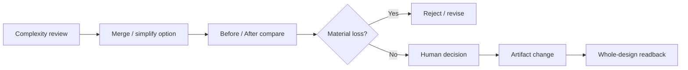
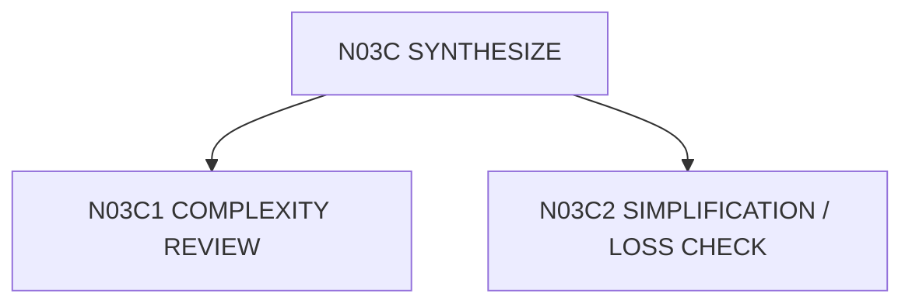

# N03C｜SYNTHESIZE

[← STUDIO](N03_STUDIO.md)

| Field | Value |
|---|---|
| Node ID | N03C |
| Children | N03C1, N03C2 — see [Atomic Children](#atomic-children) |
| Parent | N03 |
| Type | Studio Mode |
| Product job | 减少无效复杂度，同时保护独立有效设计信息 |
| Inputs | Relations, components, branches, findings |
| Outputs | Merge/simplification moves + loss checks |
| Authority | Human owns high-impact deletion / simplification |
| Primary metric | simplification accepted without material loss |
| Release priority | P1 |
| Doc state | WORKING |

## Synthesis Mindmap

## Flow

## Feature Nodes

SYN-F01–F07: Complexity Review, Merge Opportunity, Design Economy, Grammar Consistency, Hierarchy Reinforcement, Simplification Test, Loss Check.

## Acceptance

“更简洁”本身不是删除理由。Any independent valid layer removed requires explicit design rationale and post-change readback.\n\n## Atomic Children

- [N03C1｜COMPLEXITY REVIEW](atomic/N03C1_COMPLEXITY_REVIEW.md)
- [N03C2｜SIMPLIFICATION / LOSS CHECK](atomic/N03C2_SIMPLIFICATION_LOSS_CHECK.md)
