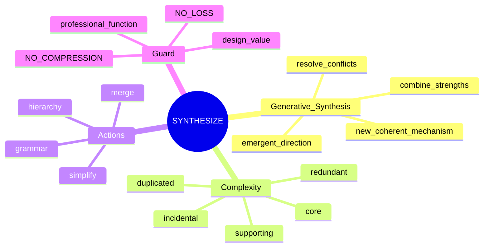
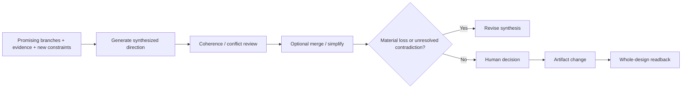
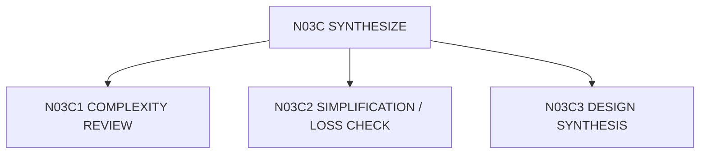

# N03C｜SYNTHESIZE

[← STUDIO](N03_STUDIO.md)

| Field | Value |
|---|---|
| Node ID | N03C |
| Children | N03C1, N03C2, N03C3 — see [Atomic Children](#atomic-children) |
| Parent | N03 |
| Type | Studio Mode |
| Product job | 把多个有效方向、关系、证据与新约束综合成更 coherent 的新方向，并在需要时减少无效复杂度 |
| Inputs | Relations, components, branches, findings |
| Outputs | Synthesized direction + merge/simplification moves + conflict/loss checks |
| Authority | AI may propose synthesis; Human owns consequential direction choice and high-impact deletion |
| Primary metric | synthesis usefulness / accepted simplification without material loss |
| Release priority | P0 |
| Doc state | WORKING |

## Synthesis Mindmap

## Flow

## Feature Nodes

SYN-F01–F08: Complexity Review, Merge Opportunity, Design Economy, Grammar Consistency, Hierarchy Reinforcement, Simplification Test, Loss Check, Design Synthesis.

## Acceptance

SYNTHESIZE is not merely “simplify”. A valid synthesis must create a coherent design mechanism that explains what is inherited, transformed, newly introduced and intentionally discarded. “更简洁”本身不是删除理由。Any independent valid layer removed requires explicit design rationale and post-change readback.

## Atomic Children

- [N03C1｜COMPLEXITY REVIEW](atomic/N03C1_COMPLEXITY_REVIEW.md)
- [N03C2｜SIMPLIFICATION / LOSS CHECK](atomic/N03C2_SIMPLIFICATION_LOSS_CHECK.md)
- [N03C3｜DESIGN SYNTHESIS](atomic/N03C3_DESIGN_SYNTHESIS.md)
