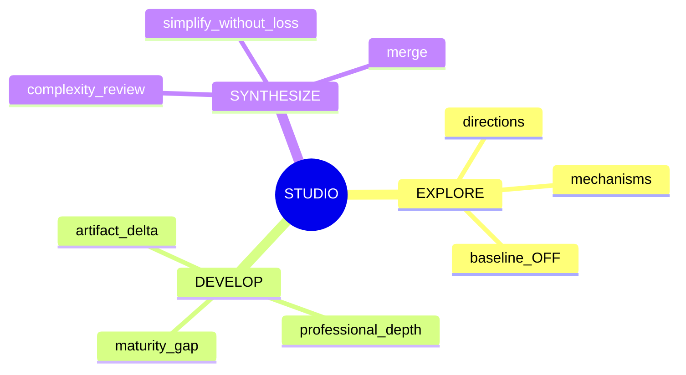
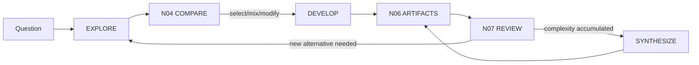

# N03｜STUDIO

[← Node Graph](README.md) · Parent: [N00](N00_PRODUCT_SYSTEM.md)

| Field | Value |
|---|---|
| Node ID | N03 |
| Children | [N03A EXPLORE](N03A_EXPLORE.md), [N03B DEVELOP](N03B_DEVELOP.md), [N03C SYNTHESIZE](N03C_SYNTHESIZE.md) |
| Type | Product Surface / Work Container |
| Product job | 组织设计探索、深化和综合，而不替代 native authoring tool |
| Inputs | Current Question, Value, Frontier, Relations, Findings |
| Outputs | Direction branches, development actions, synthesis moves |
| Authority | Human owns consequential design choice |
| Primary metric | productive design progression |
| Release priority | P0 |
| Doc state | WORKING |

## Node Mindmap

## Mode Switching

## Parent Rule

N03 only owns mode relationships. Feature details live in child node docs.

## Acceptance

- modes are not mandatory linear stages;
- all modes can return to FOCUS/COMPARE/REVIEW;
- STUDIO never claims native artifact completion without N06;
- EXPLORE/DEVELOP/SYNTHESIZE do not collapse into one generic “generate”.
