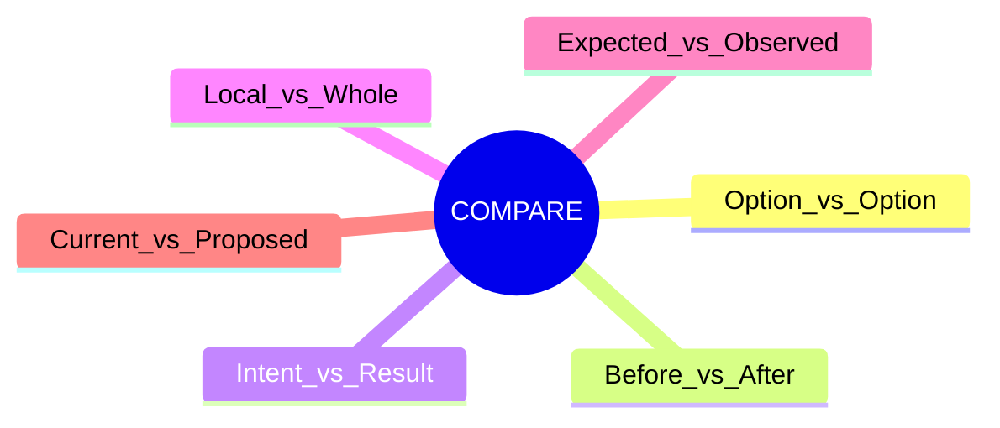
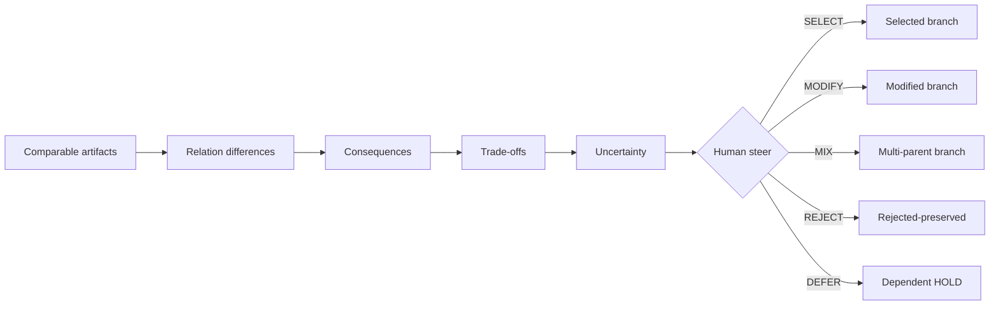

# N04｜COMPARE

[← Node Graph](README.md)

| Field | Value |
|---|---|
| Node ID | N04 |
| Type | Cross-surface Decision Mode |
| Product job | 把候选差异、trade-off、uncertainty 和 consequence 放进同一判断世界 |
| Inputs | Options/revisions + decision object + locked invariants |
| Outputs | Human steer + rationale + reopen condition |
| Authority | System compares; Human owns consequential choice |
| Primary metric | steer clarity / correction / decision usefulness |
| Release priority | P0 |
| Doc state | WORKING |

## Compare Dimensions

## Decision Flow

## Feature Nodes

CMP-F01–F11: Side-by-side, Relation Difference, Consequence Difference, Trade-off, Uncertainty, Rationale, Reopen Condition, Retained Alternative, Same Comparison World, Revision Binding, Human Steer Capture.

## Acceptance

- exact revision binding;
- fidelity mismatch visible;
- no synthetic winner score;
- Human reason not fabricated;
- branch lineage preserved.

## Events

`comparison_opened` · `tradeoff_exposed` · `human_steer_bound`
