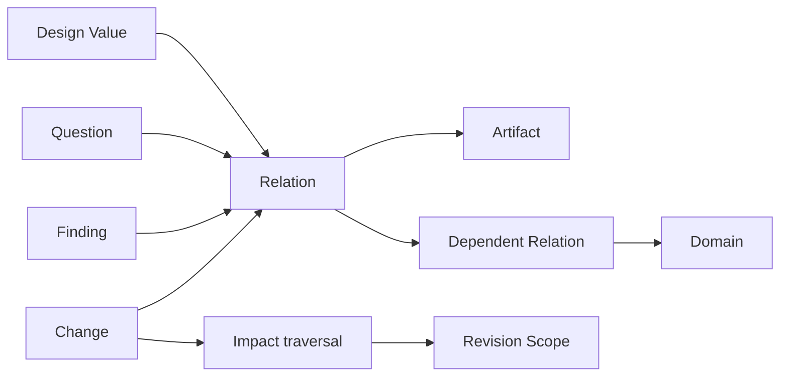
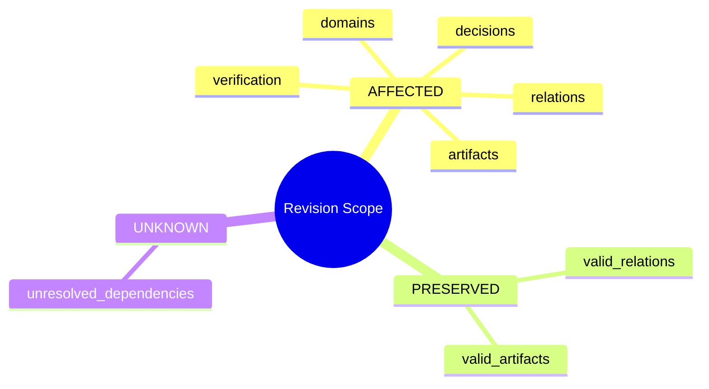

# N05｜MAP

[← Node Graph](README.md)

| Field | Value |
|---|---|
| Node ID | N05 |
| Type | Product Surface |
| Product job | 表达 materially important Design Relation、dependency 与 change impact |
| Inputs | Relations, decisions, artifacts, findings, domain interfaces |
| Outputs | Impact graph + Revision Scope |
| Authority | Map describes dependencies; does not create domain authority |
| Primary metric | Change Impact precision / Full-reset avoidance |
| Release priority | P1 |
| Doc state | WORKING |

## Relation Graph

## Change Impact

## Feature Nodes

MAP-F01–F11: Relation Create/Link/Importance/Stability, Change Impact, Whole/Local, Artifact/Issue/Professional Binding, Dependency Traversal, Preserve Unaffected Scope.

## Acceptance

- only material relations become first-class;
- change does not imply global reopen;
- unknown dependency remains UNKNOWN;
- unaffected valid work is explicitly preserved.
