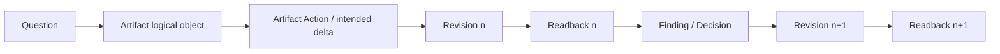
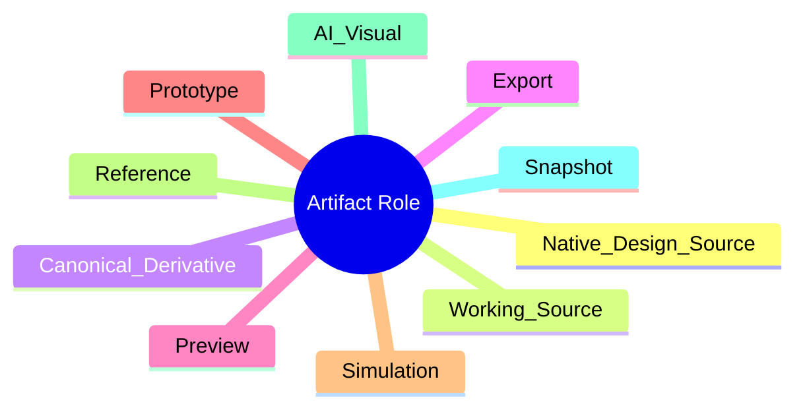
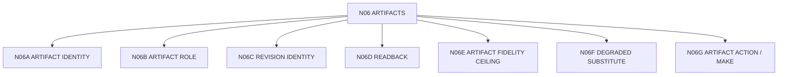

# N06｜ARTIFACTS

[← Node Graph](README.md)

| Field | Value |
|---|---|
| Node ID | N06 |
| Children | N06A, N06B, N06C, N06D, N06E, N06F, N06G — see [Atomic Children](#atomic-children) |
| Type | Product Surface |
| Product job | 对真实可编辑 artifact 进行有意图的 make/edit，并维护 identity、role、revision、fidelity、delta、rollback 与 readback |
| Inputs | Design action, native source, external authoring result |
| Outputs | Artifact revision + actual readback |
| Authority | Native/source authority remains owner-native |
| Primary metric | Readback Completion / Revision Integrity |
| Release priority | P0 |
| Doc state | WORKING |

## Artifact Truth Chain



## Artifact Roles



## Feature Nodes

ART-F01–F13: Register, Role, Native Link, Revision, Relation Binding, Question Binding, Readback, Cross-version Compare, Artifact Fidelity Ceiling, Content Binding, Stale Warning, Degraded Substitute, Artifact Action / Make.

## Hard Distinction

```text
FILE EXISTS
≠ CURRENT ARTIFACT
≠ READ
≠ VALID
≠ DESIGN KEEP
≠ PROFESSIONAL PASS
```

Artifact creation/change is not delegated conceptually to the integration layer. OLEANDER owns the **design action contract**; the authoring integration owns the actual tool execution.

## Acceptance

Any material mutation that contributes to a completion/validation claim must bind intended delta, actual delta, revision identity, rollback/recovery path where relevant, and actual readback.

## Atomic Children



- [N06A｜ARTIFACT IDENTITY](atomic/N06A_ARTIFACT_IDENTITY.md)
- [N06B｜ARTIFACT ROLE](atomic/N06B_ARTIFACT_ROLE.md)
- [N06C｜REVISION IDENTITY](atomic/N06C_REVISION_IDENTITY.md)
- [N06D｜READBACK](atomic/N06D_READBACK.md)
- [N06E｜ARTIFACT FIDELITY CEILING](atomic/N06E_FIDELITY_CLAIM_CEILING.md)
- [N06F｜DEGRADED SUBSTITUTE](atomic/N06F_DEGRADED_SUBSTITUTE.md)
- [N06G｜ARTIFACT ACTION / MAKE](atomic/N06G_ARTIFACT_ACTION_MAKE.md)
