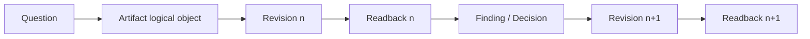
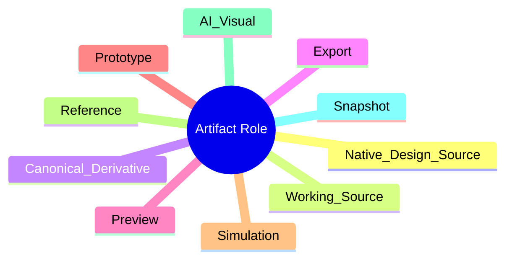

# N06｜ARTIFACTS

[← Node Graph](README.md)

| Field | Value |
|---|---|
| Node ID | N06 |
| Type | Product Surface |
| Product job | 维护真实可编辑 artifact 的 identity、role、revision、fidelity 与 readback |
| Inputs | Design action, native source, external authoring result |
| Outputs | Artifact revision + actual readback |
| Authority | Native/source authority remains owner-native |
| Primary metric | Readback Completion / Revision Integrity |
| Release priority | P0 |
| Doc state | WORKING |

## Artifact Truth Chain



## Artifact Roles



## Feature Nodes

ART-F01–F12: Register, Role, Native Link, Revision, Relation Binding, Question Binding, Readback, Cross-version Compare, Fidelity/Claim Ceiling, Content Binding, Stale Warning, Degraded Substitute.

## Hard Distinction

```text
FILE EXISTS
≠ CURRENT ARTIFACT
≠ READ
≠ VALID
≠ DESIGN KEEP
≠ PROFESSIONAL PASS
```

## Acceptance

Any material mutation that contributes to a completion/validation claim must bind the intended revision and actual readback.
