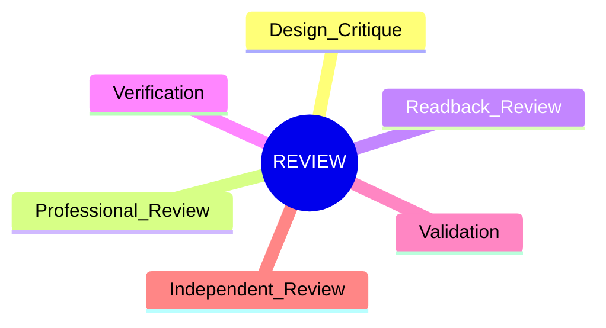
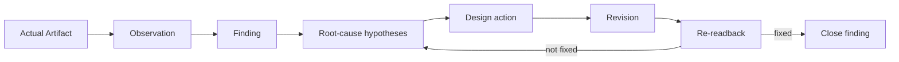
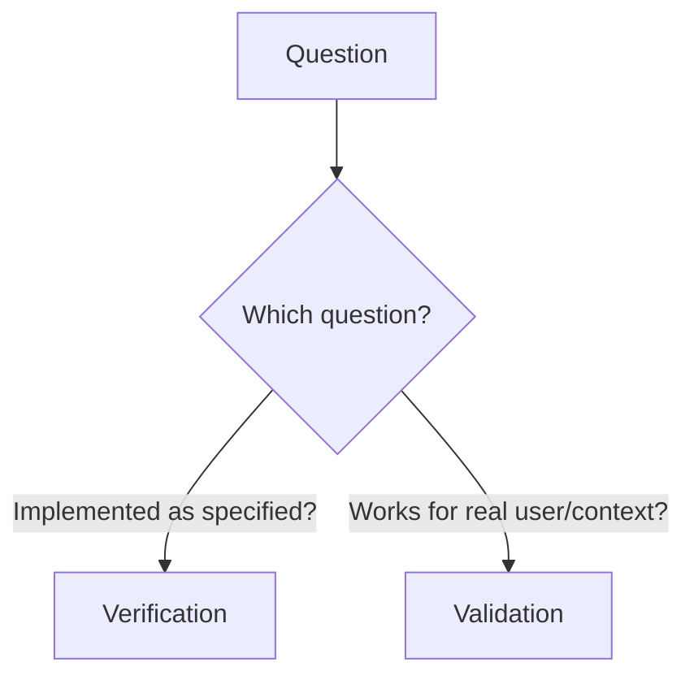

# N07｜REVIEW

[← Node Graph](README.md)

| Field | Value |
|---|---|
| Node ID | N07 |
| Type | Product Surface |
| Product job | 把真实 artifact/result 转成 finding、verification、validation 与下一 design action |
| Inputs | Artifact/readback/evidence/scenario |
| Outputs | Finding, root-cause hypothesis, action, recheck requirement |
| Authority | Review does not automatically change Project Current |
| Primary metric | Finding-to-Action / Re-readback |
| Release priority | P0 |
| Doc state | WORKING |

## Review Types

## Critique Loop

## Verification vs Validation

## Feature Nodes

REV-F01–F13.

## Acceptance

- producer summary is not review target;
- major failure cannot be averaged away;
- does-not-prove is explicit;
- important repair requires re-readback;
- independent review remains independent.
