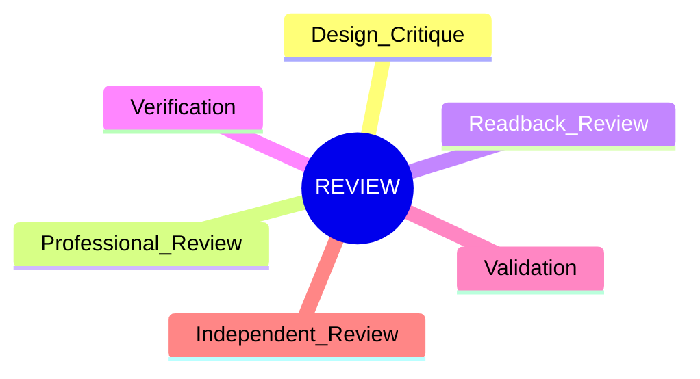
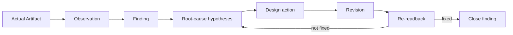
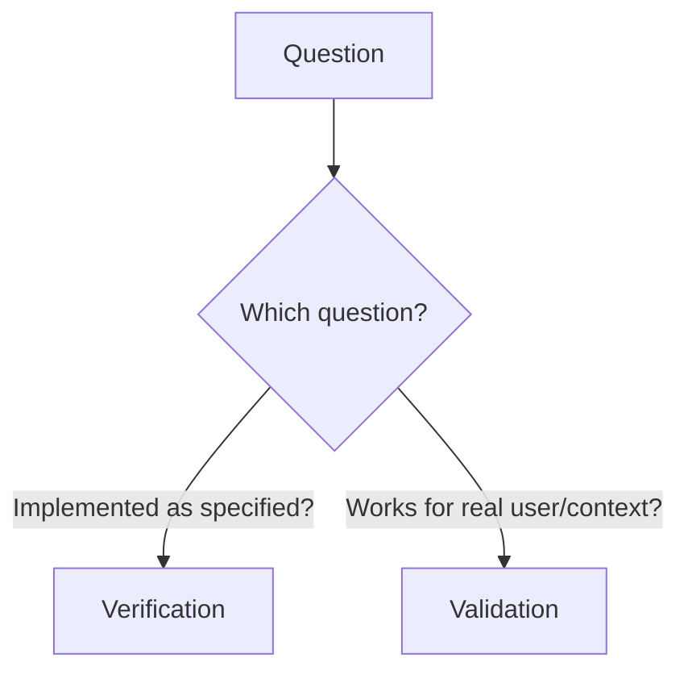
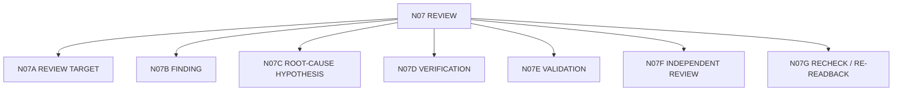

# N07｜REVIEW

[← Node Graph](README.md)

| Field | Value |
|---|---|
| Node ID | N07 |
| Children | N07A, N07B, N07C, N07D, N07E, N07F, N07G — see [Atomic Children](#atomic-children) |
| Type | Product Surface |
| Product job | 把真实 artifact/result 转成 finding、verification、validation 与下一 design action |
| Inputs | Artifact/readback/evidence/scenario |
| Outputs | Finding, root-cause hypothesis, action, recheck requirement |
| Authority | Review does not automatically change Project Current |
| Primary metric | Finding-to-Action / Re-readback |
| Release priority | P0 |
| Doc state | WORKING |

## Review Types

## Critique Loop

## Verification vs Validation

## Feature Nodes

REV-F01–F13.

## Acceptance

- producer summary is not review target;
- major failure cannot be averaged away;
- does-not-prove is explicit;
- important repair requires re-readback;
- independent review remains independent.\n\n## Atomic Children

- [N07A｜REVIEW TARGET](atomic/N07A_REVIEW_TARGET.md)
- [N07B｜FINDING](atomic/N07B_FINDING.md)
- [N07C｜ROOT-CAUSE HYPOTHESIS](atomic/N07C_ROOTCAUSE_HYPOTHESIS.md)
- [N07D｜VERIFICATION](atomic/N07D_VERIFICATION.md)
- [N07E｜VALIDATION](atomic/N07E_VALIDATION.md)
- [N07F｜INDEPENDENT REVIEW](atomic/N07F_INDEPENDENT_REVIEW.md)
- [N07G｜RECHECK / RE-READBACK](atomic/N07G_RECHECK_REREADBACK.md)
