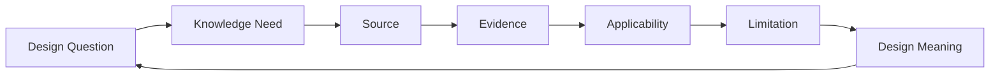
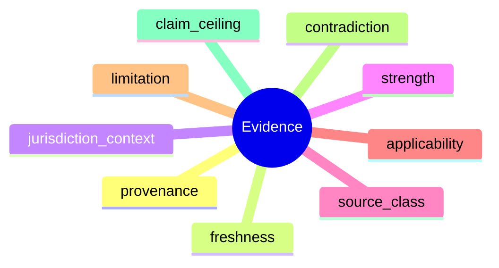
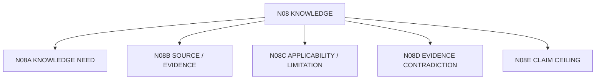

# N08｜KNOWLEDGE

[← Node Graph](README.md)

| Field | Value |
|---|---|
| Node ID | N08 |
| Children | N08A, N08B, N08C, N08D, N08E — see [Atomic Children](#atomic-children) |
| Type | Product Surface |
| Product job | 回答当前设计判断需要知道什么、适用到哪里、能证明什么 |
| Inputs | Knowledge need, sources, evidence |
| Outputs | Applicable evidence + limitation + design meaning |
| Authority | Knowledge does not self-promote to Project Fact |
| Primary metric | applicability correction / claim-ceiling integrity |
| Release priority | P1 |
| Doc state | WORKING |

## Evidence Path

## Evidence Semantics

## Feature Nodes

KNW-F01–F11.

## Acceptance

- source summary without design meaning does not dominate main workflow;
- contradiction remains visible;
- stale source affects relevant claims, not all work;
- precedent does not become Project Fact merely because it is visually or professionally persuasive;
- missing evidence narrows claim ceiling rather than manufacturing certainty.

## Atomic Children

- [N08A｜KNOWLEDGE NEED](atomic/N08A_KNOWLEDGE_NEED.md)
- [N08B｜SOURCE / EVIDENCE](atomic/N08B_SOURCE_EVIDENCE.md)
- [N08C｜APPLICABILITY / LIMITATION](atomic/N08C_APPLICABILITY_LIMITATION.md)
- [N08D｜EVIDENCE CONTRADICTION](atomic/N08D_EVIDENCE_CONTRADICTION.md)
- [N08E｜CLAIM CEILING](atomic/N08E_CLAIM_CEILING.md)
