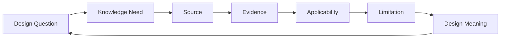
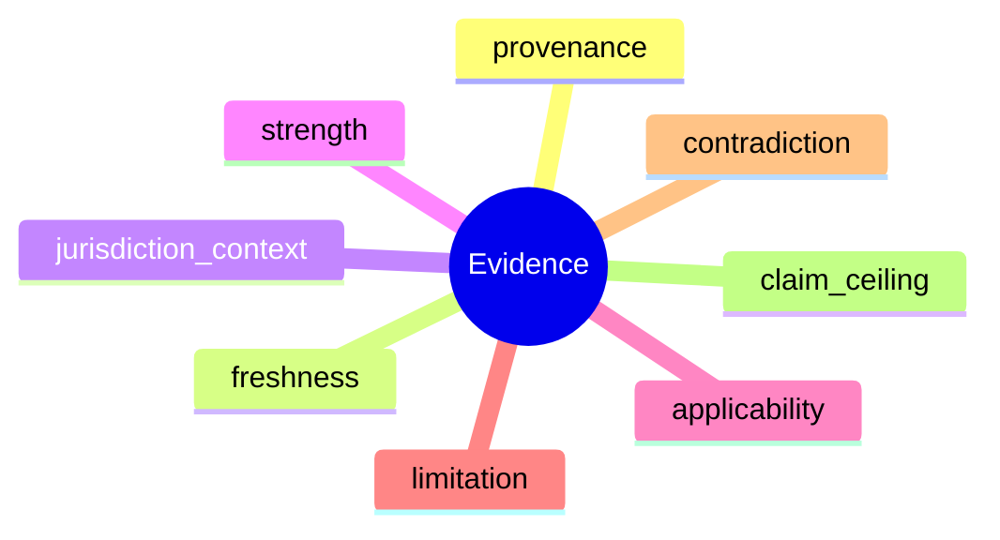

# N08｜KNOWLEDGE

[← Node Graph](README.md)

| Field | Value |
|---|---|
| Node ID | N08 |
| Type | Product Surface |
| Product job | 回答当前设计判断需要知道什么、适用到哪里、能证明什么 |
| Inputs | Knowledge need, sources, evidence |
| Outputs | Applicable evidence + limitation + design meaning |
| Authority | Knowledge does not self-promote to Project Fact |
| Primary metric | applicability correction / claim-ceiling integrity |
| Release priority | P1 |
| Doc state | WORKING |

## Evidence Path

## Evidence Semantics

## Feature Nodes

KNW-F01–F11.

## Acceptance

- source summary without design meaning does not dominate main workflow;
- contradiction remains visible;
- stale source affects relevant claims, not all work;
- missing evidence narrows claim ceiling rather than manufacturing certainty.
