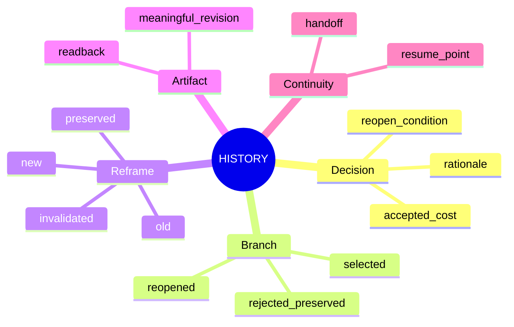
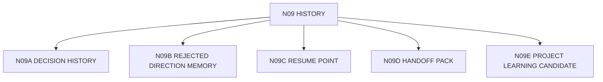

# N09｜HISTORY

[← Node Graph](README.md)

| Field | Value |
|---|---|
| Node ID | N09 |
| Children | N09A, N09B, N09C, N09D, N09E — see [Atomic Children](#atomic-children) |
| Type | Product Surface |
| Product job | 保存改变设计理解的重要历史，并支持 Resume / Handoff / Reopen |
| Inputs | decisions, reframes, revisions, findings, validation, frontier changes |
| Outputs | timeline, rationale, resume point, handoff pack |
| Authority | History preserves lineage; does not redefine Current by recency |
| Primary metric | Handoff correction / Resume success |
| Release priority | P1 |
| Doc state | WORKING |

## History Mindmap



## What History Excludes

```text
file opened
agent started
routine save
tool success
formatting change
log noise
```

unless one materially changes design truth or recovery.

## Feature Nodes

HIS-F01–F09.

## Acceptance

History tells a future collaborator **why the design is here**, not merely **what the system did**.

## Atomic Children



- [N09A｜DECISION HISTORY](atomic/N09A_DECISION_HISTORY.md)
- [N09B｜REJECTED DIRECTION MEMORY](atomic/N09B_REJECTED_DIRECTION_MEMORY.md)
- [N09C｜RESUME POINT](atomic/N09C_RESUME_POINT.md)
- [N09D｜HANDOFF PACK](atomic/N09D_HANDOFF_PACK.md)
- [N09E｜PROJECT LEARNING CANDIDATE](atomic/N09E_PROJECT_LEARNING_CANDIDATE.md)
