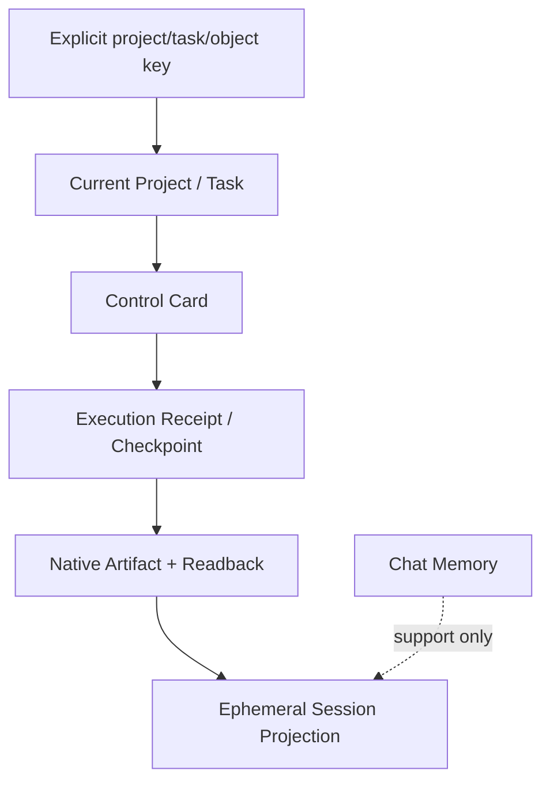
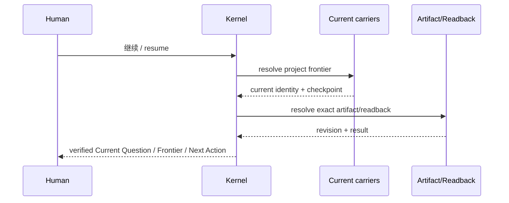

# N10A｜RESUME / RECOVER

[← Session Kernel](N10_SESSION_KERNEL.md)

| Field | Value |
|---|---|
| Node ID | N10A |
| Parent | N10 |
| Type | Kernel Node |
| Product job | 从 owner-native carriers 重建 verified working frontier |
| Inputs | explicit project/task/object key, Current, Control Card, checkpoint, artifact/readback |
| Outputs | verified session projection |
| Authority | Read/resolve only; no new project truth |
| Primary metric | Resume Accuracy / VPCR |
| Release priority | P0 |
| Doc state | WORKING |

## Resume Precedence

## Resume Sequence

## Requirements

- explicit key > owner-native Current > checkpoint > artifact/readback;
- chat memory never outranks Current;
- source conflict remains visible;
- stale checkpoint cannot authorize write;
- missing optional carrier narrows confidence rather than inventing state.

## Acceptance

A fresh session reconstructs the same material frontier without requiring user to restate already valid project context.

## Failure

If verified recovery is impossible, return `RESUME_PARTIAL / HOLD_MUTATION` with exact missing carrier(s).

## Events

`project_resume_started` · `frontier_resolved` · `resume_degraded` · `resume_corrected_by_user`
