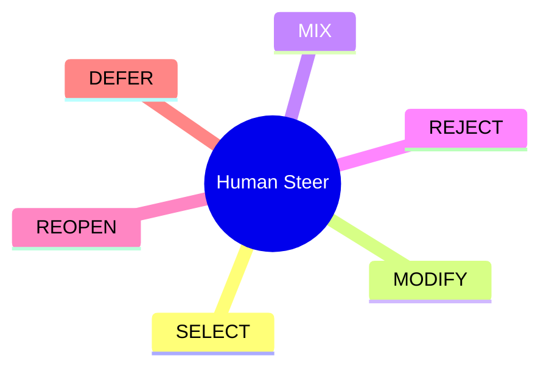
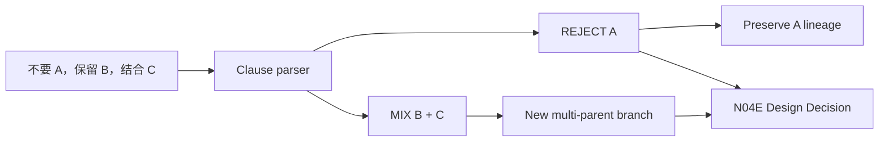
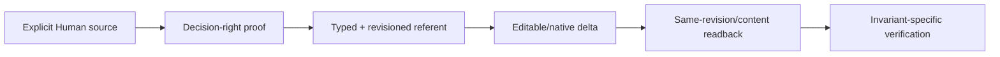

# N10B｜HUMAN STEER

[← Session Kernel](N10_SESSION_KERNEL.md)

| Field | Value |
|---|---|
| Node ID | N10B |
| Parent | N10 |
| Type | Kernel Node |
| Product job | 把 Human design steering 绑定到精确对象、revision 与 lineage |
| Inputs | raw Human message + active decision object/options |
| Outputs | clause-scoped steer acts + route to persistent Design Decision when consequential |
| Authority | Human source required; higher authority routes remain external |
| Primary metric | False Steering / Second-round Fidelity |
| Release priority | P0 |
| Doc state | WORKING |

## Action Mindmap



## Referent Contract

```text
REF
+ KIND
+ REVISION
+ LINEAGE_REF
+ DECISION_OBJECT_REF when consequential
```

## Compound Action Example



## Second-round Proof



## Acceptance

- generic “继续” never becomes steer;
- Human reason is not fabricated;
- MIX requires ≥2 resolvable parents;
- REJECT preserves branch;
- DEFER requires a pending decision and normally creates no design delta;
- consequential SELECT / MODIFY / MIX / REJECT / DEFER creates or updates N04E Design Decision rather than remaining only a session steer event;
- ambiguous consequential referent = zero mutation + one minimum clarification.

## Events

`human_feedback_received` · `human_steer_bound` · `human_action_compound_parsed`
