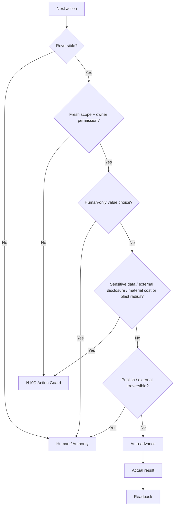

# N10C｜AUTONOMY / HUMAN STOP

[← Session Kernel](N10_SESSION_KERNEL.md)

| Field | Value |
|---|---|
| Node ID | N10C |
| Parent | N10 |
| Type | Kernel Control Node |
| Product job | 最大化可信可逆推进，同时只在真实 Human boundary 停止 |
| Inputs | next action, reversibility, recoverability, scope, authority, uncertainty, data sensitivity, external disclosure, cost/blast radius |
| Outputs | auto-advance / stop / route |
| Authority | Human retains value/authority/irreversible decisions |
| Primary metric | Useful Autonomy / Unnecessary Stop / Unauthorized Action |
| Release priority | P0 |
| Doc state | WORKING |

## Decision Graph

## Side-effect Classes

1. NONE
2. REVERSIBLE_LOCAL
3. PROJECT_MUTATION_REVERSIBLE
4. PROJECT_MUTATION_AUTHORITY_SENSITIVE
5. EXTERNAL_IRREVERSIBLE_OR_PUBLISHING

Read-only actions may still be authority-sensitive when they disclose sensitive data externally, trigger material cost, or cross a provider boundary.

## Valid Human Stop Reasons

- ambiguous consequential referent;
- real value decision exposed;
- authority escalation;
- irreversible / publishing;
- specialist / independent review;
- scoped multi-human conflict;
- no truthful native/editable substitute;
- sensitive-data disclosure / external read boundary;
- material cost or blast-radius escalation;
- requested scope complete;
- explicit user stop.

## Invalid Stop Reasons

- tool call finished;
- file saved;
- worker returned;
- reversible low-risk next action exists;
- unrelated OPEN exists.

## Acceptance

The system can continue a reversible chain without repeated permission while never crossing authority-sensitive boundaries.

## Guardrail

Unauthorized Action Rate = 0.
