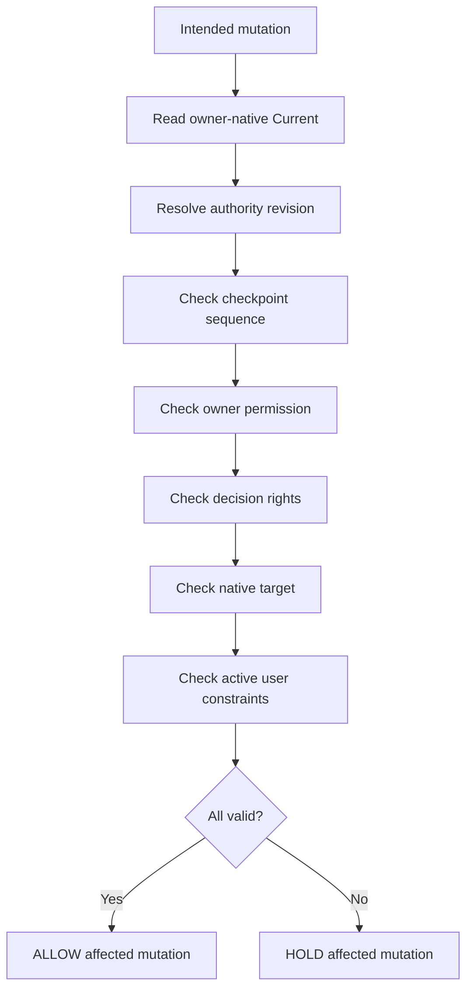

# N10D｜MUTATION GUARD

[← Session Kernel](N10_SESSION_KERNEL.md)

| Field | Value |
|---|---|
| Node ID | N10D |
| Type | Kernel Safety Node |
| Product job | 每次 material write 前重新验证 freshness、permission、target 与 decision rights |
| Inputs | intended mutation + owner-native carrier facts |
| Outputs | ALLOW / HOLD affected mutation |
| Authority | Guard never grants authority not present in owner rules |
| Primary metric | Stale Mutation Prevention / Unauthorized Action |
| Release priority | P0 |
| Doc state | WORKING |

## Pre-write Graph

## Minimum Facts

- logical object identity
- authority revision
- source revision
- expected/observed checkpoint sequence
- owner permission
- native target
- side-effect class
- decision-rights status
- active user constraints
- resolver provenance
- carrier readback status

## Hard Rules

- caller-supplied `ALLOW` is not proof;
- stale cache is not proof;
- READ_ONLY always wins;
- latest Human message is not universal authority;
- HOLD should be scoped, not global, when possible.

## Acceptance Scenarios

- stale checkpoint → blocked;
- stale artifact → blocked for affected write;
- READ_ONLY → zero mutation;
- unrelated reversible exploration may continue after scoped HOLD.

## Events

`mutation_guard_checked` · `mutation_guard_blocked`
