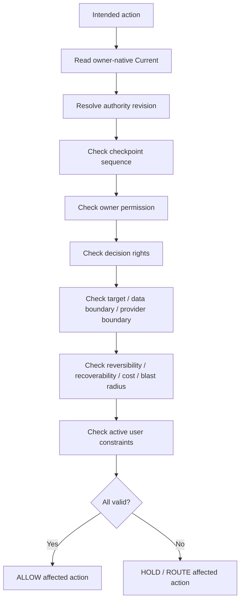

# N10D｜ACTION GUARD

[← Session Kernel](N10_SESSION_KERNEL.md)

| Field | Value |
|---|---|
| Node ID | N10D |
| Parent | N10 |
| Type | Kernel Safety Node |
| Product job | 对 material action（read/write/publish/external disclosure/tool execution）验证 freshness、permission、target、decision rights 与 side-effect risk |
| Inputs | intended action + owner-native carrier facts + data/cost/external-side-effect context |
| Outputs | ALLOW / HOLD / ROUTE affected action |
| Authority | Guard never grants authority not present in owner rules |
| Primary metric | Unauthorized Action / Stale Action Prevention / External Disclosure Guard |
| Release priority | P0 |
| Doc state | WORKING |

## Pre-action Graph

## Minimum Facts

- logical object identity
- authority revision
- source revision
- expected/observed checkpoint sequence
- owner permission
- native target
- side-effect class
- data sensitivity / disclosure destination
- expected material cost / blast radius where relevant
- decision-rights status
- active user constraints
- resolver provenance
- carrier readback status

## Hard Rules

- caller-supplied `ALLOW` is not proof;
- stale cache is not proof;
- READ_ONLY always wins;
- READ_ONLY blocks writes but does not automatically authorize sensitive external reads or disclosure;
- latest Human message is not universal authority;
- HOLD should be scoped, not global, when possible.

## Acceptance Scenarios

- stale checkpoint → blocked for affected consequential action;
- stale artifact → blocked for affected write;
- READ_ONLY → zero mutation, while external/sensitive read remains separately gated;
- external disclosure without scoped permission → blocked;
- unexpected material cost/blast radius → route/confirm before execution;
- unrelated reversible exploration may continue after scoped HOLD.

## Events

`action_guard_checked` · `action_guard_blocked` · `mutation_guard_checked` · `mutation_guard_blocked`

`mutation_guard_*` remains a valid write-specific implementation event family during migration; the product concept is now broader Action Guard.
