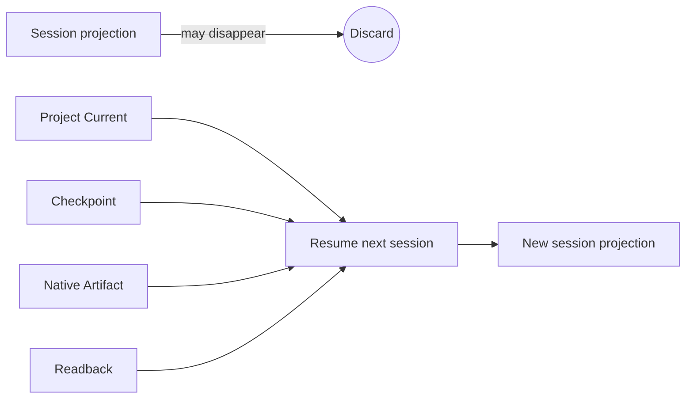
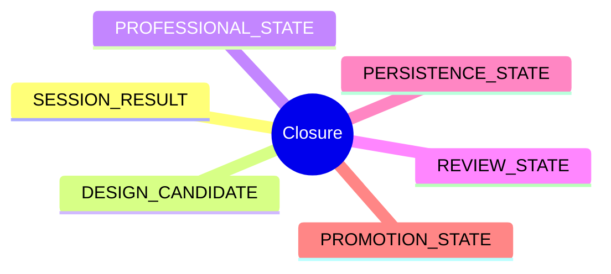

# N10E｜CONTINUITY / CLOSURE

[← Session Kernel](N10_SESSION_KERNEL.md)

| Field | Value |
|---|---|
| Node ID | N10E |
| Parent | N10 |
| Type | Kernel Continuity Node |
| Product job | 让 session 可丢弃、项目可继续；并分离报告不同 closure dimensions |
| Inputs | session work, owner-native carriers, artifacts/readbacks |
| Outputs | resume locators + separated closure report |
| Authority | No self-promotion |
| Primary metric | Plugin-off Resume / Closure integrity |
| Release priority | P0/P1 |
| Doc state | WORKING |

## Continuity Model

## Closure Dimensions

## Hard Rule

No synthetic “PASS” may collapse all closure dimensions.

## Plugin-off Requirement

Removing/replacing interaction UI must not remove:
- Project State;
- checkpoint;
- native artifact;
- authority;
- resume path.

Full claim requires real destructive uninstall/replacement test.

## Acceptance

A future session can reconstruct working context from owner-native carriers even if the previous session representation no longer exists.
