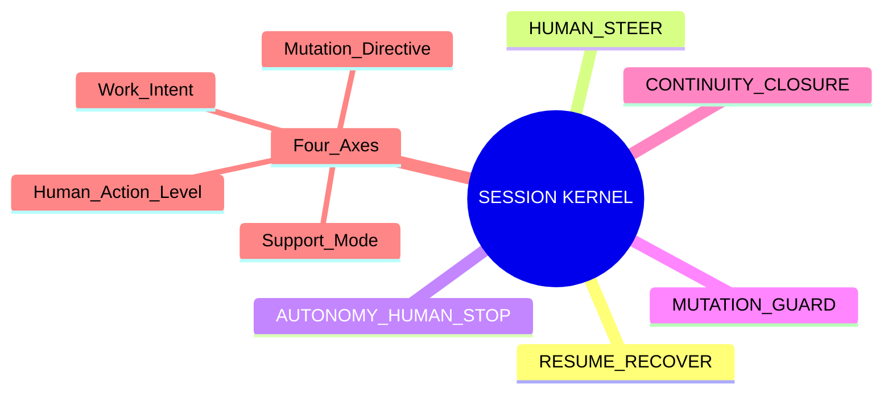
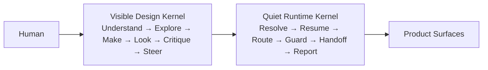

# N10｜SESSION KERNEL

[← Node Graph](README.md)

| Field | Value |
|---|---|
| Node ID | N10 |
| Children | [N10A](N10A_RESUME_RECOVER.md), [N10B](N10B_HUMAN_STEER.md), [N10C](N10C_AUTONOMY_HUMAN_STOP.md), [N10D](N10D_MUTATION_GUARD.md), [N10E](N10E_CONTINUITY_CLOSURE.md) |
| Type | Cross-product Interaction Kernel |
| Product job | 解析用户意图、恢复上下文、路由工作、保护 mutation 与 Human authority |
| Inputs | Human message + owner-native project locators + product context |
| Outputs | interaction projection / route / guard / stop / closure |
| Authority | Does not own Project State / Design KEEP / Promotion |
| Primary metric | False Steering / Useful Autonomy / Unauthorized Action |
| Release priority | P0 |
| Doc state | WORKING |

## Kernel Mindmap



## Visible / Quiet Views



## Four-axis Contract

```text
WORK INTENT
× MUTATION DIRECTIVE
× SUPPORT MODE
× HUMAN ACTION LEVEL
```

One axis never automatically grants another.

## Hard Separation

```text
CONTINUE ≠ DEFER
FEEDBACK_SIGNAL ≠ ITERATION_STEER
ITERATION_STEER ≠ DESIGN_DECISION
DESIGN_DECISION ≠ DESIGN_KEEP
DESIGN_KEEP ≠ PROMOTION_DECISION
```

## Parent Rule

This doc defines Kernel responsibilities only. Resume, steer, autonomy, mutation, continuity details live in child nodes.
