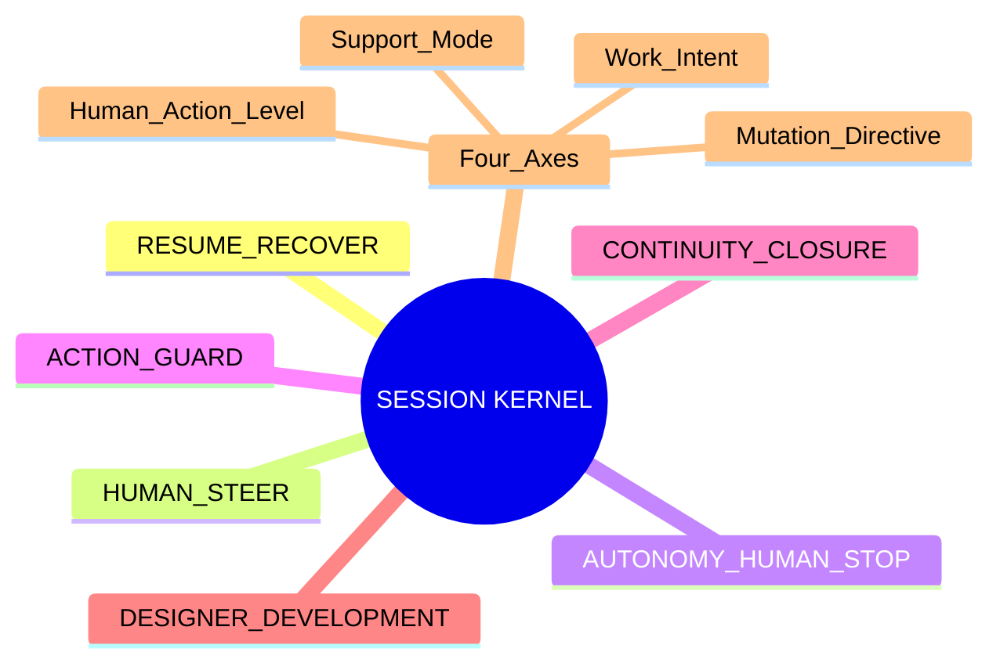
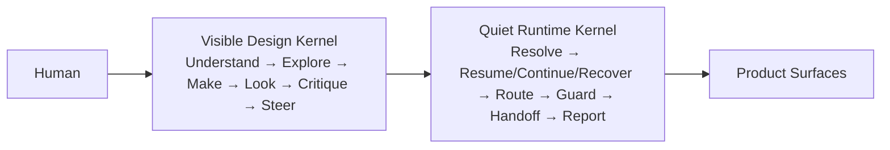
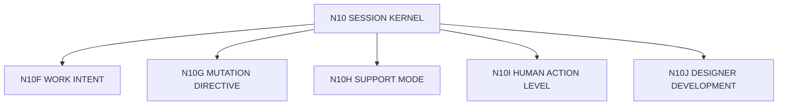

# N10｜SESSION KERNEL

[← Node Graph](README.md)

| Field | Value |
|---|---|
| Node ID | N10 |
| Children | N10A, N10B, N10C, N10D, N10E, N10F, N10G, N10H, N10I, N10J |
| Type | Cross-product Interaction Kernel |
| Product job | 解析用户意图、恢复上下文、路由工作、保护 mutation 与 Human authority |
| Inputs | Human message + owner-native project locators + product context |
| Outputs | interaction projection / route / guard / stop / closure |
| Authority | Does not own Project State / Design KEEP / Promotion |
| Primary metric | False Steering / Useful Autonomy / Unauthorized Action |
| Release priority | P0 |
| Doc state | WORKING |

## Kernel Mindmap



## Visible / Quiet Views



## Four-axis Contract

```text
WORK INTENT
× MUTATION DIRECTIVE
× SUPPORT MODE
× HUMAN ACTION LEVEL
```

One axis never automatically grants another.

## Hard Separation

```text
RESUME ≠ CONTINUE ≠ RECOVER
CONTINUE ≠ DEFER
FEEDBACK_SIGNAL ≠ ITERATION_STEER
ITERATION_STEER ≠ DESIGN_DECISION
DESIGN_DECISION ≠ DESIGN_KEEP
DESIGN_KEEP ≠ PROMOTION_DECISION
```

## Parent Rule

This doc defines Kernel responsibilities only. Resume/continue/recover, steer, autonomy, action guard, continuity and designer-development details live in child nodes.

## Kernel Child Nodes

- [N10A｜RESUME / RECOVER](N10A_RESUME_RECOVER.md)
- [N10B｜HUMAN STEER](N10B_HUMAN_STEER.md)
- [N10C｜AUTONOMY / HUMAN STOP](N10C_AUTONOMY_HUMAN_STOP.md)
- [N10D｜ACTION GUARD](N10D_MUTATION_GUARD.md)
- [N10E｜CONTINUITY / CLOSURE](N10E_CONTINUITY_CLOSURE.md)

## Atomic Axis / Support Children



- [N10F｜WORK INTENT](atomic/N10F_WORK_INTENT.md)
- [N10G｜MUTATION DIRECTIVE](atomic/N10G_MUTATION_DIRECTIVE.md)
- [N10H｜SUPPORT MODE](atomic/N10H_SUPPORT_MODE.md)
- [N10I｜HUMAN ACTION LEVEL](atomic/N10I_HUMAN_ACTION_LEVEL.md)
- [N10J｜DESIGNER DEVELOPMENT](atomic/N10J_DESIGNER_DEVELOPMENT.md)
