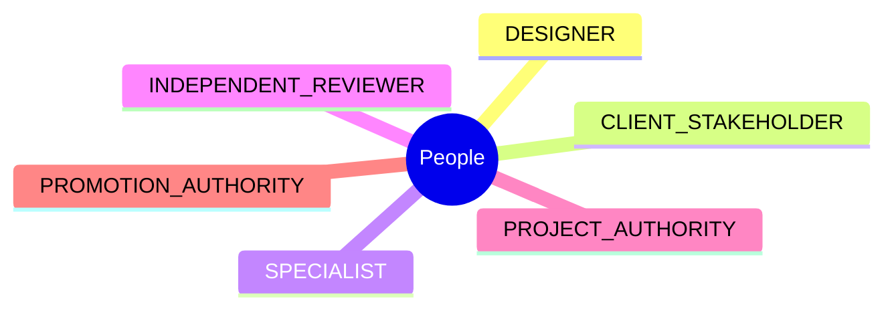
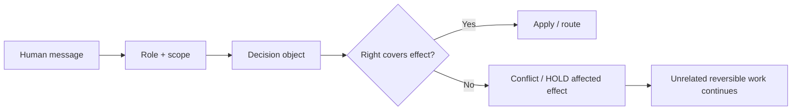
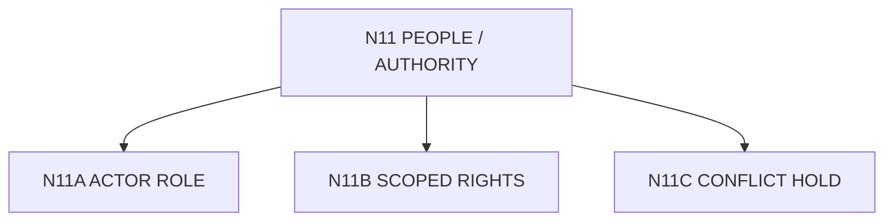

# N11｜PEOPLE / AUTHORITY

[← Node Graph](README.md)

| Field | Value |
|---|---|
| Node ID | N11 |
| Children | N11A, N11B, N11C — see [Atomic Children](#atomic-children) |
| Type | Cross-product Control Surface |
| Product job | 表达 scoped responsibility 与 decision rights，而不把“最近说话的人”变成最高权威 |
| Inputs | actor role, scope, owner rules, decision object |
| Outputs | allowed action / route / scoped conflict |
| Authority | Existing owner rules remain canonical |
| Primary metric | Conflict containment / unauthorized override |
| Release priority | P1 |
| Doc state | WORKING |

## Role Map

## Scoped Rights

## Rules

- Designer cannot waive statutory truth;
- Client / stakeholder value authority is determined by current scoped project rights; the role name alone does not grant final value priority;
- Specialist owns domain claim, not whole design;
- reviewer independence does not make reviewer project authority;
- Promotion remains explicit authority.

## Acceptance

Conflicting rights block only the affected effect where possible.

## Atomic Children

- [N11A｜ACTOR ROLE](atomic/N11A_ACTOR_ROLE.md)
- [N11B｜SCOPED RIGHTS](atomic/N11B_SCOPED_RIGHTS.md)
- [N11C｜CONFLICT HOLD](atomic/N11C_CONFLICT_HOLD.md)
