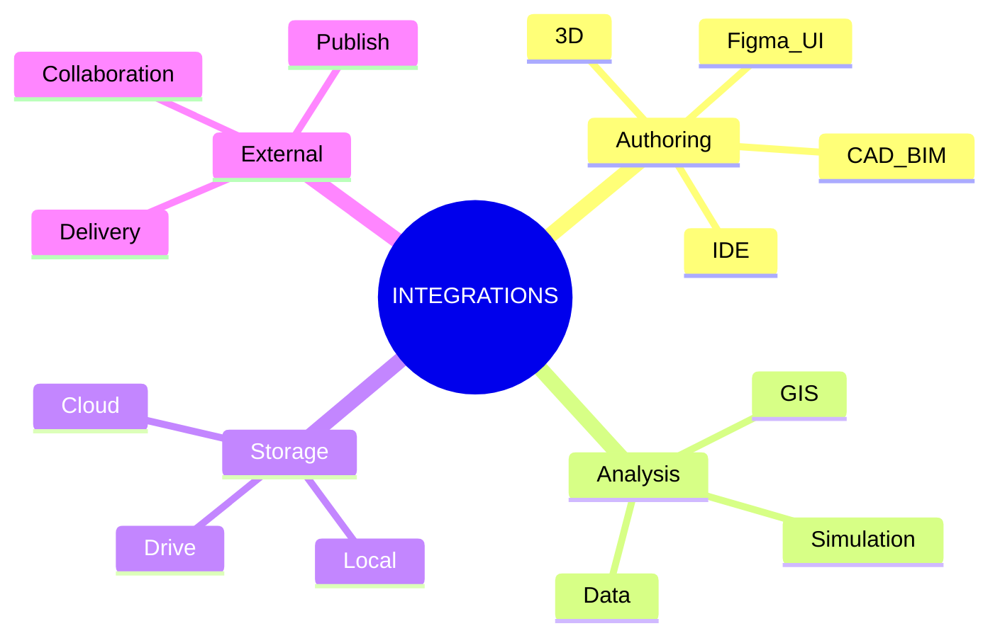
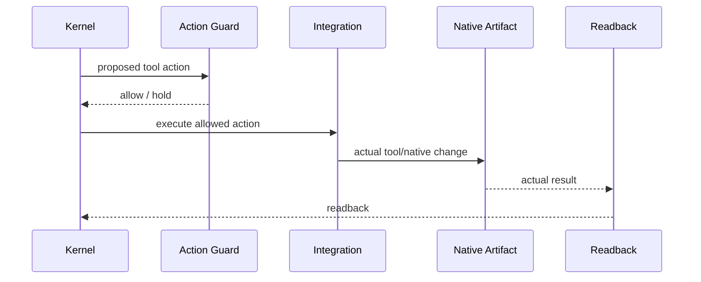
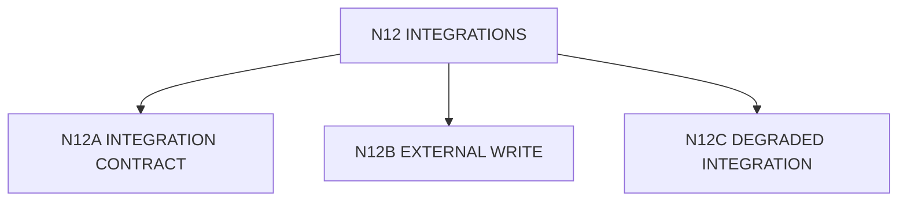

# N12｜INTEGRATIONS

[← Node Graph](README.md)

| Field | Value |
|---|---|
| Node ID | N12 |
| Children | N12A, N12B, N12C — see [Atomic Children](#atomic-children) |
| Type | Integration Node |
| Product job | 连接专业 authoring / analysis / storage / external systems，同时保持 artifact role、authority 与 degraded behaviour |
| Inputs | integration capability + scoped permission |
| Outputs | tool action / imported result / native locator |
| Authority | Connector availability does not grant project authority |
| Primary metric | integration success + truthful degradation |
| Release priority | P1/P2 |
| Doc state | WORKING |

## Integration Map

## Interaction Contract

## Requirements

- least necessary tool scope;
- explicit external irreversible boundary;
- integration failure must report partial success truthfully;
- unavailable tool may use bounded substitute only when current question remains answerable;
- integration output role is explicit.

## Open

Security/privacy permission architecture remains required before broad external beta.

## Atomic Children

- [N12A｜INTEGRATION CONTRACT](atomic/N12A_INTEGRATION_CONTRACT.md)
- [N12B｜EXTERNAL WRITE](atomic/N12B_EXTERNAL_WRITE.md)
- [N12C｜DEGRADED INTEGRATION](atomic/N12C_DEGRADED_INTEGRATION.md)
