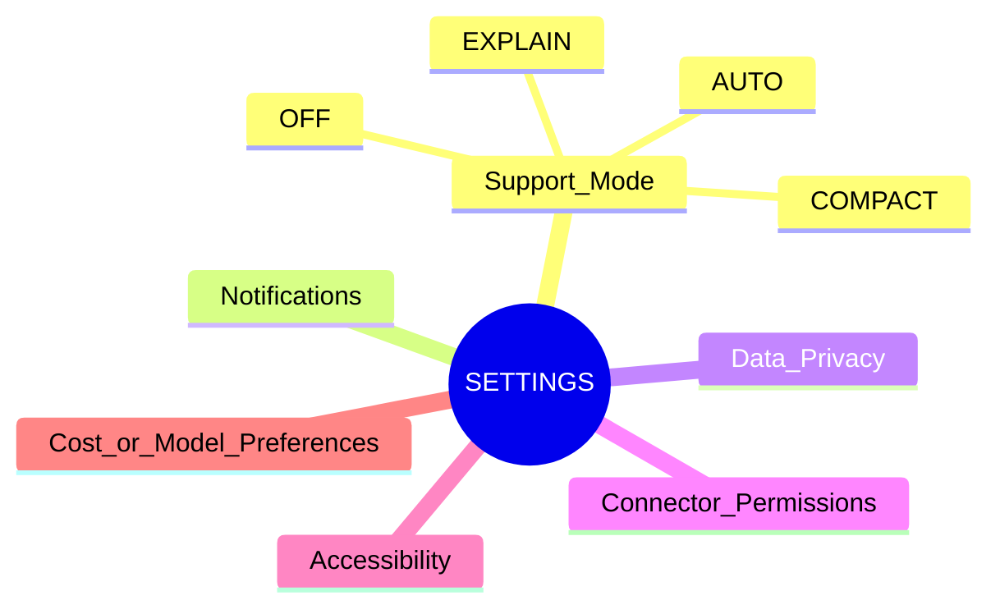

# N13｜SETTINGS

[← Node Graph](README.md)

| Field | Value |
|---|---|
| Node ID | N13 |
| Type | Supporting Product Surface |
| Product job | 提供少量真正需要用户控制的产品级偏好，而不把工作流复杂性转嫁给用户 |
| Inputs | explicit user preferences |
| Outputs | bounded interaction/configuration choices |
| Authority | Settings cannot override project/professional authority |
| Primary metric | setting usefulness / misconfiguration |
| Release priority | P2 |
| Doc state | OPEN |

## Candidate Settings

## Not a Setting

Do not expose as casual toggles:
- Design KEEP;
- Promotion;
- professional compliance;
- bypass Mutation Guard;
- “AI can do anything”;
- Project Current authority.

## Principle

> **If the product can infer safely from current context, do not make the user configure it permanently.**

Settings should remain small until real user evidence proves a persistent preference deserves a control.
