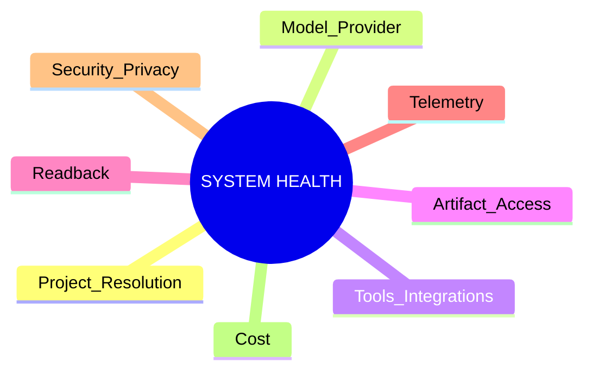
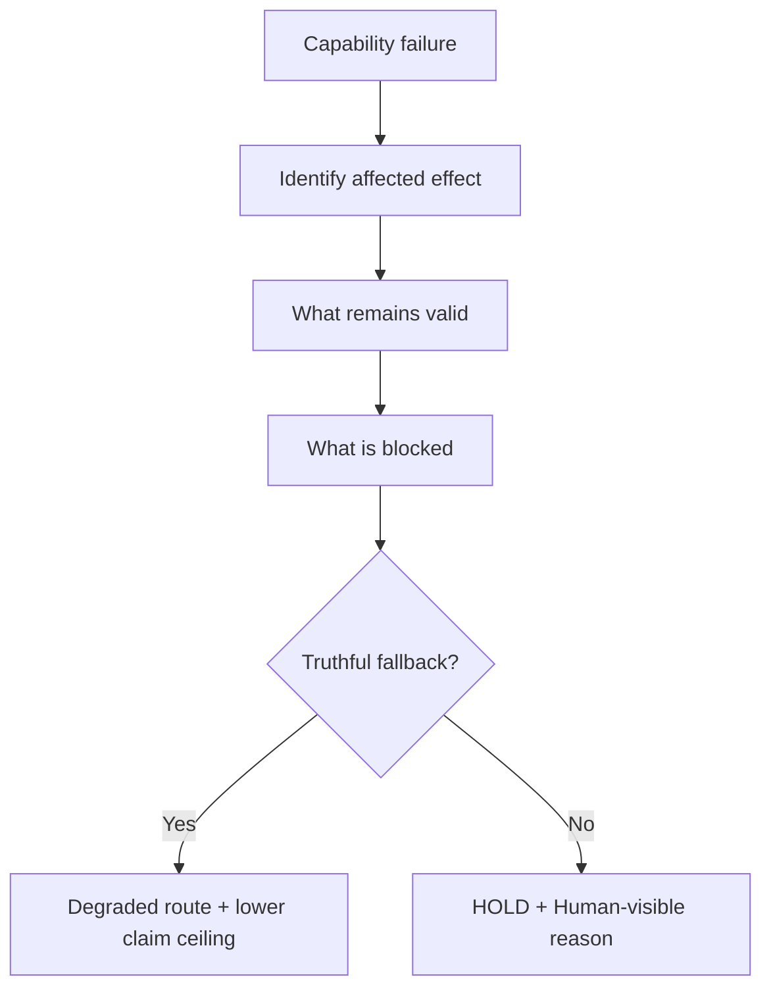

# N14｜SYSTEM HEALTH

[← Node Graph](README.md)

| Field | Value |
|---|---|
| Node ID | N14 |
| Type | Supporting Product Surface |
| Product job | 让用户/运营者知道影响当前工作的真实系统能力、降级和风险 |
| Inputs | integration/model/runtime/readback/telemetry health |
| Outputs | user-relevant health state + degraded route |
| Authority | Health status does not redefine Project State |
| Primary metric | truthful degradation / incident recovery |
| Release priority | P1/P2 |
| Doc state | OPEN |

## Health Map

## User-facing Degradation

## Requirements

System Health must answer:
- what failed;
- what remains valid;
- what is blocked;
- what fallback exists;
- what user action is required, if any.

It should not expose raw infrastructure logs as the primary UX.

## Acceptance

A dependency outage cannot silently turn into false product success or global project failure.
