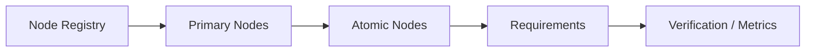

# OLEANDER Product Node Registry v0.3.1

[← Node Graph](README.md) · [Atomic Node Index](ATOMIC_NODE_INDEX.md)

> Registry 是产品文档导航 / QA 视图，不是 Project State、runtime artifact registry 或 authority source。

## Registry Graph

| Node | Parent | Type | Priority | Primary doc |
|---|---|---|---|---|
| N00 | none | Root Product Node | P0 | [PRODUCT SYSTEM](N00_PRODUCT_SYSTEM.md) |
| N01 | N00 | Product Surface | P0 | [HOME](N01_HOME.md) |
| N02 | — | Product Surface | P0 | [FOCUS](N02_FOCUS.md) |
| N03 | — | Product Surface / Work Container | P0 | [STUDIO](N03_STUDIO.md) |
| N03A | N03 | Studio Mode | P0 | [EXPLORE](N03A_EXPLORE.md) |
| N03B | N03 | Studio Mode | P0 | [DEVELOP](N03B_DEVELOP.md) |
| N03C | N03 | Studio Mode | P1 | [SYNTHESIZE](N03C_SYNTHESIZE.md) |
| N04 | — | Cross-surface Decision Mode | P0 | [COMPARE](N04_COMPARE.md) |
| N05 | — | Product Surface | P1 | [MAP](N05_MAP.md) |
| N06 | — | Product Surface | P0 | [ARTIFACTS](N06_ARTIFACTS.md) |
| N07 | — | Product Surface | P0 | [REVIEW](N07_REVIEW.md) |
| N08 | — | Product Surface | P1 | [KNOWLEDGE](N08_KNOWLEDGE.md) |
| N09 | — | Product Surface | P1 | [HISTORY](N09_HISTORY.md) |
| N10 | — | Cross-product Interaction Kernel | P0 | [SESSION KERNEL](N10_SESSION_KERNEL.md) |
| N10A | N10 | Kernel Node | P0 | [RESUME / RECOVER](N10A_RESUME_RECOVER.md) |
| N10B | N10 | Kernel Node | P0 | [HUMAN STEER](N10B_HUMAN_STEER.md) |
| N10C | — | Kernel Control Node | P0 | [AUTONOMY / HUMAN STOP](N10C_AUTONOMY_HUMAN_STOP.md) |
| N10D | — | Kernel Safety Node | P0 | [MUTATION GUARD](N10D_MUTATION_GUARD.md) |
| N10E | — | Kernel Continuity Node | P0/P1 | [CONTINUITY / CLOSURE](N10E_CONTINUITY_CLOSURE.md) |
| N11 | — | Cross-product Control Surface | P1 | [PEOPLE / AUTHORITY](N11_PEOPLE_AUTHORITY.md) |
| N12 | — | Integration Node | P1/P2 | [INTEGRATIONS](N12_INTEGRATIONS.md) |
| N13 | — | Supporting Product Surface | P2 | [SETTINGS](N13_SETTINGS.md) |
| N14 | — | Supporting Product Surface | P1/P2 | [SYSTEM HEALTH](N14_SYSTEM_HEALTH.md) |
| N01A | N01 HOME | Atomic Product Capability | P0 | [RESUME SNAPSHOT](atomic/N01A_RESUME_SNAPSHOT.md) |
| N01B | N01 HOME | Atomic Product Capability | P0 | [FRONTIER](atomic/N01B_FRONTIER.md) |
| N01C | N01 HOME | Atomic Product Capability | P0 | [CRITICAL OPEN](atomic/N01C_CRITICAL_OPEN.md) |
| N01D | N01 HOME | Atomic Product Capability | P0 | [ACTIVE ARTIFACT](atomic/N01D_ACTIVE_ARTIFACT.md) |
| N01E | N01 HOME | Atomic Product Capability | P0 | [NEXT ACTION](atomic/N01E_NEXT_ACTION.md) |
| N02A | N02 FOCUS | Atomic Product Capability | P0 | [PROBLEM STATEMENT](atomic/N02A_PROBLEM_STATEMENT.md) |
| N02B | N02 FOCUS | Atomic Product Capability | P0 | [CURRENT DESIGN QUESTION](atomic/N02B_CURRENT_DESIGN_QUESTION.md) |
| N02C | N02 FOCUS | Atomic Product Capability | P0 | [DESIGN VALUE / INTENT](atomic/N02C_DESIGN_VALUE_INTENT.md) |
| N02D | N02 FOCUS | Atomic Product Capability | P0 | [CONSTRAINT / ASSUMPTION](atomic/N02D_CONSTRAINT_ASSUMPTION.md) |
| N02E | N02 FOCUS | Atomic Product Capability | P1 | [SUCCESS CONDITION](atomic/N02E_SUCCESS_CONDITION.md) |
| N02F | N02 FOCUS | Atomic Product Capability | P0 | [REFRAME](atomic/N02F_REFRAME.md) |
| N03A1 | N03A EXPLORE | Atomic Studio Capability | P0 | [DESIGN DIRECTION](atomic/N03A1_DESIGN_DIRECTION.md) |
| N03A2 | N03A EXPLORE | Atomic Studio Capability | P0 | [ALTERNATIVE SET](atomic/N03A2_ALTERNATIVE_SET.md) |
| N03A3 | N03A EXPLORE | Atomic Studio Capability | P0 | [MATERIAL DISTINCTNESS](atomic/N03A3_MATERIAL_DISTINCTNESS.md) |
| N03A4 | N03A EXPLORE | Atomic Studio Capability | P1 | [BASELINE / OFF](atomic/N03A4_BASELINE_OFF.md) |
| N03A5 | N03A EXPLORE | Atomic Studio Capability | P1 | [REFERENCE TRANSFORMATION](atomic/N03A5_REFERENCE_TRANSFORMATION.md) |
| N03B1 | N03B DEVELOP | Atomic Studio Capability | P1 | [MATURITY GAP](atomic/N03B1_MATURITY_GAP.md) |
| N03B2 | N03B DEVELOP | Atomic Studio Capability | P0 | [DEVELOPMENT FRONTIER](atomic/N03B2_DEVELOPMENT_FRONTIER.md) |
| N03B3 | N03B DEVELOP | Atomic Studio Capability | P0 | [DOMAIN ADAPTER](atomic/N03B3_DOMAIN_ADAPTER.md) |
| N03B4 | N03B DEVELOP | Atomic Studio Capability | P1 | [INTENT CHECK](atomic/N03B4_INTENT_CHECK.md) |
| N03C1 | N03C SYNTHESIZE | Atomic Studio Capability | P1 | [COMPLEXITY REVIEW](atomic/N03C1_COMPLEXITY_REVIEW.md) |
| N03C2 | N03C SYNTHESIZE | Atomic Studio Capability | P0 | [SIMPLIFICATION / LOSS CHECK](atomic/N03C2_SIMPLIFICATION_LOSS_CHECK.md) |
| N04A | N04 COMPARE | Atomic Decision Capability | P0 | [COMPARISON WORLD](atomic/N04A_COMPARISON_WORLD.md) |
| N04B | N04 COMPARE | Atomic Decision Capability | P0 | [TRADE-OFF](atomic/N04B_TRADEOFF.md) |
| N04C | N04 COMPARE | Atomic Decision Capability | P0 | [DECISION RATIONALE](atomic/N04C_DECISION_RATIONALE.md) |
| N04D | N04 COMPARE | Atomic Decision Capability | P1 | [REOPEN CONDITION](atomic/N04D_REOPEN_CONDITION.md) |
| N05A | N05 MAP | Atomic Relation Node | P0 | [DESIGN RELATION](atomic/N05A_DESIGN_RELATION.md) |
| N05B | N05 MAP | Atomic Relation Node | P0 | [CHANGE IMPACT](atomic/N05B_CHANGE_IMPACT.md) |
| N05C | N05 MAP | Atomic Recovery Node | P0 | [REVISION SCOPE](atomic/N05C_REVISION_SCOPE.md) |
| N05D | N05 MAP | Atomic Integration Node | P1 | [PROFESSIONAL BINDING](atomic/N05D_PROFESSIONAL_BINDING.md) |
| N06A | N06 ARTIFACTS | Atomic Reality Node | P0 | [ARTIFACT IDENTITY](atomic/N06A_ARTIFACT_IDENTITY.md) |
| N06B | N06 ARTIFACTS | Atomic Reality Node | P0 | [ARTIFACT ROLE](atomic/N06B_ARTIFACT_ROLE.md) |
| N06C | N06 ARTIFACTS | Atomic Reality Node | P0 | [REVISION IDENTITY](atomic/N06C_REVISION_IDENTITY.md) |
| N06D | N06 ARTIFACTS | Atomic Reality Node | P0 | [READBACK](atomic/N06D_READBACK.md) |
| N06E | N06 ARTIFACTS | Atomic Evidence Node | P0 | [FIDELITY / CLAIM CEILING](atomic/N06E_FIDELITY_CLAIM_CEILING.md) |
| N06F | N06 ARTIFACTS | Atomic Degraded Node | P1 | [DEGRADED SUBSTITUTE](atomic/N06F_DEGRADED_SUBSTITUTE.md) |
| N07A | N07 REVIEW | Atomic Review Node | P0 | [REVIEW TARGET](atomic/N07A_REVIEW_TARGET.md) |
| N07B | N07 REVIEW | Atomic Review Node | P0 | [FINDING](atomic/N07B_FINDING.md) |
| N07C | N07 REVIEW | Atomic Review Node | P0 | [ROOT-CAUSE HYPOTHESIS](atomic/N07C_ROOTCAUSE_HYPOTHESIS.md) |
| N07D | N07 REVIEW | Atomic Assurance Node | P0 | [VERIFICATION](atomic/N07D_VERIFICATION.md) |
| N07E | N07 REVIEW | Atomic Assurance Node | P0 | [VALIDATION](atomic/N07E_VALIDATION.md) |
| N07F | N07 REVIEW | Atomic Review Node | P1 | [INDEPENDENT REVIEW](atomic/N07F_INDEPENDENT_REVIEW.md) |
| N07G | N07 REVIEW | Atomic Recovery Node | P0 | [RECHECK / RE-READBACK](atomic/N07G_RECHECK_REREADBACK.md) |
| N08A | N08 KNOWLEDGE | Atomic Knowledge Node | P0 | [KNOWLEDGE NEED](atomic/N08A_KNOWLEDGE_NEED.md) |
| N08B | N08 KNOWLEDGE | Atomic Knowledge Node | P0 | [SOURCE / EVIDENCE](atomic/N08B_SOURCE_EVIDENCE.md) |
| N08C | N08 KNOWLEDGE | Atomic Knowledge Node | P0 | [APPLICABILITY / LIMITATION](atomic/N08C_APPLICABILITY_LIMITATION.md) |
| N08D | N08 KNOWLEDGE | Atomic Knowledge Node | P1 | [EVIDENCE CONTRADICTION](atomic/N08D_EVIDENCE_CONTRADICTION.md) |
| N08E | N08 KNOWLEDGE | Atomic Knowledge Node | P0 | [CLAIM CEILING](atomic/N08E_CLAIM_CEILING.md) |
| N09A | N09 HISTORY | Atomic Continuity Node | P0 | [DECISION HISTORY](atomic/N09A_DECISION_HISTORY.md) |
| N09B | N09 HISTORY | Atomic Continuity Node | P1 | [REJECTED DIRECTION MEMORY](atomic/N09B_REJECTED_DIRECTION_MEMORY.md) |
| N09C | N09 HISTORY | Atomic Continuity Node | P0 | [RESUME POINT](atomic/N09C_RESUME_POINT.md) |
| N09D | N09 HISTORY | Atomic Continuity Node | P1 | [HANDOFF PACK](atomic/N09D_HANDOFF_PACK.md) |
| N09E | N09 HISTORY | Atomic Learning Node | P2 | [PROJECT LEARNING CANDIDATE](atomic/N09E_PROJECT_LEARNING_CANDIDATE.md) |
| N10F | N10 SESSION KERNEL | Atomic Interaction Axis | P0 | [WORK INTENT](atomic/N10F_WORK_INTENT.md) |
| N10G | N10 SESSION KERNEL | Atomic Interaction Axis | P0 | [MUTATION DIRECTIVE](atomic/N10G_MUTATION_DIRECTIVE.md) |
| N10H | N10 SESSION KERNEL | Atomic Interaction Axis | P1 | [SUPPORT MODE](atomic/N10H_SUPPORT_MODE.md) |
| N10I | N10 SESSION KERNEL | Atomic Interaction Axis | P0 | [HUMAN ACTION LEVEL](atomic/N10I_HUMAN_ACTION_LEVEL.md) |
| N11A | N11 PEOPLE / AUTHORITY | Atomic Authority Node | P1 | [ACTOR ROLE](atomic/N11A_ACTOR_ROLE.md) |
| N11B | N11 PEOPLE / AUTHORITY | Atomic Authority Node | P0 | [SCOPED RIGHTS](atomic/N11B_SCOPED_RIGHTS.md) |
| N11C | N11 PEOPLE / AUTHORITY | Atomic Authority Node | P1 | [CONFLICT HOLD](atomic/N11C_CONFLICT_HOLD.md) |
| N12A | N12 INTEGRATIONS | Atomic Integration Node | P1 | [INTEGRATION CONTRACT](atomic/N12A_INTEGRATION_CONTRACT.md) |
| N12B | N12 INTEGRATIONS | Atomic Integration Node | P0 | [EXTERNAL WRITE](atomic/N12B_EXTERNAL_WRITE.md) |
| N12C | N12 INTEGRATIONS | Atomic Integration Node | P1 | [DEGRADED INTEGRATION](atomic/N12C_DEGRADED_INTEGRATION.md) |
| N13A | N13 SETTINGS | Atomic Settings Node | P2 | [DATA / PRIVACY SETTINGS](atomic/N13A_DATA_PRIVACY_SETTINGS.md) |
| N13B | N13 SETTINGS | Atomic Settings Node | P2 | [CONNECTOR PERMISSIONS](atomic/N13B_CONNECTOR_PERMISSIONS.md) |
| N13C | N13 SETTINGS | Atomic Settings Node | P2 | [ACCESSIBILITY SETTINGS](atomic/N13C_ACCESSIBILITY_SETTINGS.md) |
| N14A | N14 SYSTEM HEALTH | Atomic Health Node | P1 | [HEALTH SIGNAL](atomic/N14A_HEALTH_SIGNAL.md) |
| N14B | N14 SYSTEM HEALTH | Atomic Health Node | P1 | [DEGRADED ROUTE](atomic/N14B_DEGRADED_ROUTE.md) |
| N14C | N14 SYSTEM HEALTH | Atomic Health Node | P1 | [INCIDENT / RECOVERY](atomic/N14C_INCIDENT_RECOVERY.md) |
