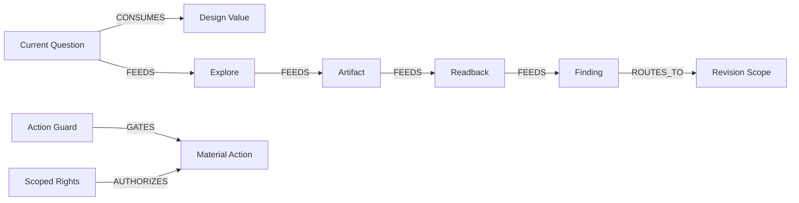

# OLEANDER Product Node Relation Schema v0.3.2

[← Node Graph](README.md) · [Node Registry](NODE_REGISTRY.md)

> 图中的箭头必须有语义。不要用大量无类型的 related-to 关系制造“图很多但不能决策”的假复杂度。

## Allowed Relation Types

| Relation | Meaning | Typical use |
|---|---|---|
| CONSUMES | Node 读取另一节点的输出 | Question consumes Problem / Value |
| FEEDS | Node 产出成为下游输入 | Readback feeds Review |
| GATES | 条件不满足时阻止特定 effect | Action Guard gates consequential action |
| ROUTES_TO | 根据判断把工作转到另一节点 | HOME routes to FOCUS |
| BINDS | 把两个对象建立可追踪绑定 | Artifact binds Relation |
| PRESERVES | 失败/修改后明确保护仍有效范围 | Revision Scope preserves unaffected work |
| INVALIDATES | 新证据使特定对象不再有效 | assumption invalidates downstream claim |
| OBSERVES | 只读观察，不拥有对象 | System Health observes runtime capability |
| AUTHORIZES | 有权允许某 consequential effect | Scoped Rights authorizes action |
| BLOCKS | 明确阻止受影响 effect | Conflict HOLD blocks scoped mutation |
| REOPENS | 让先前 closed/held decision 再进入判断 | Reopen Condition |
| VERIFIES | 检查 implemented-as-specified | Verification |
| VALIDATES | 检查 real-user/context effectiveness | Validation |

## Relation Rules

1. Relation 必须能回答“为什么这个边存在”。
2. AUTHORIZES 只能来自真实 owner / decision-right source；图本身不能制造 authority。
3. BLOCKS 应尽量 scoped，不默认全局冻结。
4. CONSUMES / FEEDS 不代表 ownership。
5. OBSERVES 不允许被解释为 Current source。
6. REOPENS 必须保留 original lineage。
7. INVALIDATES 只影响可证明的依赖范围。

## Example

