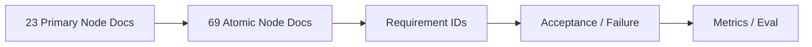
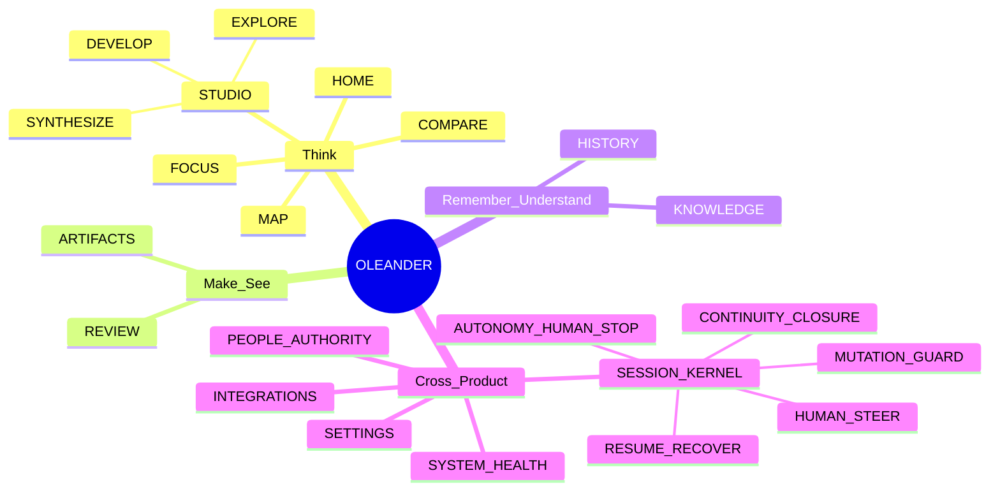
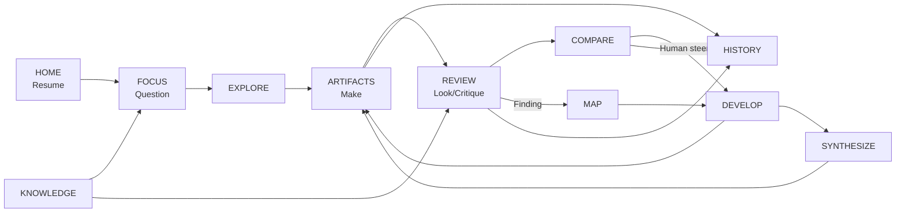
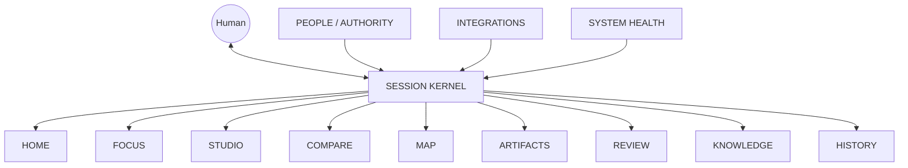

# OLEANDER Product Node Graph v0.3.1

[← Product Operating Package](../README.md) · [Node Contract](NODE_DOCUMENTATION_CONTRACT.md) · [Visual Maps](../maps/README.md)

> **Graph-first / Node-first rule:** 一个逻辑产品节点只维护一份主文档；父文档负责关系和导航，不重复子节点正文。

---

## v0.3.1 Deep Node Layer

- [Atomic Node Index](ATOMIC_NODE_INDEX.md)
- [Node Registry](NODE_REGISTRY.md)
- [Node Traceability Matrix](NODE_TRACEABILITY_MATRIX_v0.3.1.md)
- [Node Relation Schema](NODE_RELATION_SCHEMA_v0.3.1.md)
- [Visual Maps](../maps/README.md)



**Total product node documents: 92**

---

## 1｜产品节点总图



---

## 2｜节点目录

| Node | 文档 | 主要责任 |
|---|---|---|
| N00 | [PRODUCT SYSTEM](N00_PRODUCT_SYSTEM.md) | 产品边界、节点关系、整体 contract |
| N01 | [HOME](N01_HOME.md) | Resume / Now / Frontier |
| N02 | [FOCUS](N02_FOCUS.md) | Problem / Question / Value / Reframe |
| N03 | [STUDIO](N03_STUDIO.md) | 设计工作容器 |
| N03A | [EXPLORE](N03A_EXPLORE.md) | materially distinct alternatives |
| N03B | [DEVELOP](N03B_DEVELOP.md) | 设计深化 / maturity frontier |
| N03C | [SYNTHESIZE](N03C_SYNTHESIZE.md) | 复杂度整合 / no-loss simplification |
| N04 | [COMPARE](N04_COMPARE.md) | trade-off / decision surface |
| N05 | [MAP](N05_MAP.md) | Design Relation / dependency / change impact |
| N06 | [ARTIFACTS](N06_ARTIFACTS.md) | native artifact / revision / readback |
| N07 | [REVIEW](N07_REVIEW.md) | critique / verification / validation |
| N08 | [KNOWLEDGE](N08_KNOWLEDGE.md) | evidence / applicability / claim ceiling |
| N09 | [HISTORY](N09_HISTORY.md) | continuity / rationale / handoff |
| N10 | [SESSION KERNEL](N10_SESSION_KERNEL.md) | 跨节点 Human–AI interaction |
| N10A | [RESUME / RECOVER](N10A_RESUME_RECOVER.md) | verified frontier reconstruction |
| N10B | [HUMAN STEER](N10B_HUMAN_STEER.md) | SELECT / MODIFY / MIX / REJECT / REOPEN / DEFER |
| N10C | [AUTONOMY / HUMAN STOP](N10C_AUTONOMY_HUMAN_STOP.md) | safe auto-advance / stop boundary |
| N10D | [MUTATION GUARD](N10D_MUTATION_GUARD.md) | pre-write freshness / fail closed |
| N10E | [CONTINUITY / CLOSURE](N10E_CONTINUITY_CLOSURE.md) | session-off survival / separated closure |
| N11 | [PEOPLE / AUTHORITY](N11_PEOPLE_AUTHORITY.md) | scoped decision rights |
| N12 | [INTEGRATIONS](N12_INTEGRATIONS.md) | authoring / external systems |
| N13 | [SETTINGS](N13_SETTINGS.md) | user-facing product controls only |
| N14 | [SYSTEM HEALTH](N14_SYSTEM_HEALTH.md) | product health / degraded operation |

---

## 3｜主工作链



---

## 4｜跨节点 Kernel



**Kernel 是 interaction layer，不是第二套 Project State。**

---

## 5｜节点阅读规则

每个节点文档固定包含：

```text
NODE CARD
→ WHY
→ USER / CONTEXT
→ INPUT
→ OUTPUT
→ INTERNAL SUBNODES
→ RELATIONS
→ HAPPY PATH
→ EDGE / DEGRADED
→ HUMAN / SYSTEM AUTHORITY
→ REQUIREMENTS
→ ACCEPTANCE
→ EVENTS / METRICS
→ OPEN QUESTIONS
```

详细规范见 [Node Documentation Contract](NODE_DOCUMENTATION_CONTRACT.md)。

---

## 6｜状态原则

节点文档中的 `WORKING / OPEN / HOLD` 是**产品文档状态**，不等于 OLEANDER Project Current / Design KEEP / Professional PASS / Promotion。

```text
NODE DOC STATUS
≠ PROJECT STATE
≠ DESIGN VERDICT
≠ PROFESSIONAL VERDICT
≠ PROMOTION
```
