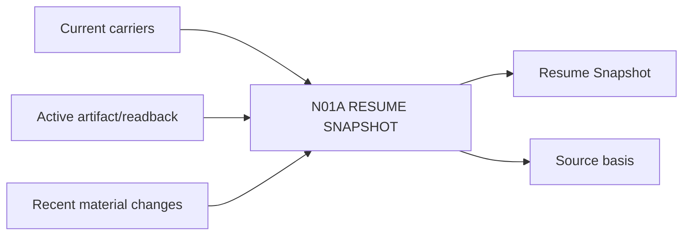

# N01A｜RESUME SNAPSHOT

[← Parent](../N01_HOME.md) · [← Atomic Node Index](../ATOMIC_NODE_INDEX.md)

| Field | Value |
|---|---|
| Node ID | N01A |
| Parent | N01 HOME |
| Type | Atomic Product Capability |
| Product job | 把恢复后的项目状态压缩成用户可立即行动的 Now 视图 |
| Inputs | Current carriers; Active artifact/readback; Recent material changes |
| Outputs | Resume Snapshot; Source basis |
| Authority | Projection only; no new project truth |
| Primary metric | Resume Accuracy / Resume Correction |
| Release priority | P0 |
| Doc state | WORKING |

## Context Graph

## Product Contract

Snapshot 必须先回答“现在是什么”，再允许用户展开 provenance。它不是聊天摘要，而是 owner-native Current 的可读投影。

## Requirement Links

- `HOME-F01`
- `HOME-F07`
- `INT-F25`

## Acceptance

1. Current Question、Direction、Frontier、Active Artifact 与 owner-native source 一致
2. Chat memory 与 Current 冲突时 Current 胜出
3. source conflict 未闭合时显示 provisional/conflict，而不是制造 certainty

## Failure / Degraded Behaviour

- 缺少非关键 carrier → 降级显示并列出缺口
- 关键 Current 无法解析 → HOLD material mutation

## Events / Metrics

- `project_resume_started`
- `frontier_resolved`
- `resume_corrected_by_user`

## Relations

- Parent N01 HOME consumes this node
- Feeds N01B Frontier and N01E Next Action
- Uses N10A Resume/Recover

## Open Questions

- Resume Snapshot 最小字段是否因 domain 不同而变化？

