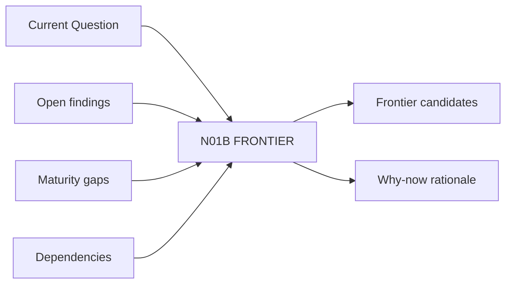

# N01B｜FRONTIER

[← Parent](../N01_HOME.md) · [← Atomic Node Index](../ATOMIC_NODE_INDEX.md)

| Field | Value |
|---|---|
| Node ID | N01B |
| Parent | N01 HOME |
| Type | Atomic Product Capability |
| Product job | 指出当前真正限制设计成熟度的 1–3 个高价值前沿 |
| Inputs | Current Question; Open findings; Maturity gaps; Dependencies |
| Outputs | Frontier candidates; Why-now rationale |
| Authority | System may propose; Human may correct |
| Primary metric | Frontier Correction Rate |
| Release priority | P0 |
| Doc state | WORKING |

## Context Graph

## Product Contract

Frontier 不是 task backlog。它必须能解释为什么现在解决这个问题最有价值。

## Requirement Links

- `HOME-F02`
- `FOCUS-F09`
- `DEV-F02`

## Acceptance

1. 每个 frontier 可追溯 Question/Relation/Finding
2. 不允许 generic ‘继续深化’
3. 如果无法唯一判断，可并列 2–3 个 candidate frontier

## Failure / Degraded Behaviour

- 依赖不明 → 标记 uncertainty
- 多个 blocker 同级 → 显示 candidate set

## Events / Metrics

- `frontier_candidate_shown`
- `frontier_confirmed`
- `frontier_reframed`

## Relations

- Receives N02B Current Question
- Feeds N01E Next Action
- Can route N03B Development Frontier

