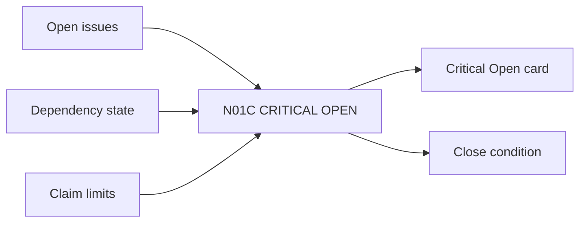

# N01C｜CRITICAL OPEN

[← Parent](../N01_HOME.md) · [← Atomic Node Index](../ATOMIC_NODE_INDEX.md)

| Field | Value |
|---|---|
| Node ID | N01C |
| Parent | N01 HOME |
| Type | Atomic Product Capability |
| Product job | 只暴露真正会改变当前推进能力的 OPEN |
| Inputs | Open issues; Dependency state; Claim limits |
| Outputs | Critical Open card; Close condition |
| Authority | Descriptive; does not create HOLD by itself |
| Primary metric | Critical-open Resolution Rate |
| Release priority | P0 |
| Doc state | WORKING |

## Context Graph

## Product Contract

OPEN 必须说明 reason、impact、what it blocks、what it does not block、close condition。

## Requirement Links

- `HOME-F03`
- `UN-P28`
- `UN-P35`

## Acceptance

1. safe-open 不阻止无关 reversible work
2. 关闭 Critical Open 时存在 evidence/decision/readback basis
3. OPEN 与 FAIL 分开

## Failure / Degraded Behaviour

- 原因未知 → UNKNOWN，不伪造根因
- 没有 close condition → 保持 open

## Events / Metrics

- `critical_open_exposed`
- `critical_open_closed`

## Relations

- Feeds N10C Human Stop only when effect is truly blocked
- May link N08 Knowledge or N07 Review

